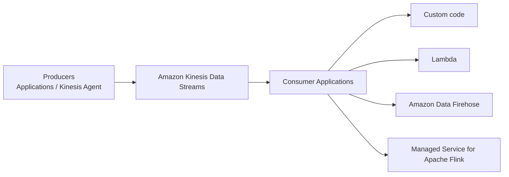

# 227. Amazon Kinesis Data Streams

## 🎯 Giới thiệu
Amazon Kinesis Data Streams là dịch vụ dùng để **collect** và **store streaming data trong real-time**.

- Keyword quan trọng khi làm bài thi: **real-time**
- Dữ liệu real-time là dữ liệu được tạo và sử dụng ngay tại chỗ
- Ví dụ được nhắc trong transcript:
  - **click stream** từ website
  - dữ liệu từ **connected device** như một chiếc xe đạp kết nối Internet
  - **metrics** và **logs** từ server

## 1. Producers và Consumers
Để đưa dữ liệu vào Kinesis Data Streams, cần có **producers**.

- **Producers** có thể là:
  - **Applications**: code do bạn viết để lấy dữ liệu từ website hoặc device và gửi vào Kinesis Data Streams
  - **Kinesis Agent**: cài trên server để gửi **metrics** và **logs**
- Dữ liệu được gửi **real-time**, tức là ngay khi phát sinh

Phía nhận dữ liệu là **consumer applications**:

- Ứng dụng tự viết để đọc từ Kinesis Data Streams
- **Lambda functions** cũng có thể đọc dữ liệu
- **Amazon Data Firehose**
- Công cụ analytics như **Managed Service for Apache Flink**

## 2. Features quan trọng
Kinesis Data Streams có các đặc điểm chính sau:

- Dữ liệu có thể được **retained up to 365 days**
- Vì dữ liệu được **persisted**, consumer có thể **reprocess / replay** dữ liệu
- Khi đã đưa dữ liệu vào stream thì **không thể xóa ngay**
  - Phải đợi dữ liệu **expire** theo thời gian
- Có thể gửi dữ liệu **up to 10 MB**
- Trường hợp sử dụng điển hình là:
  - **nhiều dữ liệu nhỏ**
  - phát sinh **real-time**
- Dữ liệu sẽ **in order** nếu gửi hai data points có cùng **partition ID**
  - partition ID thể hiện hai dữ liệu này có liên quan về thời gian
- Bảo mật:
  - **at-rest KMS encryption**
  - **in-flight HTTPS encryption**
- Tối ưu hiệu năng:
  - Producer high throughput: **Kinesis Producer Library (KPL)**
  - Consumer optimized: **Kinesis Client Library (KCL)**

## 3. Capacity Modes và Shards
Kinesis Data Streams có 2 **capacity mode**.

### Provisioned mode
- Bạn phải chọn số lượng **shards**
- **Shard** là cách đo “độ lớn” của stream
- Càng nhiều shard thì **throughput inbound** càng cao
- Mỗi shard cung cấp:
  - **1 MB/s** hoặc **1,000 records/s** cho inbound
  - **2 MB/s** cho read capacity / out-traffic
- Ví dụ:
  - muốn gửi **10,000 records/s** hoặc **10 MB/s**
  - cần scale lên **10 shards**
- Có thể **scale manually** để tăng hoặc giảm shard
- Cần theo dõi **throughput** để biết cần bao nhiêu shard
- Chi phí: **pay for each shard provisioned per hour**

### On-demand mode
- Không cần provision hay quản lý capacity
- Có **default capacity provision** khoảng:
  - **4,000 records/s**
  - **4 MB in**
- Kinesis Data Streams tự động scale dựa trên **observed throughput during the past 30 days**
- Chi phí:
  - **pay per stream per hour**
  - tính thêm theo lượng data **in and out**

## 📊 Bảng tóm tắt
| Tiêu chí | Mô tả |
|----------|------|
| Mục đích | Collect và store streaming data trong real-time |
| Keyword thi | `real-time` |
| Producers | Applications hoặc Kinesis Agent |
| Consumers | Custom code, Lambda, Amazon Data Firehose, Managed Service for Apache Flink |
| Retention | Tối đa 365 days |
| Replay | Có thể reprocess / replay dữ liệu |
| Xóa dữ liệu | Không xóa ngay, phải đợi expire |
| Kích thước dữ liệu | Up to 10 MB |
| Thứ tự dữ liệu | Giữ order nếu cùng partition ID |
| Security | KMS at-rest encryption, HTTPS in-flight encryption |
| Producer tối ưu | Kinesis Producer Library (KPL) |
| Consumer tối ưu | Kinesis Client Library (KCL) |
| Provisioned mode | Chọn số shards, tính phí theo shard/hour |
| On-demand mode | Tự scale, tính phí theo stream/hour và data in/out |

## 💡 Mẹo ghi nhớ cho kỳ thi AWS
- Gặp từ khóa **real-time streaming data** thì nghĩ ngay đến **Amazon Kinesis Data Streams**
- Muốn nhớ luồng hoạt động:
  - **Producer** đẩy dữ liệu vào stream
  - **Consumer** đọc dữ liệu ra để xử lý
- Nhớ 2 mode:
  - **Provisioned** = tự chọn **shards**
  - **On-demand** = không quản lý capacity
- Nhớ số liệu quan trọng trong transcript:
  - retention: **365 days**
  - max data: **10 MB**
  - mỗi shard inbound: **1 MB/s hoặc 1,000 records/s**
  - mỗi shard read: **2 MB/s**
- Nếu đề bài nói đến tối ưu producer/consumer:
  - producer -> **KPL**
  - consumer -> **KCL**
- Nếu nói đến bảo mật:
  - **KMS encryption** cho at-rest
  - **HTTPS** cho in-flight

## ✅ Kết luận
Amazon Kinesis Data Streams là dịch vụ để xử lý **streaming data real-time** với mô hình **producers -> stream -> consumers**.

- Hỗ trợ **replay** nhờ dữ liệu được lưu giữ
- Có 2 cách quản lý capacity: **Provisioned** và **On-demand**
- Các thuật ngữ quan trọng cần nhớ cho thi AWS: **real-time, shard, partition ID, KPL, KCL, KMS, HTTPS**
