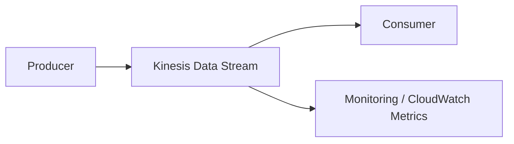
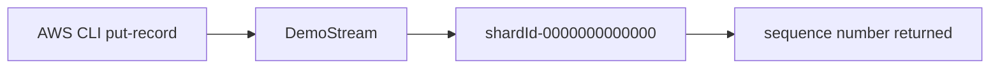
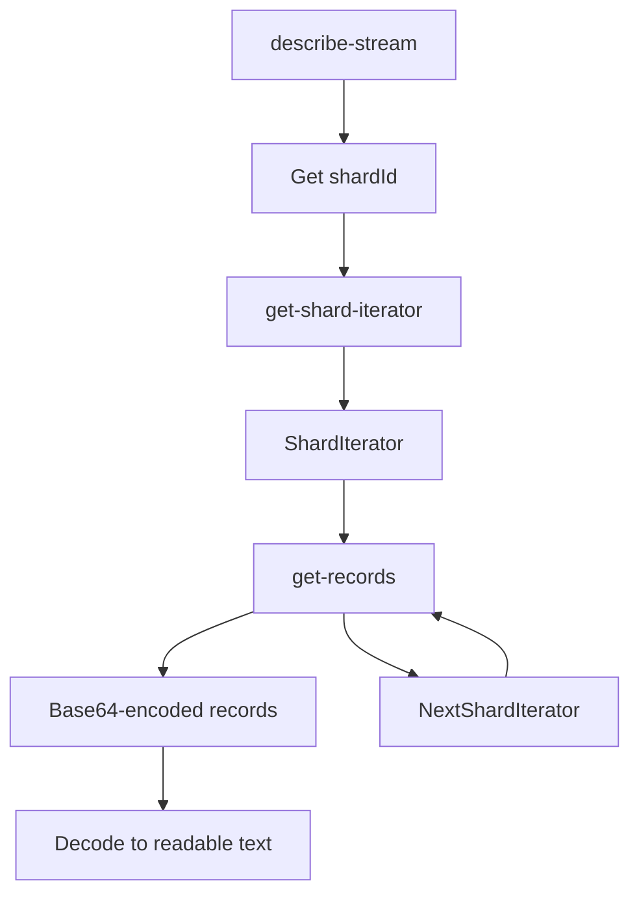

# 228. Amazon Kinesis Data Streams - Hands On

## 🎯 Giới thiệu
Bài hands-on này minh họa cách:
- Tạo một `Kinesis Data Stream`
- Gửi dữ liệu vào stream bằng `AWS CLI`
- Đọc dữ liệu từ stream ở mức low-level
- Quan sát các khái niệm quan trọng như `Shard`, `Partition Key`, `ShardIterator`, `Shared Consumption`, và `Base64 encoding`

## 1. Tạo Kinesis Data Stream
- Trong Kinesis service, có 3 lựa chọn:
  - `Data Streams`
  - `Data Firehose`
  - `Data Analytics`
- Ở demo này chỉ dùng `Data Streams`.
- Tạo stream tên `DemoStream`.
- Có 2 chế độ capacity:
  - `On-demand mode`
    - Tự scale, không cần tự nghĩ về capacity
    - Max throughput: `200 MB/s`
    - Max: `200,000 records/s`
    - Max read capacity: `400 MB/s per consumer` nếu dùng `enhanced Fan-Out`
    - Tính phí theo throughput
    - Không có free tier
  - `Provision mode`
    - Cần provision `shards`
    - Cũng không có free tier
    - Có `Shard estimator tool` để ước lượng số shard theo số record, kích thước record, và số consumer
- Trong demo, dùng `1 shard`:
  - `1 MB/s` write
  - `2 MB/s` read
  - Nếu có `10 shards` thì năng lực tăng gấp 10

## 2. Ghi dữ liệu vào stream
- Các lựa chọn producer được nhắc tới:
  - `Kinesis Agents`
  - `SDK`
  - `Kinesis Producer Library (KPL)`
- Ý nghĩa:
  - `SDK`: phát triển producer ở mức thấp
  - `KPL`: phát triển ở mức cao hơn, API tốt hơn
- Trong demo dùng `AWS CLI` trong `CloudShell`.
- `CloudShell`:
  - Là môi trường CLI trên AWS
  - Có sẵn `IAM credentials` của bạn
  - Dùng `region` mặc định khi khởi chạy, ở demo là `us-east-1`
  - Được nhắc là free
- Trước khi chạy lệnh, kiểm tra version:
  - `aws --version`
  - Demo dùng `AWS CLI v2`
- API dùng để ghi là `put-record`
- Khi gọi `put-record`, cần:
  - `--stream-name DemoStream`
  - `--partition-key user1`
  - `--data ...`
  - `--cli-binary-format raw-in-base64-out` vì dữ liệu là text
- Demo gửi các message như:
  - `user signup`
  - `user login`
  - `user logout`
- Kết quả trả về:
  - `shardId-0000000000000`
  - `sequence number`
- Có nhắc rằng các record cùng `partition key` sẽ đi vào cùng một `shard`, nhưng demo chỉ có 1 shard nên không ảnh hưởng.

## 3. Đọc dữ liệu từ stream
- Để consume dữ liệu, trước tiên dùng `describe-stream` để xem cấu trúc stream.
- Demo cho thấy stream có:
  - `StreamDescription`
  - 1 shard: `shardId-0000000000000`
- Khi dùng CLI/SDK ở mức thấp, phải chỉ rõ shard đang đọc từ đâu.
- Bước đọc gồm 2 API:
  - `get-shard-iterator`
  - `get-records`
- `shard-iterator-type` được dùng là `TRIM_HORIZON`
  - Nghĩa là đọc từ đầu stream
  - Có thể đọc toàn bộ record đã được gửi từ trước đó
- `ShardIterator`:
  - Có thể tái sử dụng để tiếp tục đọc
  - Lần đọc sau phải dùng `NextShardIterator`
- Demo nhấn mạnh đây là `shared consumption mode`, không phải `enhanced Fan-Out`
- Dùng low-level CLI nên phải tự quản lý vòng lặp đọc dữ liệu
- Dữ liệu đọc ra hiển thị dạng `base64-encoded`
- Muốn xem nội dung thực, dùng `base64 decode`
  - `user signup`
  - `user login`
- Khi consume xong, có `NextShardIterator` để tiếp tục từ vị trí đã đọc.

## 📊 Bảng tóm tắt
| Tiêu chí | Mô tả |
|----------|------|
| Dịch vụ | `Kinesis Data Streams` |
| Stream trong demo | `DemoStream` |
| Capacity mode | `On-demand mode` hoặc `Provision mode` |
| Demo capacity | `1 shard` |
| Write / Read theo shard | `1 MB/s` write, `2 MB/s` read |
| API ghi dữ liệu | `put-record` |
| API đọc dữ liệu | `get-shard-iterator`, `get-records` |
| Iterator type | `TRIM_HORIZON` |
| Dữ liệu trả về | `base64-encoded` |
| Công cụ CLI | `CloudShell` |
| Loại consumption | `shared consumption mode` |

## 💡 Mẹo ghi nhớ cho kỳ thi AWS
- `On-demand mode` = không cần tự quản lý capacity, nhưng vẫn có giới hạn throughput và không có free tier.
- `Provision mode` = phải tự tính và provision `shards`.
- `Partition key` quyết định record đi vào shard nào.
- Ghi dữ liệu dùng `put-record`, đọc dữ liệu low-level cần `describe-stream` → `get-shard-iterator` → `get-records`.
- `TRIM_HORIZON` = đọc từ đầu stream.
- Dữ liệu trong demo là `base64-encoded`, không phải text thuần.
- `NextShardIterator` là phần cần giữ lại để tiếp tục consume.
- `CloudShell` có sẵn credentials và region mặc định, tiện cho hands-on.

## ✅ Kết luận
Demo này cho thấy luồng cơ bản của `Kinesis Data Streams`:
- Tạo stream
- Chọn capacity mode
- Gửi record bằng `put-record`
- Lấy `ShardIterator`
- Đọc records bằng `get-records`
- Giải mã `base64` để kiểm tra dữ liệu

Đây là nền tảng quan trọng để hiểu cách producer và consumer làm việc với `Kinesis Data Streams` trong bài thi AWS.
