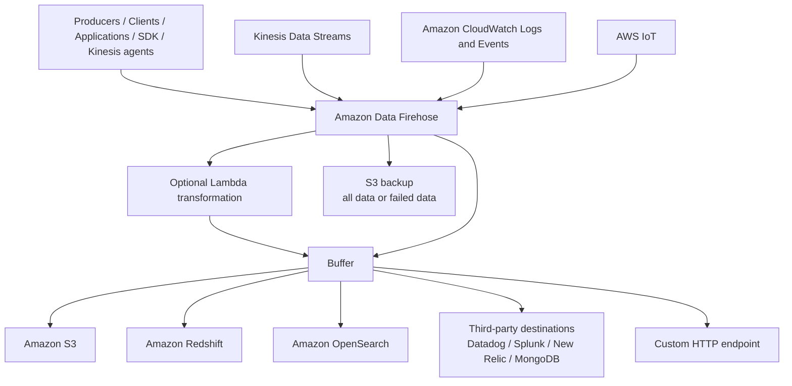

# 229. Amazon Data Firehose

## 🎯 Giới thiệu
Amazon Data Firehose là dịch vụ dùng để đưa data từ **sources** vào các **target destinations**.  
Điểm chính cần nhớ khi ôn thi AWS:

- Có thể **push** dữ liệu vào Firehose từ:
  - Applications
  - Clients
  - Code tự viết qua SDK
  - Kinesis agents
- Firehose cũng có thể **pull trực tiếp** từ một số dịch vụ như:
  - Kinesis Data Streams
  - Amazon CloudWatch Logs and Events
  - AWS IoT
- Đây là dịch vụ **fully managed**, **fully serverless**, có **automatic scaling**
- Bạn chỉ trả tiền theo mức sử dụng
- Đây là dịch vụ **near real-time**, không phải real-time tuyệt đối

## 1. Nguồn dữ liệu và cách nạp vào Firehose 🚚
Firehose nhận dữ liệu theo 2 kiểu chính:

- **Push**:
  - Ứng dụng, client hoặc code của bạn dùng **SDK** để gửi data vào Firehose
  - Có thể dùng **Kinesis agents**
- **Pull**:
  - Firehose tự lấy data từ:
    - **Kinesis Data Streams**
    - **CloudWatch Logs and Events**
    - **AWS IoT**

Ý nghĩa trong thực tế:
- Bạn không cần tự xây dựng toàn bộ pipeline ingest phức tạp
- Firehose đứng giữa để nhận data và chuyển tiếp đến đích

## 2. Xử lý dữ liệu và đích đến 📦
Sau khi nhận record, Firehose có thể:

- **Optional transform** bằng **Lambda**
  - Ví dụ: chuyển đổi format dữ liệu
  - Transcript nêu ví dụ chuyển từ **CSV sang JSON**
- Gom dữ liệu vào **buffer**
- **Flush** buffer theo:
  - **size**
  - hoặc **time**
- Sau đó ghi theo kiểu **batch** ra đích

### Destinations được hỗ trợ
- AWS destinations:
  - **Amazon S3**
  - **Amazon Redshift**
  - **Amazon OpenSearch**
- Third-party partner destinations:
  - **Datadog**
  - **Splunk**
  - **New Relic**
  - **MongoDB**
- Nếu destination không được hỗ trợ:
  - dùng **HTTP endpoint integration**
- Có thể ghi **all data** hoặc chỉ **failed data** vào **S3 bucket** để backup

## 3. Đặc điểm quan trọng cho kỳ thi AWS 🎓
Các ý cần nhớ:

- Tên cũ là **Kinesis Data Firehose**
- Hiện tại gọi là **Amazon Data Firehose**
- Là dịch vụ **fully managed**
- Là dịch vụ **near real-time**
  - Lý do: có **buffer**, nên dữ liệu không được đẩy đi ngay lập tức
- Có **automatic scaling**
- Có thể xử lý các kiểu dữ liệu:
  - **CSV**
  - **JSON**
  - **Parquet**
  - **Avro**
  - **text**
  - **binary**
- Có thể:
  - chuyển sang **Parquet** hoặc **ORC**
  - nén bằng **gzip** hoặc **snappy**
- Nếu cần chuyển đổi tùy biến:
  - dùng **AWS Lambda**

### So sánh với Kinesis Data Streams
| Tiêu chí | Kinesis Data Streams | Amazon Data Firehose |
|----------|----------------------|----------------------|
| Mục đích | Streaming data collection service | Load streaming data vào target destinations |
| Code xử lý | Thường phải tự viết producer/consumer | Fully managed |
| Tốc độ | Real-time | Near real-time |
| Chế độ | Provisioned, on-demand | Không nêu trong transcript |
| Lưu trữ data | Tối đa 1 năm | No data storage |
| Replay | Có | Không có |
| Scaling | Không nêu trong transcript | Automatic scaling |

## 📊 Bảng tóm tắt
| Tiêu chí | Mô tả |
|----------|------|
| Vai trò | Đưa data từ sources vào target destinations |
| Cách nhận data | Push từ apps/clients/SDK/Kinesis agents hoặc pull từ Kinesis Data Streams, CloudWatch Logs and Events, AWS IoT |
| Xử lý | Optional Lambda transformation, buffer, batch write |
| Destination | S3, Redshift, OpenSearch, partner destinations, custom HTTP endpoint |
| Backup | Có thể ghi all hoặc failed data vào S3 bucket |
| Tính chất | Fully managed, fully serverless, automatic scaling |
| Độ trễ | Near real-time |
| Hỗ trợ format | CSV, JSON, Parquet, Avro, text, binary |
| Chuyển đổi / nén | Parquet, ORC, gzip, snappy |
| Điểm khác với Kinesis Data Streams | Không có data storage và replay capability |

## 💡 Mẹo ghi nhớ cho kỳ thi AWS
- **Near real-time** thường gợi ý đến **Amazon Data Firehose**
- Nếu câu hỏi nói về:
  - đưa streaming data vào **S3 / Redshift / OpenSearch**
  - muốn **fully managed**
  - muốn **buffer rồi batch write**
  thì nghĩ ngay đến **Amazon Data Firehose**
- Nếu cần:
  - **replay**
  - **data storage**
  - hoặc tự xây **producer/consumer**
  thì đó là đặc điểm nghiêng về **Kinesis Data Streams**
- Nếu cần transform trước khi đẩy ra đích:
  - nhớ đến **Lambda**
- Nếu destination không có sẵn:
  - nhớ đến **custom HTTP endpoint**

## ✅ Kết luận
Amazon Data Firehose là dịch vụ ingest streaming data vào nhiều đích khác nhau một cách **fully managed** và **near real-time**.  
Điểm cốt lõi của dịch vụ này là **buffering**, **batch delivery**, hỗ trợ nhiều **destinations**, và có thể dùng **Lambda** để chuyển đổi dữ liệu trước khi ghi ra đích.
