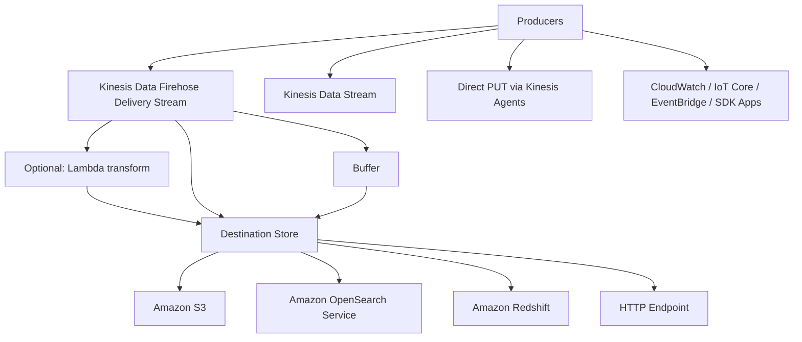

# 230. Amazon Data Firehose - Hands On

## 🎯 Giới thiệu
- Bài thực hành này demo cách dùng **Kinesis Data Firehose** qua **delivery streams**.
- Luồng tổng quát:
  - Nhận data từ nhiều **producers**
  - Có thể **transform** bằng **Lambda**
  - Ghi vào các **destination** như **Amazon S3**
- Trong ví dụ này:
  - **Source**: **Kinesis Data Stream** (`DemoStream`)
  - **Destination**: **Amazon S3**

## 1. Nguồn dữ liệu và tạo delivery stream
- Vào **Delivery streams** và tạo một **delivery stream** mới.
- Firehose có thể ingest data từ:
  - **Kinesis Data Stream**
  - **Direct PUTs** qua **Kinesis Agents**
  - Các dịch vụ AWS như **CloudWatch**, **IoT Core**, **EventBridge**
  - Ứng dụng riêng dùng **SDK**
- Điểm cần nhớ cho thi:
  - **OpenSearch Service** (ElasticSearch đổi tên)
  - **Redshift**
  - **S3**
- Có thể dùng cả **custom HTTP endpoint** và nhiều **third-party services**, nhưng transcript nhấn mạnh không cần nhớ hết.

## 2. Transform, convert và destination
- Tùy chọn **Transform and convert records** là **optional**.
- Có thể dùng **Lambda** để:
  - transform
  - filter
  - un-compress
  - convert
  - process source records
- **Convert record format**:
  - Có thể đổi định dạng record sang **Parquet** hoặc **ORC**
  - Transcript nhấn mạnh đây là kiến thức ở mức high level cho phần data & analytics
- Chọn **destination**:
  - Trong demo, chọn **S3 bucket** đã tạo sẵn
- Các tùy chọn phụ:
  - **Dynamic partitioning**: chọn `No`
  - **S3 bucket prefix**: không cần trong demo
  - **Bucket error output prefix**: không dùng trong demo

## 3. Buffer, compression, encryption và kiểm tra kết quả
- **Buffer** là nơi Firehose gom record trước khi đẩy sang target.
- Mặc định Firehose ghi khoảng **5 MB** vào buffer trước khi deliver.
- Có thể:
  - tăng buffer để hiệu quả hơn
  - giảm buffer để gửi nhanh hơn
- **Buffer interval**:
  - `300 seconds` = khoảng 5 phút
  - `60 seconds` = nhanh hơn, là mức tối thiểu trong demo
  - `900 seconds` = khoảng 15 phút
- **Compression**:
  - Có thể nén bằng **GZIP**, **Snappy**, **Zip**, hoặc **Hadoop-Compatible Snappy**
  - Mục tiêu là tiết kiệm dung lượng và cost khi lưu vào **Amazon S3**
- **Encryption**:
  - Có tùy chọn bật/tắt
- **IAM role**:
  - Firehose tự tạo **IAM role**
  - Role này có quyền cần thiết để:
    - ghi vào **Amazon S3**
    - đọc từ **Kinesis Data Stream**
- Khi stream đã active:
  - Có thể xem **metrics**
  - Xem destination error logs qua **CloudWatch Logs**
- Quan trọng khi test:
  - Sau khi cấu hình Firehose, phải **gửi data mới**
  - Data đã có trước đó trong **Kinesis Data Stream** sẽ không tự động được xử lý cho Firehose
- Trong demo:
  - Dùng **CloudShell**
  - Gửi 3 records: `user signup`, `user login`, `user logout`
  - Chờ hơn **60 seconds**
  - Refresh **S3 bucket** và thấy object xuất hiện
  - Mở file ra sẽ thấy 3 record nằm chung trong một text file
- Dọn dẹp:
  - Xóa **delivery stream**
  - Xóa luôn **DemoStream**
  - Nếu không, sẽ tốn tiền theo giờ

## 📊 Bảng tóm tắt
| Tiêu chí | Mô tả |
|----------|------|
| Service chính | **Kinesis Data Firehose** |
| Source | **Kinesis Data Stream**, Direct PUT, CloudWatch, IoT Core, EventBridge, SDK apps |
| Transform | **Lambda** để transform/filter/un-compress/convert/process |
| Destination | **S3**, **OpenSearch Service**, **Redshift**, HTTP endpoint |
| Buffer | Gom record trước khi deliver; demo dùng **60 seconds** |
| Compression | **GZIP**, **Snappy**, **Zip**, **Hadoop-Compatible Snappy** |
| IAM | Firehose tự tạo **IAM role** để ghi S3 và đọc stream |
| Test flow | Gửi **data mới** sau khi tạo Firehose, chờ buffer flush rồi kiểm tra ở S3 |

## 💡 Mẹo ghi nhớ cho kỳ thi AWS
- Nhớ bộ ba destination quan trọng: **S3**, **OpenSearch Service**, **Redshift**.
- **Firehose** có thể nhận data từ nhiều nguồn, không chỉ **Kinesis Data Stream**.
- **Lambda** trong Firehose là bước **optional** để transform dữ liệu trước khi đẩy đi.
- **Buffer interval** quyết định tốc độ flush:
  - thấp hơn = nhanh hơn
  - cao hơn = chậm hơn nhưng có thể hiệu quả hơn
- Khi test Firehose, phải gửi **new records** sau khi tạo stream.
- Đừng quên cleanup:
  - xóa **delivery stream**
  - xóa **source stream**
  - nếu không sẽ phát sinh cost

## ✅ Kết luận
- **Amazon Data Firehose / Kinesis Data Firehose** là dịch vụ đưa dữ liệu từ nhiều nguồn vào các destination như **S3**, **OpenSearch Service**, và **Redshift**.
- Dữ liệu có thể được **transform bằng Lambda**, **nén**, **mã hóa**, và được Firehose tự động quản lý bằng **IAM role**.
- Trong hands-on này, dữ liệu từ **Kinesis Data Stream** được đẩy sang **Amazon S3** sau khi buffer đạt điều kiện flush.
