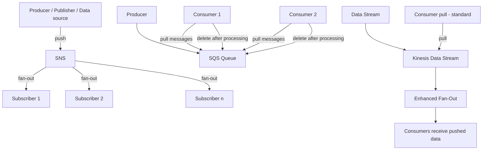

# 232. SQS vs SNS vs Kinesis

## 🎯 Giới thiệu
Bài này so sánh 3 dịch vụ AWS rất hay gặp trong đề thi: `SQS`, `SNS` và `Kinesis`.

- `SQS` theo mô hình **consumer pull**: consumer tự kéo message từ queue.
- `SNS` theo mô hình **pub/sub**: publisher đẩy message đến nhiều subscriber.
- `Kinesis` dùng cho **real-time data streaming**, có thể pull hoặc enhanced fan-out để push tới consumer.

## 1. SQS 🚚
`SQS` là dịch vụ queue với mô hình **pull**.

- Consumer sẽ **request messages** từ queue.
- Sau khi xử lý xong, consumer phải **delete message** để không còn consumer nào đọc lại được.
- Có thể có **nhiều workers / consumers** cùng đọc và xử lý message.
- Không cần provision throughput trước vì đây là **managed service** và có thể scale rất nhanh.
- **Ordering** chỉ có khi bật `FIFO queues`.
- Có thể đặt **individual message delay**, ví dụ message chỉ xuất hiện sau 30 giây.

## 2. SNS 📣
`SNS` là dịch vụ **pub/sub**.

- Publisher **push data** đến nhiều subscribers.
- Mỗi subscriber sẽ nhận **một bản copy** của message.
- Có thể lên đến **12,500,000 subscribers per SNS topic**.
- Sau khi gửi vào `SNS`, message **không persistent**.
- Nếu message không được deliver, có nguy cơ **mất dữ liệu**.
- Không cần provision throughput trước.
- Có thể kết hợp với `SQS` theo mô hình **fan out architecture**:
  - `SNS` + `SQS`
  - `SNS FIFO topics` + `SQS FIFO queues`

## 3. Kinesis 🌊
`Kinesis` có 2 cách consumption:

- **Standard mode**: consumers **pull data** từ Kinesis.
  - Throughput: **2 MB/s per shard**
- **Enhanced fan-out**: Kinesis **pushes data** vào consumers.
  - Throughput cao hơn
  - Cho phép nhiều applications đọc từ stream hơn

Các điểm chính:

- Data được **persisted**, nên có thể **replay data**.
- Dùng cho:
  - **real-time big data**
  - **analytics**
  - **ETL**
- Ordering có ở mức **shard level**
- Phải xác định số lượng **shards** trước cho mỗi `Kinesis data stream`
- Cần tự scale shards
- Data sẽ **expire after X days**
  - Theo transcript: từ **1 đến 365 days retention**
- Có 2 capacity modes:
  - `provisioned mode`: tự chỉ định số shards trước
  - `on-demand capacity mode`: Kinesis tự điều chỉnh số shards

## 📊 Bảng tóm tắt
| Tiêu chí | Mô tả |
|----------|------|
| Mô hình chính | `SQS` pull, `SNS` pub/sub push, `Kinesis` pull hoặc enhanced fan-out push |
| Persistence | `SQS` message nằm trong queue cho đến khi bị delete; `SNS` không persistent; `Kinesis` có persisted data |
| Ordering | `SQS` chỉ có khi dùng `FIFO`; `SNS` theo transcript không nhấn mạnh ordering; `Kinesis` ordering ở mức shard |
| Scale | Cả 3 đều là managed service và không cần provision throughput theo kiểu truyền thống |
| Fan-out | `SNS` rất phù hợp cho fan-out, có thể kết hợp với `SQS` |
| Use case | `SQS` cho queue và xử lý công việc; `SNS` cho broadcast đến nhiều subscriber; `Kinesis` cho streaming, analytics, ETL |
| Retention / Delay | `SQS` có message delay; `Kinesis` có retention từ 1 đến 365 ngày theo transcript |
| Capacity | `Kinesis` có `provisioned` và `on-demand`; `SQS`/`SNS` không cần provision throughput trước |

## 💡 Mẹo ghi nhớ cho kỳ thi AWS
- `SQS` = **Queue + Pull + Delete after processing**
- `SNS` = **Publish once, deliver to many**
- `Kinesis` = **Streaming data + replay + shards**
- Nhớ nhanh:
  - `SQS` cho **task queue**
  - `SNS` cho **fan-out notification**
  - `Kinesis` cho **real-time stream processing**
- Nếu đề bài nói:
  - **consumer tự lấy message** -> nghĩ `SQS` hoặc `Kinesis standard`
  - **gửi một message đến nhiều bên** -> nghĩ `SNS`
  - **cần replay / retention / analytics stream** -> nghĩ `Kinesis`

## ✅ Kết luận
- `SQS` là queue theo mô hình **pull**, message phải được delete sau xử lý.
- `SNS` là **pub/sub**, đẩy message đến nhiều subscribers nhưng không persistent.
- `Kinesis` là streaming service cho dữ liệu thời gian thực, có thể pull hoặc enhanced fan-out, hỗ trợ replay và retention theo thời gian.
