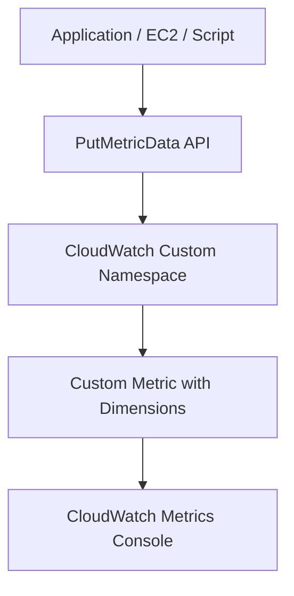

# 236. CloudWatch Custom Metrics

## 🎯 Giới thiệu
CloudWatch không chỉ nhận metrics mặc định từ các AWS services đã bật sẵn, mà còn cho phép tạo **custom metrics** do bạn tự định nghĩa.  
Ví dụ: bạn có thể đẩy lên CloudWatch các giá trị như:

- Memory usage của RAM
- Disk usage
- Số lượng user đăng nhập của application

Cách thực hiện là dùng API call **`PutMetricData`**.

## 1. Tạo Custom Metrics bằng `PutMetricData`
Bạn có thể tự tạo metric riêng cho CloudWatch thông qua **`PutMetricData`**.

- Đây là API dùng để push dữ liệu metric lên CloudWatch
- Có thể truyền:
  - `value`
  - `unit`
  - `timestamp`
  - `dimensions`
  - `storage resolution`

### Dimensions / Attributes
Bạn có thể thêm các **dimensions** hoặc **attributes** cho metric, ví dụ:

- `instance.id`
- `environment.name`
- `instance type`

Các tên này do bạn tự quyết định.

### Mermaid: luồng đẩy custom metric

## 2. Storage Resolution và độ phân giải metric
Khi tạo custom metric, bạn có thể chọn **storage resolution** với 2 kiểu:

- **Standard custom metric**
  - Push metric mỗi **1 minute / 60 seconds**
- **High resolution**
  - Push metric mỗi **1, 5, 10, hoặc 30 seconds**

Điểm cần nhớ là độ phân giải có thể được điều chỉnh bằng tham số API tương ứng.

## 3. Timestamp, dữ liệu quá khứ và tương lai
Một điểm rất quan trọng cho kỳ thi:

- Bạn có thể push metric với timestamp:
  - **tối đa 2 tuần trong quá khứ**
  - **tối đa 2 giờ trong tương lai**
- CloudWatch **không trả lỗi** trong các trường hợp này
- Vì vậy, nếu muốn dữ liệu khớp với thời gian thực của AWS, cần đảm bảo **EC2 instance time** được cấu hình đúng

### Ví dụ hành vi
- Nếu script trên EC2 đẩy metric định kỳ, CloudWatch sẽ nhận các datapoint đó
- Unified CloudWatch Agent cũng dùng chính **`PutMetricData`** để đẩy metrics định kỳ

## 📊 Bảng tóm tắt
| Tiêu chí | Mô tả |
|----------|------|
| Cách tạo custom metric | Dùng API **`PutMetricData`** |
| Use case | Đẩy memory usage, disk usage, số user login, v.v. |
| Dimensions | Có thể tự định nghĩa như `instance.id`, `environment.name` |
| Standard resolution | Mỗi **60 giây** |
| High resolution | Mỗi **1, 5, 10, 30 giây** |
| Timestamp giới hạn | **2 tuần trong quá khứ**, **2 giờ trong tương lai** |
| Lưu ý quan trọng | CloudWatch chấp nhận timestamp lệch thời gian trong giới hạn trên, không báo lỗi |

## 💡 Mẹo ghi nhớ cho kỳ thi AWS
- Nhớ ngay: **Custom metrics = `PutMetricData`**
- **Dimensions** là do bạn tự đặt, không bị cố định
- **Standard** = 60 giây, **High resolution** = 1/5/10/30 giây
- Câu hỏi thi hay hỏi: CloudWatch có chấp nhận metric “lệch thời gian” không?
  - Có, nếu trong giới hạn **2 tuần quá khứ** và **2 giờ tương lai**
- Nếu thấy nhắc đến **Unified CloudWatch Agent**, hãy nhớ nó cũng dùng **`PutMetricData`**

## ✅ Kết luận
CloudWatch cho phép bạn tạo **custom metrics** rất linh hoạt bằng **`PutMetricData`**.  
Bạn có thể tự thêm dimensions, chọn độ phân giải tiêu chuẩn hoặc high resolution, và thậm chí gửi metric với timestamp trong quá khứ hoặc tương lai trong giới hạn cho phép. Đây là một chủ đề quan trọng và rất dễ xuất hiện trong đề AWS exam.
