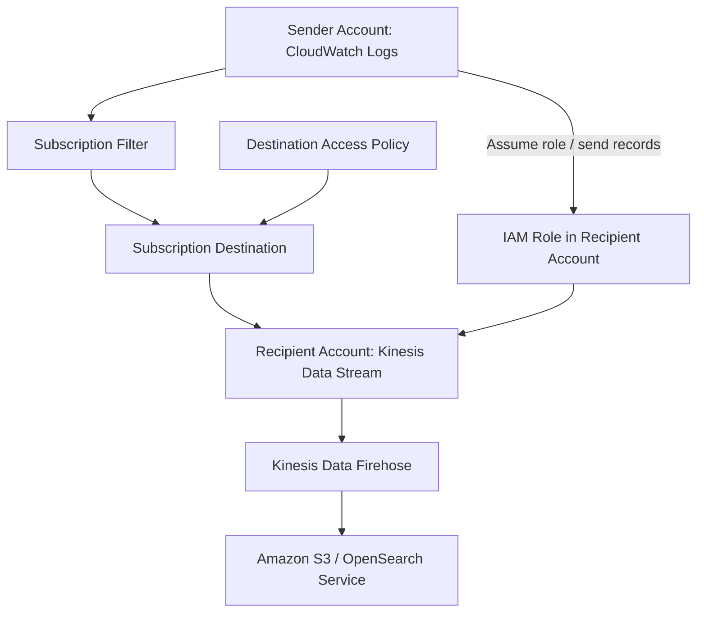

# 237. CloudWatch Logs

## 🎯 Giới thiệu
CloudWatch Logs là nơi phù hợp để lưu **application logs** trong AWS. Nội dung bài giảng tập trung vào:
- Cách tổ chức log bằng **log group** và **log stream**
- **Retention policy** để giữ log theo thời gian
- Cách **query**, **export**, và **stream** log sang các dịch vụ khác
- Cách **log aggregation** giữa nhiều account/region

## 1. Cấu trúc CloudWatch Logs
- **Log group**: tên do bạn tự đặt, thường đại diện cho một application.
- **Log stream**: nằm bên trong log group, đại diện cho:
  - một log instance trong application
  - một file log cụ thể
  - một container cụ thể trong cluster
- **Log expiration policy**:
  - có thể giữ vô thời hạn
  - hoặc đặt thời gian hết hạn từ **1 day đến 10 years**
- **Encryption**:
  - log được **encrypted by default**
  - có thể dùng **KMS-based encryption** với key riêng

## 2. Nguồn log và CloudWatch Logs Insights
### Nguồn log có thể gửi vào CloudWatch Logs
- Gửi bằng **SDK**
- Dùng **CloudWatch Logs Agent**
- Dùng **CloudWatch Unified Agent**  
  - Unified Agent là hướng được nhắc là thay thế dần, còn Logs Agent thì gần như **deprecated**
- Một số dịch vụ gửi log trực tiếp:
  - **Elastic Beanstalk**
  - **ECS**
  - **Lambda**
  - **VPC Flow Logs**
  - **API Gateway**
  - **CloudTrail**
  - **Route53**

### CloudWatch Logs Insights
- Là công cụ **query** log trong CloudWatch Logs
- Bạn có thể:
  - chọn **timeframe**
  - chạy query và xem **visualization**
  - xem các **specific log lines** tạo ra visualization đó
  - export kết quả hoặc add vào **dashboard**
- Hỗ trợ:
  - tìm các events gần nhất
  - đếm error/exception
  - tìm theo IP
  - filter theo điều kiện
  - aggregate statistics
  - sort, limit events
- Có thể query **multiple log groups** cùng lúc, kể cả ở **different accounts**
- Lưu ý quan trọng: **CloudWatch Logs Insights là query engine, không phải real-time engine**  
  -> chỉ query **historical data**

## 3. Export, Subscription và Log Aggregation
### Export sang Amazon S3
- Dùng khi cần **batch export**
- Có thể mất tới **12 hours**
- API dùng để khởi tạo: **CreateExportTask**
- Đây **không phải real-time** hoặc near real-time

### Subscription để stream log near real-time
- Dùng **CloudWatch Logs subscription**
- Cho phép stream log events gần real-time để xử lý và phân tích
- Có thể đẩy tới:
  - **Kinesis Data Streams**
  - **Kinesis Data Firehose**
  - **Lambda**
- Có thể dùng **subscription filter** để chọn loại log events cần gửi

### Log aggregation giữa nhiều account/region
- Có thể gom log từ nhiều **CloudWatch Logs** ở nhiều **accounts** và **regions** về một destination chung
- Luồng hoạt động:
  1. Tạo **CloudWatch Log subscription filter**
  2. Gửi tới **subscription destination**
  3. Destination là đại diện ảo của **Kinesis Data Stream** ở recipient account
  4. Gắn **destination access policy** để cho phép sender account gửi dữ liệu
  5. Tạo **IAM role** ở recipient account để cho phép ghi vào **Kinesis Data Stream**
  6. Đảm bảo role đó có thể được **assumed** bởi account đầu tiên

## 📊 Bảng tóm tắt
| Tiêu chí | Mô tả |
|----------|------|
| Mục đích | Lưu application logs trong AWS |
| Cấu trúc | **Log group** chứa nhiều **log stream** |
| Retention | Giữ vô thời hạn hoặc từ **1 day đến 10 years** |
| Mã hóa | Mặc định được encrypted, có thể dùng **KMS** riêng |
| Query | **CloudWatch Logs Insights** để query historical data |
| Export batch | Xuất sang **Amazon S3** bằng **CreateExportTask**, có thể mất đến 12 hours |
| Near real-time | Dùng **subscription** để stream tới **Kinesis Data Streams**, **Firehose**, **Lambda** |
| Aggregation | Có thể gom log đa account, đa region về destination chung |

## 💡 Mẹo ghi nhớ cho kỳ thi AWS
- **Log group = application**, **log stream = instance/file/container**
- **Insights = query historical data**, không phải real-time
- **CreateExportTask = batch export sang S3**
- **Subscription = near real-time streaming**
- Nhớ các đích phổ biến: **Kinesis Data Streams**, **Kinesis Data Firehose**, **Lambda**
- Khi thấy bài toán **cross-account log aggregation**, hãy nghĩ tới:
  - **subscription destination**
  - **destination access policy**
  - **IAM role**
  - **Kinesis Data Stream**

## ✅ Kết luận
CloudWatch Logs là dịch vụ trung tâm để lưu, query, export và stream log trong AWS. Điểm cần nhớ cho kỳ thi là cách tổ chức bằng **log group/log stream**, sự khác nhau giữa **Logs Insights** và **subscription**, cùng cơ chế **cross-account log aggregation**.
