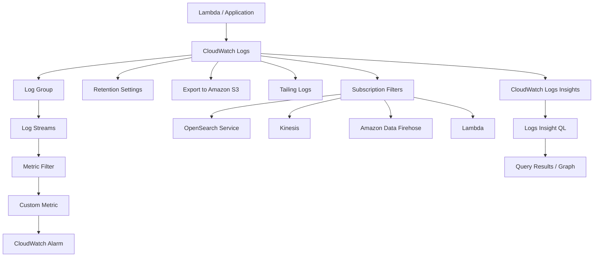

# 238. CloudWatch Logs - Hands On

## 🎯 Giới thiệu
CloudWatch Logs dùng để lưu và quan sát log từ AWS services hoặc từ application của bạn. Trong bài này, trọng tâm là cách:
- Xem **log groups** và **log streams**
- Tạo **metric filter** từ log
- Tạo **alarm** dựa trên metric sinh ra từ log
- Dùng thêm các chức năng như retention, export, tailing, subscription filters và **CloudWatch Logs Insights**

## 1. Log Groups và Log Streams
- Trong CloudWatch console, phần **Logs** hiển thị các **log groups**.
- Có 2 nguồn log chính được nhắc tới:
  - Log do AWS service tự tạo
  - Log do bạn tự tạo bằng cách tạo **log group** mới
- Khi tạo log group, có thể cấu hình:
  - **Retention policy**
  - Loại lưu trữ: **standard** hoặc **infrequent access**
  - **KMS key** để mã hóa
  - **Deletion protection** để tránh xóa nhầm
- **Log streams** được tạo dần theo thời gian.
- Với ví dụ **Lambda HelloWorld**, mỗi lần invoke có thể tạo ra log stream và chứa các log line bên trong.
- Mỗi log line có:
  - **timestamp**
  - **message**

## 2. Metric Filter và Alarm
- **Metric filter** dùng để tìm các text/pattern cụ thể trong log lines và tạo ra metric từ đó.
- Có thể dùng metric filter cho các tình huống như:
  - Đếm số lần xuất hiện của một từ như `info`
  - Tìm keyword như `start`
- Cần chú ý:
  - Filter pattern có thể gây **false positive**
  - Cần chỉnh pattern cẩn thận để khớp đúng ý định, ví dụ chỉ bắt `start request ID`
- Khi tạo metric filter, cần khai báo:
  - **Namespace**
  - **Metric name**
  - **Metric value**
  - Có thể thêm **dimensions** nếu cần phân biệt account, region, organization
- Metric từ filter chỉ được populate với **giá trị mới**, không backfill lịch sử.
- Sau khi có metric, có thể tạo **alarm** trên đó.
  - Ví dụ: nếu `count` lớn hơn `10` trong `5 minutes` thì trigger alarm
- Đây là cách tạo alerting dựa trên log thông qua metric.

## 3. Các thao tác khác với CloudWatch Logs
- Có thể:
  - Chỉnh **retention settings**
  - **Export** log sang **Amazon S3**
  - **Tail** logs để xem gần như real-time
  - Tạo **subscription filters** để stream log sang dịch vụ khác
- Các destination cho subscription filters được nhắc tới:
  - **Amazon OpenSearch Service**
  - **Kinesis**
  - **Amazon Data Firehose**
  - **Lambda**
- **CloudWatch Logs Insights** cho phép query log bằng **Logs Insight QL**
  - Viết query rồi bấm **Run query**
  - Có thể xem:
    - Kết quả query
    - Graph theo thời gian
  - Có các **saved queries** và query mẫu như:
    - 25 log events gần nhất
    - Số exceptions mỗi 5 phút
    - Latency statistics theo 5-minute intervals
- Nội dung Logs Insights được mô tả là hữu ích để thực hành thực tế.

## 📊 Bảng tóm tắt
| Tiêu chí | Mô tả |
|----------|------|
| Log group | Nơi chứa logs trong CloudWatch Logs |
| Log stream | Các luồng log được tạo theo thời gian, thường gắn với các lần invoke |
| Metric filter | Lọc pattern trong log để tạo metric |
| Alarm | Cảnh báo dựa trên metric sinh từ log |
| Retention | Quy định thời gian log hết hạn |
| Export | Đẩy log ra Amazon S3 |
| Tailing | Xem log gần như real-time |
| Subscription filters | Stream log sang OpenSearch, Kinesis, Firehose hoặc Lambda |
| Logs Insights | Query log bằng Logs Insight QL |

## 💡 Mẹo ghi nhớ cho kỳ thi AWS
- **Log group** là cấp chứa log, **log stream** là dòng log cụ thể theo thời gian.
- **Metric filter** biến log thành metric, rồi từ metric mới tạo **alarm**.
- **CloudWatch Logs Insights** là công cụ để query log, không phải để lưu log.
- Nhớ 4 destination của **subscription filters** trong transcript: **OpenSearch Service, Kinesis, Amazon Data Firehose, Lambda**.
- Khi thấy `KMS key`, `retention`, `export to S3`, hãy liên tưởng ngay đến thao tác quản lý log trong CloudWatch Logs.

## ✅ Kết luận
CloudWatch Logs không chỉ để xem log, mà còn giúp:
- Tổ chức log bằng **log groups** và **log streams**
- Biến log thành metric bằng **metric filter**
- Tạo **alarm** để theo dõi bất thường
- Phân tích log bằng **Logs Insights**
- Điều hướng log sang dịch vụ khác bằng **subscription filters**
