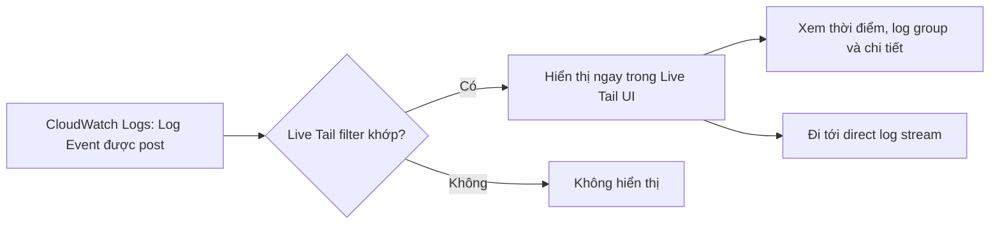

# 239. CloudWatch Logs - Live Tail - Hands On

## 🎯 Giới thiệu
- **Live Tail** là một tính năng của **CloudWatch Logs** giúp theo dõi log event gần như theo thời gian thực.
- Trong bài hands-on này:
  - Tạo **log group** `demo log group`
  - Tạo **log stream** `DemoLogStream`
  - Bật **Start tailing** để xem log event xuất hiện ngay khi được post vào CloudWatch Logs
- Tính năng này rất hữu ích cho **debugging** khi log được đẩy lên nhanh liên tục.

## 1. Thiết lập Live Tail
- Tạo **log group** và **log stream** trước khi tailing.
- Mở log stream rồi chọn **Start tailing**.
- Trong giao diện **Live Tail**:
  - Có thể filter theo **log group**
  - Có thể chọn thêm **log stream** cụ thể, nhưng đây là **optional**
- Sau khi apply filter, Live Tail sẽ chờ các log event phù hợp.

## 2. Cách hoạt động của Live Tail
- Khi có **log events** mới được post vào CloudWatch Logs, chúng sẽ xuất hiện trong **Live Tail UI** nếu khớp filter.
- Ví dụ trong bài:
  - Vào `demo log stream`
  - Chọn **Actions** → tạo **log event**
  - Gửi event `hello world`
- Sau khi post, event này xuất hiện ngay trong Live Tail.
- Từ giao diện Live Tail có thể xem thêm:
  - Thời điểm xảy ra
  - Log group
  - Thông tin liên quan khác
- Có thể click để đi tới **direct log stream** nơi event đó xuất hiện.

## 3. Điểm cần nhớ khi ôn thi
- **Live Tail** là công cụ rất tiện cho **debugging** CloudWatch Logs.
- Có thể theo dõi log gần như **real-time**.
- Filter theo **log group** và **log stream** giúp thu hẹp kết quả.
- Có link để mở thẳng sang **log stream** liên quan.

## 📊 Bảng tóm tắt
| Tiêu chí | Mô tả |
|----------|------|
| Tính năng | **CloudWatch Logs Live Tail** |
| Mục đích | Theo dõi log event gần như real-time để debugging |
| Đối tượng áp dụng | **Log group** và tùy chọn **log stream** |
| Cách dùng | Start tailing, apply filter, chờ log event xuất hiện |
| Ví dụ trong bài | Post log event `hello world` vào `DemoLogStream` |
| Điểm tiện lợi | Xem nhanh thời gian, group, và mở trực tiếp log stream |
| Lưu ý chi phí | Chỉ có vài giờ mỗi ngày, ví dụ khoảng **1 hour/day free usage**; nên **cancel/close session** để tránh phát sinh cost |

## 💡 Mẹo ghi nhớ cho kỳ thi AWS
- **Live Tail = xem log “ngay lập tức”** để debug nhanh.
- Nhớ 3 ý chính:
  - **Filter** theo log group / log stream
  - **Real-time appearance** của log event
  - **Direct link** đến log stream gốc
- Lưu ý về **pricing**: phải đóng session khi không dùng.

## ✅ Kết luận
- **CloudWatch Logs Live Tail** là tính năng hữu ích để theo dõi log event theo thời gian thực.
- Trong hands-on này, chỉ cần tạo **log group**, **log stream**, bật **Start tailing**, rồi post log event để thấy nó xuất hiện ngay.
- Đây là công cụ rất phù hợp cho việc **debugging** nhanh trong CloudWatch Logs.
