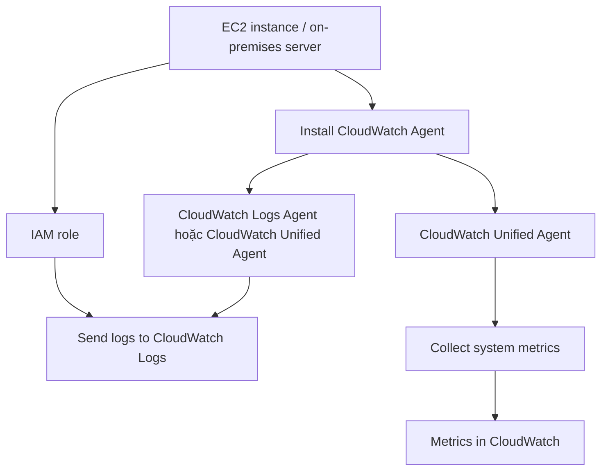

# 240. CloudWatch Agent & CloudWatch Logs Agent

## 🎯 Giới thiệu
CloudWatch Agents dùng để lấy **logs** từ **EC2 instances** và cả **metrics** rồi đẩy lên **CloudWatch**.

- Mặc định, **EC2 instance** không tự gửi logs lên CloudWatch.
- Cần cài và chạy một **agent** nhỏ trên EC2 để push log files mong muốn.
- **CloudWatch Logs Agent** và **CloudWatch Unified Agent** cũng có thể cài trên **on-premises servers**.
- Để gửi logs lên **CloudWatch Logs**, EC2 instance cần có **IAM role** phù hợp.

## 1. CloudWatch Logs Agent
- Là **agent cũ**.
- Chỉ có thể gửi **logs** lên **CloudWatch Logs**.
- Dùng cho **EC2**, **virtual servers**, và **on-premises servers**.

## 2. CloudWatch Unified Agent
- Là **agent mới**.
- Có thể làm **2 việc**:
  - Gửi **logs** lên **CloudWatch Logs**
  - Thu thập thêm **system level metrics**
- Hỗ trợ **centralized configuration** qua **SSM Parameter Store**.
- Đây là điểm cải tiến so với agent cũ.

## 3. Metrics mà Unified Agent thu thập
Unified Agent cho phép thu thập metrics chi tiết hơn so với monitoring mặc định của EC2.

- **CPU metrics**: active, guest, idle, system, user, steal
- **Disk metrics**: free, used, total
- **Disk IO**: writes, reads, bytes, iops
- **RAM**: free, inactive, used, total, cached
- **Netstats**: TCP/UDP connections, net packets, bytes
- **Processes**: dead, blocked, idle, running, sleep
- **Swap Space**: free, used, percentage

## 📊 Bảng tóm tắt
| Tiêu chí | Mô tả |
|----------|------|
| Mục đích | Đưa **logs** và **metrics** từ EC2/on-premises lên CloudWatch |
| Cách hoạt động | Cài **agent** trên server rồi push dữ liệu lên CloudWatch |
| CloudWatch Logs Agent | Agent cũ, chỉ gửi **logs** |
| CloudWatch Unified Agent | Agent mới, gửi **logs** và thu thập **metrics** |
| Quản lý cấu hình | Unified Agent hỗ trợ **SSM Parameter Store** |
| Yêu cầu quyền | EC2 cần **IAM role** để gửi logs lên **CloudWatch Logs** |
| Dữ liệu metrics | CPU, Disk, Disk IO, RAM, Netstats, Processes, Swap Space |

## 💡 Mẹo ghi nhớ cho kỳ thi AWS
- Nhớ rằng **EC2 mặc định không tự gửi logs** lên CloudWatch.
- Nếu đề bài nhắc đến **logs + metrics + granularity cao**, nghĩ ngay đến **CloudWatch Unified Agent**.
- Nếu chỉ nhắc đến **logs**, đó có thể là **CloudWatch Logs Agent**.
- **SSM Parameter Store** là dấu hiệu nhận biết của **Unified Agent**.
- **IAM role** là điều kiện cần để EC2 gửi logs lên **CloudWatch Logs**.

## ✅ Kết luận
- **CloudWatch Logs Agent**: agent cũ, chỉ gửi **logs**.
- **CloudWatch Unified Agent**: agent mới, gửi **logs** và thu thập **metrics** chi tiết hơn.
- Cả hai có thể dùng cho **EC2** và **on-premises servers**, nhưng Unified Agent là lựa chọn tốt hơn khi cần quan sát hệ thống sâu hơn.
