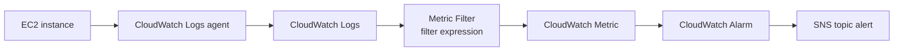

# 241. CloudWatch Logs - Metric Filters

## 🎯 Giới thiệu
CloudWatch Logs **metric filter** cho phép bạn tạo **filter expression** trên log để:
- Tìm một giá trị cụ thể, ví dụ một **IP**
- Đếm số lần xuất hiện của từ **`error`**
- Từ kết quả đó, tạo ra một **CloudWatch metric**

Metric này sau đó có thể dùng để kích hoạt **CloudWatch alarm**.

## 1. Metric Filter là gì? 🔍
- Là cơ chế lọc dữ liệu trong **CloudWatch Logs**
- Dựa trên **filter expression**
- Có thể chuyển log pattern thành **metric**
- Hữu ích khi muốn theo dõi số lần một sự kiện xảy ra trong log

Ví dụ trong transcript:
- Tìm một IP cụ thể trong log
- Đếm số lần xuất hiện của `error`

## 2. Cách hoạt động của Metric Filter ⚙️
- Log được stream vào **CloudWatch Logs** từ **CloudWatch Logs agent** trên một **EC2 instance**
- **Metric filter** áp dụng lên log events
- Từ filter expression, AWS tạo ra một **real CloudWatch metric**
- Metric này có thể được dùng cho alerting

## 3. Điểm cần nhớ khi thi AWS 🧠
- Metric filter **không filter ngược lại dữ liệu cũ**
- Chỉ những event xảy ra **sau khi tạo filter** mới được push thành metric
- Có thể chỉ định **tối đa 3 dimensions** cho metric filter
- Metric từ filter có thể dùng để tạo **alarm**
- Ví dụ alert trong transcript: nếu đếm được **5 lần error trong chưa đầy 1 phút** thì có thể cảnh báo qua **SNS topic**

## 📊 Bảng tóm tắt
| Tiêu chí | Mô tả |
|----------|------|
| Mục đích | Tạo metric từ log dựa trên filter expression |
| Ví dụ | Tìm IP cụ thể, đếm số lần `error` |
| Dữ liệu cũ | Không áp dụng retroactively |
| Dimensions | Tối đa 3 dimensions |
| Tích hợp | CloudWatch Alarm, SNS topic |
| Nguồn log | Có thể đến từ CloudWatch Logs agent trên EC2 |

## 💡 Mẹo ghi nhớ cho kỳ thi AWS
- Nhớ cụm: **Logs -> Metric Filter -> Metric -> Alarm -> SNS**
- Nếu đề bài nói đến việc **đếm số lần xuất hiện trong log** rồi cảnh báo, hãy nghĩ ngay đến **CloudWatch Logs metric filter**
- Từ khóa quan trọng: **filter expression**, **metric**, **alarm**, **no retroactive filtering**

## ✅ Kết luận
**CloudWatch Logs metric filter** biến dữ liệu log thành **CloudWatch metric** từ một **filter expression**, hỗ trợ theo dõi và cảnh báo theo sự kiện trong log. Điểm quan trọng nhất là **chỉ áp dụng cho log sau thời điểm tạo filter** và có thể dùng để kích hoạt **CloudWatch alarm** hoặc gửi cảnh báo qua **SNS**.
