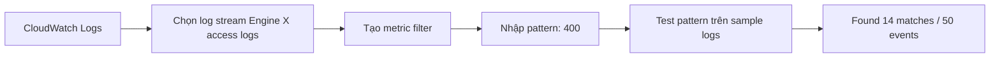

# 242. CloudWatch Logs - Metric Filters Hands On

## 🎯 Giới thiệu
Bài này minh họa cách tạo **metric filter** trong **CloudWatch Logs** từ log của **Engine X access logs**, để tìm các event có mã **400** và chuyển chúng thành **custom metric** trong **CloudWatch Metrics**.

## 1. Tạo Metric Filter từ Log Events
- Trong **CloudWatch Logs**, tìm pattern đơn giản là `400`.
- Có thể tạo metric filter ngay từ log stream hoặc vào mục **Metric filters** để tạo mới.
- Khi test pattern trên sample logs, hệ thống tìm thấy **14 matches trên 50 events**.
- Ý chính: pattern càng đúng thì metric filter càng khớp với log events cần theo dõi.

## 2. Gán Metric Namespace, Name và Value
- Đặt tên metric filter là **MetricFilter400Code**.
- Tạo **metric namespace** là **MetricFilters**.
- Đặt **metric name** là **MyDemoFilter**.
- Khi có match, publish **metric value = 1**.
- Nếu không có value được publish thì **default value = 0**.
- Sau khi tạo xong, metric sẽ xuất hiện trong **CloudWatch Metrics**.

## 3. Metric Filter Không Backfill và Tạo Alarm
- Metric filter **không retroactive**:
  - Không backfill dữ liệu cũ.
  - Chỉ bắt đầu ghi metric từ lúc filter được tạo.
- Để tạo dữ liệu mới, tác giả restart app servers trong **MyFirstBeanstalk environment**.
- Sau đó mở app và truy cập `/test` để sinh thêm log.
- Khi refresh **CloudWatch Metrics**, thấy custom namespace **MetricFilters** và metric **MyDemoFilter**.
- Metric hiện tại là **0** vì chưa phát hiện event 400 mới.
- Có thể click metric để tạo **CloudWatch alarm**:
  - Dùng metric **MyDemoFilter**
  - Đặt static threshold, ví dụ **greater than 50**
  - Chọn gửi alarm tới **SMS topic**
  - Đặt tên alarm là **DemoMetricFilterAlarm**
- Kết quả: alarm được gắn với metric filter, tạo nền tảng cho **notifications**.

## 📊 Bảng tóm tắt
| Tiêu chí | Mô tả |
|----------|------|
| Nguồn dữ liệu | Log từ **CloudWatch Logs** |
| Mục tiêu | Bắt các log có mã **400** |
| Công cụ | **Metric filter** |
| Pattern test | Khớp **14/50 events** trong sample logs |
| Metric namespace | **MetricFilters** |
| Metric name | **MyDemoFilter** |
| Metric value khi match | **1** |
| Default value | **0** |
| Đặc tính quan trọng | **Không retroactive**, không backfill dữ liệu cũ |
| Hành động tiếp theo | Tạo **CloudWatch alarm** và gửi qua **SMS topic** |

## 💡 Mẹo ghi nhớ cho kỳ thi AWS
- **Metric filter** = biến log thành **metric**.
- **Không retroactive** = tạo sau thì chỉ theo dõi từ thời điểm tạo trở đi.
- Nhớ chuỗi xử lý: **CloudWatch Logs -> Metric Filter -> CloudWatch Metrics -> CloudWatch Alarm**.
- Khi thấy câu hỏi về giám sát log và cảnh báo, hãy nghĩ đến việc dùng **metric filter** để đếm pattern trong log.
- Tên quan trọng trong bài:
  - Filter: **MetricFilter400Code**
  - Namespace: **MetricFilters**
  - Metric: **MyDemoFilter**
  - Alarm: **DemoMetricFilterAlarm**

## ✅ Kết luận
Bài thực hành này cho thấy cách dùng **CloudWatch Logs metric filters** để phát hiện pattern trong log, chuyển chúng thành **custom metric**, rồi tạo **CloudWatch alarm** để phục vụ giám sát và thông báo. Điểm cần nhớ nhất là **metric filter không backfill dữ liệu cũ** và chỉ ghi nhận log từ lúc được tạo.
