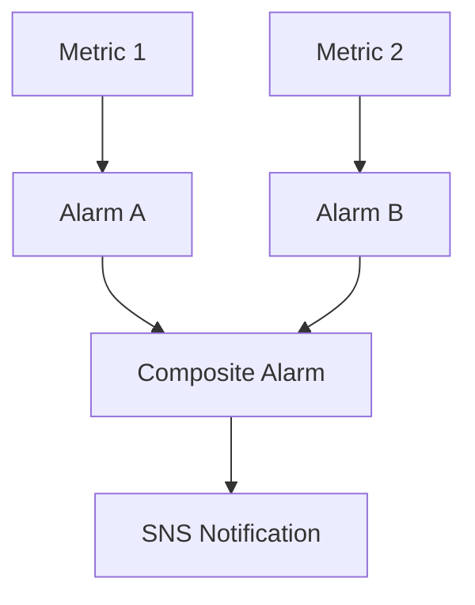

# 243. CloudWatch Alarms

## 🎯 Giới thiệu
CloudWatch Alarms dùng để:
- Kích hoạt notification dựa trên **metric**
- Theo dõi ngưỡng và tạo phản ứng tự động khi metric bị breach
- Áp dụng cho các tình huống như **EC2 actions**, **Auto Scaling**, hoặc gửi cảnh báo qua **SNS** rồi nối tiếp sang **Lambda**

## 1. Cơ chế hoạt động của CloudWatch Alarms
- Alarm có thể được cấu hình theo nhiều kiểu:
  - sampling
  - percentage
  - maximum
  - các biến thể khác tùy metric
- Alarm có **3 states**:
  - **OK**: chưa bị trigger
  - **INSUFFICIENT_DATA**: chưa đủ dữ liệu để xác định trạng thái
  - **ALARM**: ngưỡng đã bị breach, notification sẽ được gửi
- **Period** là khoảng thời gian alarm dùng để evaluate metric
  - Có thể rất ngắn hoặc rất dài
  - Hỗ trợ cả **high resolution custom metrics**
  - Ví dụ: **10 seconds**, **30 seconds**, hoặc bội số của **60 seconds**

## 2. Targets và Composite Alarms
### 🎯 3 mục tiêu chính của Alarm
- Thực hiện action trên **EC2 instance**
  - stop
  - terminate
  - reboot
  - recover
- Kích hoạt **Auto Scaling**
  - scale out
  - scale in
- Gửi notification tới **SNS**
  - từ **SNS** có thể hook sang **Lambda** để xử lý linh hoạt

### 🔗 Composite Alarms
- **CloudWatch Alarm** thường theo dõi **một metric**
- **Composite Alarm** dùng khi muốn kết hợp **nhiều alarms**
- Composite Alarm theo dõi trạng thái của các alarm con, mỗi alarm con có thể dựa trên một metric khác nhau
- Có thể dùng điều kiện **AND** hoặc **OR**
- Mục đích chính:
  - giảm **alarm noise**
  - chỉ alert khi kết hợp nhiều điều kiện đúng theo ý muốn

### Ví dụ trong transcript
- **Alarm A** theo dõi **CPU** của EC2
- **Alarm B** theo dõi **IOPS** của EC2
- **Composite Alarm** kết hợp Alarm A và Alarm B
- Nếu cả hai cùng vào trạng thái alarm thì Composite Alarm sẽ trigger và có thể gửi **SNS notification**

## 3. EC2 Instance Recovery và Test Alarm
### 🛠️ EC2 instance recovery
CloudWatch Alarm có thể gắn với các **status checks** của EC2:
- **Instance status check**: kiểm tra virtual machine của EC2
- **System status check**: kiểm tra tầng hardware underlying
- **Attached EBS status check**: kiểm tra health của EBS volume gắn kèm

Khi alarm bị breach:
- Có thể kích hoạt **EC2 instance recovery**
- Mục tiêu là chuyển instance sang host khác
- Khi recovery:
  - giữ nguyên **private IP**
  - giữ nguyên **public IP**
  - giữ nguyên **elastic IP**
  - giữ nguyên **metadata**
  - giữ nguyên **placement group**
- Có thể gửi alert tới **SNS topic** để biết instance đã được recover

### 📩 Alarm từ CloudWatch Logs metric filter
- Có thể tạo alarm trên một **CloudWatch Logs metric filter**
- Khi số lần xuất hiện của một từ khóa cụ thể quá nhiều, ví dụ **error**
- Alarm sẽ gửi message tới **Amazon SNS**

### 🧪 Test alarm
- Có thể dùng CLI:
  - `set alarm states`
- Mục đích:
  - test alarm và notification
  - ép alarm trigger dù threshold thật chưa bị breach
- Hữu ích khi cần kiểm tra action thực tế của infrastructure

## 📊 Bảng tóm tắt
| Tiêu chí | Mô tả |
|----------|------|
| Mục đích | Trigger notification từ metric |
| Trạng thái | **OK**, **INSUFFICIENT_DATA**, **ALARM** |
| Period | Thời gian dùng để evaluate metric |
| Target chính | EC2 actions, Auto Scaling, SNS/Lambda |
| Composite Alarm | Kết hợp nhiều alarms bằng **AND/OR** |
| EC2 Recovery | Recover instance và giữ nguyên IP, metadata, placement group |
| Test alarm | Dùng CLI `set alarm states` |

## 💡 Mẹo ghi nhớ cho kỳ thi AWS
- **Alarm = 1 metric**, **Composite Alarm = nhiều alarms**
- Nhớ 3 state: **OK / INSUFFICIENT_DATA / ALARM**
- **ALARM** nghĩa là threshold đã bị breach
- **SNS** thường là điểm nhận notification, rồi có thể nối sang **Lambda**
- EC2 recovery giữ nguyên:
  - **private IP**
  - **public IP**
  - **elastic IP**
  - **metadata**
  - **placement group**
- **status checks** của EC2 gồm:
  - instance
  - system
  - attached EBS
- `set alarm states` dùng để **test** alarm, không cần chờ threshold thật

## ✅ Kết luận
CloudWatch Alarms là cơ chế theo dõi metric và tự động phản ứng khi vượt ngưỡng. Điểm cần nhớ nhất là **3 states**, các **targets** của alarm, cách dùng **Composite Alarms** để giảm noise, và khả năng **EC2 instance recovery** cùng test bằng `set alarm states`.
