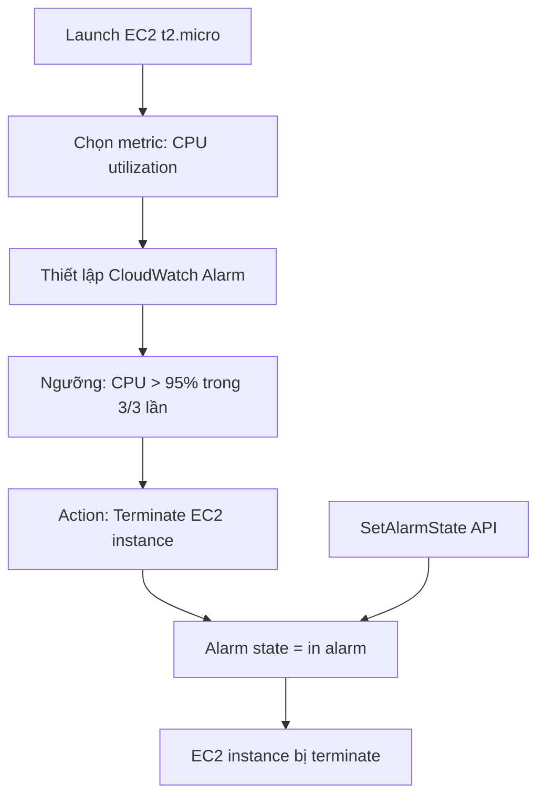

# 244. CloudWatch Alarms Hands On

## 🎯 Giới thiệu
Bài này minh hoạ cách dùng **CloudWatch Alarms** để giám sát **EC2 CPU utilization** và kích hoạt hành động khi vượt ngưỡng.  
Mục tiêu thực hành là tạo một alarm, gắn hành động **terminate EC2 instance** khi CPU bị giữ ở mức cao trong thời gian đủ lâu.

## 1. Tạo EC2 instance và chuẩn bị metric
- Tạo nhanh một **EC2 instance t2.micro**.
- Sau khi instance được launch, vào phần **EC2 per-instance metric** để tìm metric của chính instance đó.
- Ban đầu metric có thể chưa xuất hiện ngay, transcript ghi nhận mất khoảng **5 phút** để dữ liệu hiện lên.
- Khi metric đã có, chọn **CPU utilization** của instance.

## 2. Cấu hình CloudWatch Alarm
- Chọn cách tính metric như:
  - `average`
  - `sum`
  - `maximum`
- Chọn **period** là **5 minutes** vì metric được cập nhật theo chu kỳ này nếu không bật detailed monitoring.
- Thiết lập điều kiện:
  - **Static** hoặc **Anomaly detection**
  - So sánh kiểu `greater than`
- Ví dụ trong bài:
  - CPU **greater than 95%**
  - Trong **3 out of 3** lần kiểm tra
  - Tương đương khoảng **15 phút** CPU bị cao liên tục
- Khi alarm chuyển sang trạng thái **alarm**, chọn action là:
  - **EC2 action**
  - **Terminate instance**
- Đặt tên alarm theo nội dung mô tả, ví dụ:
  - `EC2 on high CPU`

## 3. Kiểm tra alarm bằng `SetAlarmState`
- Alarm ban đầu có thể ở trạng thái **insufficient data** cho đến khi đủ dữ liệu.
- Thay vì chờ CPU thật sự tăng cao, transcript dùng API **`SetAlarmState`** để mô phỏng trạng thái alarm.
- Các tham số được dùng:
  - `alarm name`
  - `state value = alarm`
  - `state reason = testing`
- Sau khi ép alarm sang trạng thái **in alarm**:
  - CloudWatch ghi nhận alarm chuyển từ **OK** sang **in alarm**
  - Action đã được thực thi thành công
  - **EC2 instance bị terminate**

## 📊 Bảng tóm tắt
| Tiêu chí | Mô tả |
|----------|------|
| Mục tiêu | Dùng **CloudWatch Alarms** để giám sát **EC2 CPU utilization** |
| Metric | **CPU utilization** của instance |
| Chu kỳ đánh giá | **5 minutes** |
| Điều kiện ví dụ | CPU **greater than 95%** trong **3 out of 3** lần |
| Action | **EC2 action**: **terminate instance** |
| Cách test | Dùng API **SetAlarmState** để đẩy alarm sang trạng thái **alarm** |
| Kết quả | Alarm kích hoạt và **EC2 instance** bị terminate |

## 💡 Mẹo ghi nhớ cho kỳ thi AWS
- **CloudWatch Alarm** không chỉ cảnh báo, mà còn có thể gắn **action** trực tiếp.
- Nếu metric chưa xuất hiện ngay, transcript cho thấy có thể phải chờ khoảng **5 phút**.
- `SetAlarmState` là cách nhanh để **test alarm behavior** mà không cần chờ tải thật.
- Khi thấy bài thi nhắc đến:
  - **CPU cao kéo dài**
  - **Terminate instance**
  - **CloudWatch alarm action**
  thì hãy nghĩ đến **CloudWatch Alarms + EC2 action**.
- Trạng thái quan trọng cần nhớ: **insufficient data**, **OK**, **alarm**.

## ✅ Kết luận
Bài thực hành này cho thấy quy trình đầy đủ: tạo **EC2 instance**, chọn metric **CPU utilization**, cấu hình **CloudWatch Alarm** với ngưỡng cao, rồi dùng **SetAlarmState** để kiểm tra. Khi alarm vào trạng thái **in alarm**, action đã cấu hình sẽ chạy và **terminate EC2 instance**.
