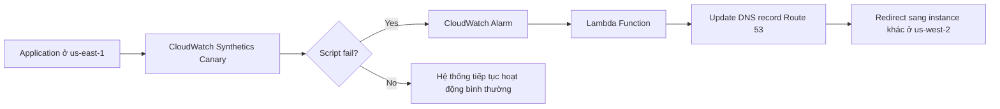

# 245. CloudWatch Synthetics

## 🎯 Giới thiệu
CloudWatch Synthetics Canary là một tính năng dùng để chạy một **configurable script** từ CloudWatch nhằm giám sát **APIs, URLs, websites**.

- Mục tiêu là mô phỏng lại hành vi của khách hàng một cách **programmatically**
- Giúp phát hiện lỗi **trước khi khách hàng gặp phải**
- Có thể kiểm tra:
  - **flow** có hoạt động đúng không
  - **availability**
  - **latency**
  - **load time data**
  - **screenshots** của UI

## 1. CloudWatch Synthetics Canary hoạt động như thế nào
Bạn viết một script để tái hiện các bước người dùng thực hiện trên website hoặc application.

- Ví dụ:
  - vào product page
  - click
  - add to cart
  - checkout
  - nhập credit card details
  - xác nhận checkout hoạt động

Nếu script thất bại, điều đó cho thấy có vấn đề trong hệ thống.

## 2. Ngôn ngữ, browser và lịch chạy
Script của Synthetics Canary có thể viết bằng:

- **Node.js**
- **Python**

Bên trong Canary, bạn có thể dùng:

- **headless Google Chrome browser**
- thực hiện các thao tác như trên Chrome thật

Cách chạy:

- chạy **once**
- hoặc chạy theo **regular schedule**

Điều này phù hợp khi bạn muốn kiểm tra định kỳ **availability** của endpoint.

## 3. Blueprints và các kiểu kiểm tra
CloudWatch Synthetics cung cấp một số **blueprints** để dùng nhanh:

- **Heartbeat Monitor**
  - load URL
  - lưu **screenshots**
  - lưu **HTTP archive file**
  - xác nhận mọi thứ hoạt động đúng
- **API Canary**
  - kiểm tra các chức năng **read** và **write** cơ bản của **REST APIs**
- **Broken Link Checker**
  - kiểm tra toàn bộ link bên trong URL đang test
  - নিশ্চিত đảm bảo không có link nào bị broken
- **Visual monitoring**
  - so sánh screenshot trong lần chạy Canary với **baseline screenshot**
- **Canary Recorder**
  - dùng với **CloudWatch Synthetics Recorder**
  - record thao tác trên website
  - tự động sinh script để chạy lại trên Canary
- **GUI Workflow Builder**
  - xác minh các thao tác trên webpage, ví dụ như **login form**, có hoạt động đúng không

## 📊 Bảng tóm tắt
| Tiêu chí | Mô tả |
|----------|------|
| Mục đích | Giám sát APIs, URLs, websites bằng script mô phỏng hành vi người dùng |
| Ngôn ngữ script | **Node.js**, **Python** |
| Browser hỗ trợ | **headless Google Chrome** |
| Cách chạy | Chạy một lần hoặc theo lịch định kỳ |
| Dữ liệu kiểm tra | Flow, availability, latency, load time data, screenshots |
| Tích hợp xử lý lỗi | **CloudWatch Alarm** -> **Lambda** -> có thể cập nhật **Route 53** |
| Blueprints | Heartbeat Monitor, API Canary, Broken Link Checker, Visual monitoring, Canary Recorder, GUI Workflow Builder |

## 💡 Mẹo ghi nhớ cho kỳ thi AWS
- **Canary = script mô phỏng user journey**
- Nhớ 3 nhóm giá trị chính:
  - **monitor API/URL/website**
  - **measure availability + latency**
  - **capture screenshots + load time**
- Khi có lỗi:
  - **CloudWatch Alarm** có thể kích hoạt **Lambda**
  - **Lambda** có thể cập nhật **Route 53** để redirect sang nơi khác
- Các blueprint hay được hỏi:
  - **Heartbeat Monitor**
  - **API Canary**
  - **Broken Link Checker**
  - **Visual monitoring**
  - **Canary Recorder**

## ✅ Kết luận
CloudWatch Synthetics Canary là công cụ dùng để **tự động kiểm tra trải nghiệm người dùng và tình trạng hoạt động của hệ thống** bằng script chạy trong CloudWatch. Nó giúp phát hiện lỗi sớm, kiểm tra endpoint, ghi nhận screenshot, và hỗ trợ nhiều blueprint sẵn có để kiểm thử nhanh các luồng quan trọng.
