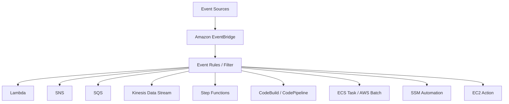

# 246. Amazon EventBridge

## 🎯 Giới thiệu
Amazon EventBridge là dịch vụ dùng để **xử lý events** và **route events** đến các đích khác nhau trong AWS.

- Tên cũ là **CloudWatch Events**.
- Dùng cho:
  - **Schedule** jobs theo cron / interval.
  - **React to event patterns** khi một service hoặc action nào đó xảy ra.
- EventBridge có thể nhận event từ nhiều nguồn, rồi áp dụng **Event Rules** để lọc và gửi đến các destination phù hợp.

## 1. Event Sources và Use Cases
EventBridge có thể nhận event từ nhiều nguồn khác nhau:

- **AWS services**
  - **EC2**: start, stop, terminate
  - **S3**: khi object được upload
  - **CodeBuild**: build fail
  - **Trusted Advisor**: có new finding về security
- **CloudTrail + EventBridge**
  - Có thể intercept các **API call** trong AWS accounts
- **Schedule / cron**
  - Ví dụ:
    - mỗi giờ trigger một **Lambda function**
    - mỗi 4 giờ
    - mỗi Monday 8:00 AM
    - ngày Monday đầu tiên của tháng

### Event pattern
- Không chỉ chạy theo lịch, EventBridge còn có thể phản ứng với **event pattern**.
- Ví dụ:
  - detect **IAM root user sign in**
  - sau đó gửi notification qua **SNS** để nhận email

## 2. Event Bus
EventBridge có 3 loại event bus chính:

| Loại event bus | Mô tả |
|---|---|
| **Default event bus** | Nhận events từ AWS services trong account |
| **Partner event bus** | Nhận events từ các partner/SaaS như **Zendesk**, **Datadog**, **Auth0** |
| **Custom event bus** | Ứng dụng của bạn tự gửi events vào bus riêng |

### Ý nghĩa thực tế
- **Default event bus**: dùng cho event phát sinh trong AWS.
- **Partner event bus**: nhận event từ hệ thống bên ngoài AWS.
- **Custom event bus**: app của bạn publish event riêng, rồi dùng **EventBridge rules** để route tiếp.

## 3. Event Flow, Archive, Schema Registry, Policies
### Event flow
- Event từ source đi vào EventBridge.
- EventBridge tạo ra một **JSON document** chứa chi tiết event:
  - instance nào start
  - ID
  - time
  - IP
  - và các thông tin liên quan khác
- Sau đó event có thể được gửi tới nhiều destination khác nhau.

### Destinations có thể được trigger
- **Lambda**
- **AWS Batch**
- **ECS task**
- **SQS**
- **SNS**
- **Kinesis Data Stream**
- **Step Functions**
- **CodePipeline**
- **CodeBuild**
- **SSM automation**
- Các action như **start / stop / restart EC2 instance**

### Archive và Replay
- EventBridge có thể **archive events**
- Có thể lưu:
  - toàn bộ events
  - hoặc một subset theo filter
- Retention:
  - **indefinite**
  - hoặc theo một khoảng thời gian xác định
- Có thể **replay archived events**
  - rất hữu ích khi debug / troubleshooting / test lại production flow sau khi fix bug

### Schema Registry
- EventBridge có **Schema Registry**
- Nó phân tích events trong bus để **infer schema**
- Schema này giúp:
  - generate code cho application
  - biết trước cấu trúc dữ liệu của event
- Schema có thể **versioned**

### Resource-based policies
- EventBridge hỗ trợ **resource based policies** cho event bus
- Dùng để:
  - allow / deny events từ account hoặc region khác
- Use case:
  - xây dựng **central event bus** trong AWS Organization
  - các account khác dùng **put events** vào central bus
- Event bus có thể **cross-account** nhờ resource-based policy

## 📊 Bảng tóm tắt
| Tiêu chí | Mô tả |
|----------|------|
| Tên cũ | **CloudWatch Events** |
| Mục đích chính | Nhận, lọc và route events |
| Cách kích hoạt | Theo **schedule/cron** hoặc **event pattern** |
| Nguồn event | EC2, S3, CodeBuild, Trusted Advisor, CloudTrail, partner SaaS, custom app |
| Đích đến | Lambda, SNS, SQS, ECS, Batch, Kinesis, Step Functions, CodePipeline, CodeBuild, SSM, EC2 action |
| Event bus | **Default**, **Partner**, **Custom** |
| Tính năng đặc biệt | **Archive**, **Replay**, **Schema Registry**, **Resource-based policies** |
| Use case nổi bật | Security alert, automation, event-driven architecture, cross-account event aggregation |

## 💡 Mẹo ghi nhớ cho kỳ thi AWS
- **EventBridge = events + rules + destinations**
- Nhớ 3 loại event bus:
  - **Default** = AWS services
  - **Partner** = SaaS/partner
  - **Custom** = app tự gửi
- **Archive + Replay** rất hữu ích cho **debugging** và **troubleshooting**
- **Schema Registry** giúp biết trước cấu trúc JSON event và generate code
- **Resource-based policies** dùng cho **cross-account event bus**
- Nếu đề bài nói về:
  - schedule job
  - event-driven trigger
  - nhận event từ SaaS
  - central event bus trong organization  
  thì nghĩ ngay đến **Amazon EventBridge**

## ✅ Kết luận
Amazon EventBridge là dịch vụ trung tâm để xử lý event trong AWS. Nó hỗ trợ **schedule**, **event pattern**, nhiều loại **event bus**, **archive/replay**, **Schema Registry**, và **cross-account access** bằng **resource-based policies**. Đây là dịch vụ quan trọng cho kiến trúc **event-driven** và rất hay xuất hiện trong đề thi AWS.
