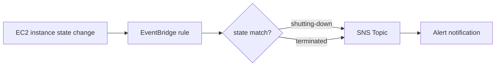
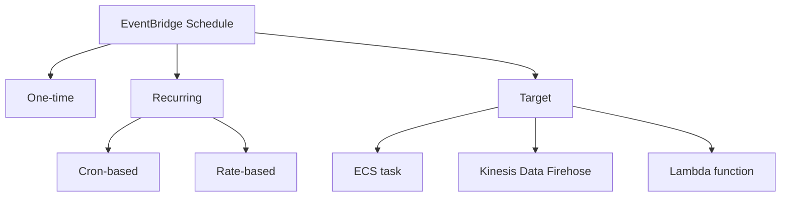

# 247. Amazon EventBridge - Hands On

## 🎯 Giới thiệu
Amazon EventBridge được dùng để xử lý các **events** theo nhiều cách:
- Tạo **rule với event pattern** để bắt các sự kiện phù hợp.
- Tạo **schedule rule** để chạy theo lịch.
- Dùng **Pipe** để chuyển dữ liệu từ event source sang target, có thể kèm **filtering** và **enrichment**.
- Dùng **schema registry** để xem schema của các events.

## 1. EventBridge Rule với Event Pattern
- Tạo rule để phản ứng khi **EC2 instance** bị **shutting down** hoặc **terminated**.
- Chọn **Service Events** để xem danh sách event theo từng service.
- Ví dụ nổi bật trong transcript: **EC2 instance State-change Notification**.
- Event có:
  - **schema**: mô tả cấu trúc event.
  - **sample event**: ví dụ dữ liệu thực tế.
- Filter theo field **state** với điều kiện **Equal**.
- Hai giá trị cần bắt:
  - `shutting-down`
  - `terminated`
- Target được chọn là **SNS Topic** để nhận alert.
- Hệ thống tự tạo **IAM role / exception role** để EventBridge có quyền gửi message vào SNS.
- Khi hoàn tất, rule có thể đặt tên như `NotifyEC2InstanceShutdownOrTerminated`.

## 2. EventBridge Schedule
- **Schedule** là cách để chạy tác vụ theo thời gian.
- Có thể tạo:
  - **one-time schedule**: chạy một lần.
  - **recurring schedule**: chạy lặp lại.
- Có 2 kiểu lịch:
  - **Cron-based schedule**
  - **rate schedule**
- Ví dụ trong transcript:
  - chạy **1 hour**
  - **no flexible time window**
- Target của schedule có thể là:
  - **Amazon ECS task**
  - ghi vào **Kinesis Data Firehose**
  - **invoke Lambda function**
- Sau khi tạo xong, bạn có một schedule trong **Amazon EventBridge**.

## 3. Các tính năng khác của EventBridge
- **Event buses**
  - **Default event bus**: nhận các **AWS-generated events**.
  - **Custom event bus**: tự tạo để gửi **custom events** vào, phục vụ ứng dụng riêng.
- **Archive**
  - Lưu lại events đã xảy ra trên event bus.
- **Replay**
  - Phát lại một event cũ từ archive.
- **Partner event sources**
  - Nhận dữ liệu từ **third-party partners** trực tiếp vào AWS account.
  - Ví dụ trong transcript: **Auth0**.
- **API destinations**
  - Kết nối EventBridge tới **external HTTP destination**.
  - Hỗ trợ tích hợp với hạ tầng bên ngoài.
- **Schemas**
  - Chứa schema của các AWS events.
  - Có thể có **custom registry** cho events riêng.
  - Giúp hiểu **shape** và **form** của events trong EventBridge.
- Có thể vào **rules** để **disable** rule nếu cần.

## 📊 Bảng tóm tắt
| Tiêu chí | Mô tả |
|----------|------|
| Event pattern rule | Bắt event theo điều kiện, ví dụ EC2 state change |
| Filter chính | Lọc theo `state = shutting-down` hoặc `terminated` |
| Target phổ biến | SNS Topic để gửi alert |
| Schedule | Chạy tác vụ theo lịch one-time hoặc recurring |
| Schedule types | Cron-based hoặc rate schedule |
| Event bus | Default bus cho AWS events, custom bus cho custom events |
| Archive / Replay | Lưu và phát lại event cũ |
| Partner sources | Nhận event từ third-party như Auth0 |
| API destinations | Kết nối ra HTTP destination bên ngoài |
| Schemas | Xem cấu trúc event và custom registry |

## 💡 Mẹo ghi nhớ cho kỳ thi AWS
- **Rule + event pattern**: dùng khi muốn phản ứng với event cụ thể, như **EC2 state change**.
- **Schedule**: dùng khi muốn chạy theo thời gian, nhớ 2 kiểu là **Cron** và **rate**.
- **SNS Topic** thường là target phù hợp khi cần **alert**.
- **Default event bus** = AWS-generated events.
- **Custom event bus** = events do bạn tự gửi vào.
- **Archive** để lưu, **Replay** để chạy lại event cũ.
- **Partner event sources** và **API destinations** là các cách mở rộng EventBridge ra ngoài AWS.
- **Schema registry** giúp hiểu cấu trúc event trước khi xử lý.

## ✅ Kết luận
Amazon EventBridge trong bài này được minh họa qua 3 ý chính:
- **Event pattern rule** để bắt event như **EC2 shutting-down/terminated**.
- **Schedule** để chạy tác vụ theo thời gian.
- Các tính năng mở rộng như **event bus**, **archive/replay**, **partner event sources**, **API destinations**, và **schemas** để xây dựng tích hợp linh hoạt hơn.
