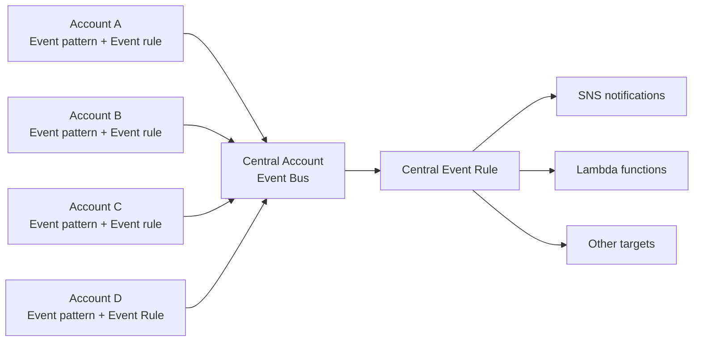

# 248. Amazon EventBridge - Multi-Account Aggregation

## 🎯 Giới thiệu
- Bài học này mô tả cách dùng **EventBridge** để **aggregate events từ nhiều AWS accounts** về một **central account event bus**.
- Mục tiêu là theo dõi tập trung các **EC2 state changes** từ nhiều account, rồi xử lý tiếp ở account trung tâm.

## 1. Mô hình multi-account aggregation
- Giả sử có nhiều AWS accounts và muốn gom các events về một account trung tâm.
- Trong từng account, bạn tạo:
  - **event pattern**
  - **event rule**
- Rule sẽ bắt các **state changes** của resources, ví dụ **EC2 instances**.

## 2. Gửi event sang central account
- Điểm quan trọng của kiến trúc này:
  - **Target của event rule trong một account có thể là event bus ở account khác**
- Để account A có thể gửi event vào central account:
  - cần tạo **resource policy** trên **event bus** của central account
  - policy này phải cho phép nhận events từ các account khác
- Sau đó áp dụng cùng mô hình cho account B, C, D để toàn bộ events đều đổ về central event bus.

## 3. Xử lý tại central event bus
- Khi events đã tập trung về central account, bạn có thể tạo **event rule** riêng trên central event bus để:
  - trigger **SNS notifications**
  - trigger **Lambda functions**
  - hoặc bất kỳ target nào khác theo nhu cầu

## 🔁 Mermaid Flow

## 📊 Bảng tóm tắt
| Tiêu chí | Mô tả |
|----------|------|
| Mục tiêu | Gom events từ nhiều AWS accounts về một account trung tâm |
| Nguồn event | Các **EC2 state changes** trong từng account |
| Thành phần chính | **event pattern**, **event rule**, **event bus**, **resource policy** |
| Điều kiện để cross-account | Central event bus phải có **resource policy** cho phép account khác gửi event |
| Xử lý ở trung tâm | Tạo rule trên central bus để trigger **SNS**, **Lambda**, hoặc target khác |

## 💡 Mẹo ghi nhớ cho kỳ thi AWS
- Nhớ cấu trúc: **Account source -> Event rule -> Central event bus -> Central processing**
- Điểm hay bị hỏi: **cross-account EventBridge cần resource policy trên event bus nhận**
- Nếu đề bài nói “gom event từ nhiều accounts về một nơi để xử lý tập trung”, hãy nghĩ ngay đến **EventBridge multi-account aggregation**

## ✅ Kết luận
- **EventBridge** có thể dùng để **aggregate events từ nhiều accounts** về một **central event bus**.
- Mỗi account tạo **event rule** riêng, và central account cần **resource policy** để nhận events.
- Sau khi tập trung, central account có thể tiếp tục trigger **SNS**, **Lambda**, hoặc các target khác.
