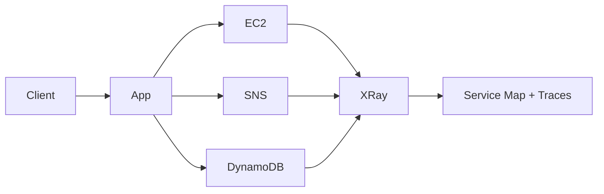

# 249. X-Ray Overview

## 🎯 Giới thiệu
AWS X-Ray là dịch vụ dùng để **debug và quan sát ứng dụng production** theo cách trực quan hơn so với việc chỉ dựa vào log.

- Hữu ích khi bạn có:
  - nhiều application riêng lẻ
  - distributed services / microservices
  - khó nhìn ra toàn bộ **service map**
- X-Ray giúp:
  - thấy request đi qua các thành phần nào
  - xác định lỗi, bottleneck, latency cao
  - hiểu dependency giữa các service
  - biết request nào fail, service nào chậm, user nào bị ảnh hưởng

## 1. Vì sao cần X-Ray
Cách debug truyền thống thường rất khó chịu:

- test local
- thêm log khắp nơi
- deploy lại production
- đọc log từ nhiều ứng dụng khác nhau trong CloudWatch

Vấn đề của cách này:

- log từ nhiều app có format khác nhau
- khó centralize insights
- khó phân tích và điều hướng log
- với microservices thì gần như thành “nightmare”

X-Ray giải quyết bằng cách cung cấp **visual analysis** cho application.

## 2. X-Ray hoạt động như thế nào
X-Ray dùng **tracing** để theo dõi một request từ đầu đến cuối.

- Mỗi component xử lý request sẽ thêm trace của riêng nó
- Trace gồm:
  - **segments**
  - **subsegments**
- Có thể thêm **annotations** để đính kèm thông tin bổ sung
- Có thể lấy trace theo:
  - toàn bộ request
  - hoặc chỉ một phần request theo tỷ lệ / số lượng giới hạn

Ví dụ luồng request:

- client gửi request đến application
- application gọi các dịch vụ khác như:
  - IPs
  - SNS
  - DynamoDB Table
- X-Ray hiển thị trực quan thành graph, giúp bạn thấy lỗi nằm ở đâu

Điểm quan trọng trong exam:

- bạn không chỉ thấy “có lỗi”
- mà còn thấy **lỗi phát sinh từ service nào**

## 3. Cách bật X-Ray và các yêu cầu
Để enable X-Ray, transcript nêu 2 phần chính:

### a) Modify code
- Code có thể là:
  - Java
  - Python
  - Go
  - Node.js
  - .Net
- Phải import **AWS SDK**
- **X-Ray SDK** sẽ capture:
  - AWS service calls
  - HTTP / HTTPS requests
  - database calls như:
    - MySQL
    - PostgreSQL
    - DynamoDB
  - queue calls

### b) Chạy X-Ray daemon hoặc bật integration
- Nếu chạy trên:
  - on-premise server
  - EC2 instance
- thì phải cài **X-Ray daemon**
- Daemon là chương trình chạy cục bộ, intercept low-level UDP packet
- Hỗ trợ:
  - Linux
  - Windows
  - Mac

Nếu dùng dịch vụ đã tích hợp sẵn với X-Ray như:
- AWS Lambda
- các service khác có integration

thì daemon sẽ được AWS chạy thay cho bạn.

### c) IAM permissions
- Ứng dụng phải có **IAM rights** để ghi dữ liệu lên X-Ray
- Với Lambda:
  - cần **IAM execution role** có policy phù hợp
  - cần import X-Ray code
  - cần bật **active tracing** trên Lambda

### d) Lỗi thường gặp trên EC2
Nếu X-Ray chạy local nhưng không chạy trên EC2, nguyên nhân thường là:

- EC2 chưa chạy **X-Ray daemon**
- hoặc **IAM role** chưa có quyền phù hợp

## 📊 Bảng tóm tắt
| Tiêu chí | Mô tả |
|----------|------|
| Mục tiêu | Quan sát và debug production bằng tracing trực quan |
| Vấn đề giải quyết | Log rời rạc, khó debug microservices, khó thấy dependency |
| Cơ chế chính | Trace gồm segments, subsegments, annotations |
| Kết quả | Service map và phân tích request path rõ ràng |
| Tích hợp | Lambda, Beanstalk, ECS, ELBs, API Gateway, EC2, on-premise |
| Cách bật | Modify code + cài X-Ray daemon hoặc bật integration |
| Yêu cầu bảo mật | IAM authorization, KMS for encryption at rest |
| Điểm dễ bị hỏi | EC2 cần daemon; Lambda cần execution role và active tracing |

## 💡 Mẹo ghi nhớ cho kỳ thi AWS
- **X-Ray = tracing + service map + visual debug**
- Nhớ cụm:
  - **code modification**
  - **X-Ray daemon**
  - **IAM permission**
- Với **EC2 / on-premise**:
  - phải cài daemon
- Với **Lambda**:
  - dùng integration + IAM execution role + active tracing
- X-Ray đặc biệt hữu ích cho **microservices** và request đi qua nhiều service
- Nếu đề hỏi “service nào gây lỗi / chậm”, X-Ray là đáp án rất đáng nghĩ tới

## ✅ Kết luận
AWS X-Ray là công cụ quan sát và debug mạnh cho application, nhất là distributed systems và microservices. Nó giúp theo dõi request theo **tracing**, hiển thị **segments/subsegments**, và tạo **service map** để tìm bottleneck, lỗi, và dependency trong hệ thống.
