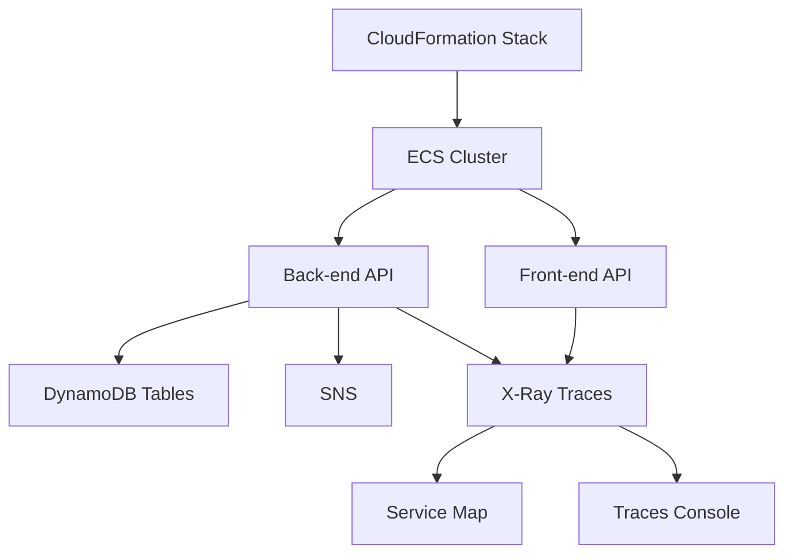

# 250. X-Ray Hands On

## 🎯 Giới thiệu
- Bài thực hành này dùng **X-Ray** trong **CloudWatch console** vì X-Ray console hiện đã nằm bên trong CloudWatch.
- Mục tiêu là tạo dữ liệu trace từ một demo app, rồi quan sát:
  - **service map**
  - **traces**
  - độ trễ, lỗi, và quan hệ giữa các thành phần
- Ý chính cần nhớ cho AWS exam:
  - X-Ray hữu ích khi muốn xem **dependencies** giữa các service
  - Kết hợp tốt với **metrics**, **logs**, và **alarms** trong cùng một nơi

## 1. Thiết lập demo app bằng CloudFormation
- Demo app mặc định của AWS không hoạt động tốt trong bài thực hành này, nên người dạy dùng một bản đã chỉnh sửa.
- Cách triển khai:
  - vào **CloudFormation**
  - tạo stack từ template trong thư mục **X-Ray**
  - chọn file **EB Javas Scorekeep X-Ray simplified**
  - đặt stack name là **Scorekeep X-Ray**
- Khi cấu hình stack:
  - giữ mặc định hầu hết các mục
  - chỉ chọn 3 giá trị ở cuối:
    - **Subnet 1**
    - **Subnet 2**
    - **VPCID**
- Lý do chọn các giá trị này:
  - để chỉ định nơi deploy resources
- Stack này sẽ deploy:
  - một **ECS cluster**
  - **front-end**
  - **back-end API**
  - các resource dùng **X-Ray**
  - chạy trên **T2/T3 micro**

## 2. Chạy ứng dụng và xem Service Map
- Sau khi stack deploy xong:
  - vào **Resources** để thấy các resource đã tạo
  - ví dụ: **ECS execution role**, **ASG**, **DynamoDB game table**, và các thành phần khác
- Vào **Outputs** và mở **load balancer** để truy cập web app
- Trên UI:
  - chọn session là **games**
  - để chế độ **random**
  - tạo game với tên ví dụ **Sample Game**
  - chọn luật chơi **Tic Tac Toe**
- Sau đó:
  - mở game
  - chơi vài nước
  - hệ thống sẽ gửi **traces** vào X-Ray

- **Service map** cho thấy:
  - các dependency giữa component trong AWS
  - cách API calls đi qua các service
  - các node như:
    - **ECS container**
    - nhiều **DynamoDB tables**
    - **SNS**
    - **session table**
    - **state table**
- Nếu có lỗi:
  - node sẽ được tô màu cảnh báo
  - có thể xem latency, số request, số faults, và response time distribution

## 3. Traces, latency và phân tích lỗi
- Vào **View traces** để mở **traces console**
- Có thể:
  - chạy query để xem trace
  - lọc theo **node**
  - tập trung vào một service cụ thể như **ECS container** hoặc một **DynamoDB table**
- Khi lọc query:
  - số trace giảm, ví dụ từ **21 traces** còn **10 traces**
- Có thể xem:
  - **latency distribution**
  - request nào chậm, ví dụ có request trên **500 ms**
- Khi mở một trace cụ thể:
  - thấy trace map chi tiết cho riêng trace đó
  - thấy breakdown của request theo từng event
  - ví dụ một POST request đã gọi nhiều **DynamoDB GetItem** trên các bảng khác nhau
- Trong phần trace details có thể xem:
  - **errors**
  - **resources**
  - **annotations**
  - **metadata**
- Ý nghĩa thực hành:
  - giúp hiểu request đi qua những bước nào
  - giúp xác định chỗ chậm hoặc lỗi
- Lưu ý về console:
  - bản X-Ray console mới hiện chỉ có:
    - **service map**
    - **traces**
  - các mục như **sampling**, **encryption**, **groups** vẫn chưa có trong console mới
  - các mục đó còn xuất hiện trong console cũ
- Kết thúc bài thực hành phải **delete stack** để không để resource chạy tiếp

## 📊 Bảng tóm tắt
| Tiêu chí | Mô tả |
|----------|------|
| Mục tiêu | Thực hành X-Ray để xem service dependency, traces, latency và lỗi |
| Nơi truy cập | X-Ray nằm trong **CloudWatch console** |
| Cách tạo data | Deploy demo app bằng **CloudFormation** |
| Resource chính | **ECS**, **DynamoDB**, **SNS**, load balancer, X-Ray traces |
| Chức năng nổi bật | **Service map**, **traces console**, query theo node, xem latency |
| Phân tích lỗi | Xem trace details, errors, annotations, metadata |
| Lưu ý quan trọng | X-Ray console mới chưa có đầy đủ tính năng như console cũ |
| Việc cần làm sau cùng | Xóa stack **Scorekeep X-Ray** |

## 💡 Mẹo ghi nhớ cho kỳ thi AWS
- **X-Ray = quan sát request path và dependency graph**
- **Service map** dùng để nhìn tổng quan các service liên kết với nhau như thế nào
- **Traces** dùng để đi sâu vào một request cụ thể và tìm điểm chậm hoặc lỗi
- Khi muốn phân tích microservices:
  - nhớ X-Ray cho thấy **API calls** giữa các thành phần
  - các vấn đề như **latency** và **faults** sẽ nổi bật trên service map
- Nếu đề bài nhắc đến:
  - “xem một request cụ thể”
  - “tìm chỗ chậm”
  - “xem các service phụ thuộc nhau ra sao”
  - thì **X-Ray** là lựa chọn phù hợp
- Nhớ rằng trong bài này:
  - demo app được dựng bằng **CloudFormation**
  - và sau khi xong phải **delete stack**

## ✅ Kết luận
- Bài hands-on này cho thấy cách dùng **X-Ray** để quan sát hệ thống từ mức tổng quan đến mức chi tiết.
- Điểm cần nhớ:
  - triển khai app bằng **CloudFormation**
  - tạo traffic bằng cách chơi game
  - xem **service map** để hiểu dependency
  - xem **traces** để phân tích latency, lỗi, và request breakdown
- Đây là phần rất quan trọng để ôn thi AWS vì nó gắn trực tiếp với việc quan sát và debug hệ thống phân tán.
