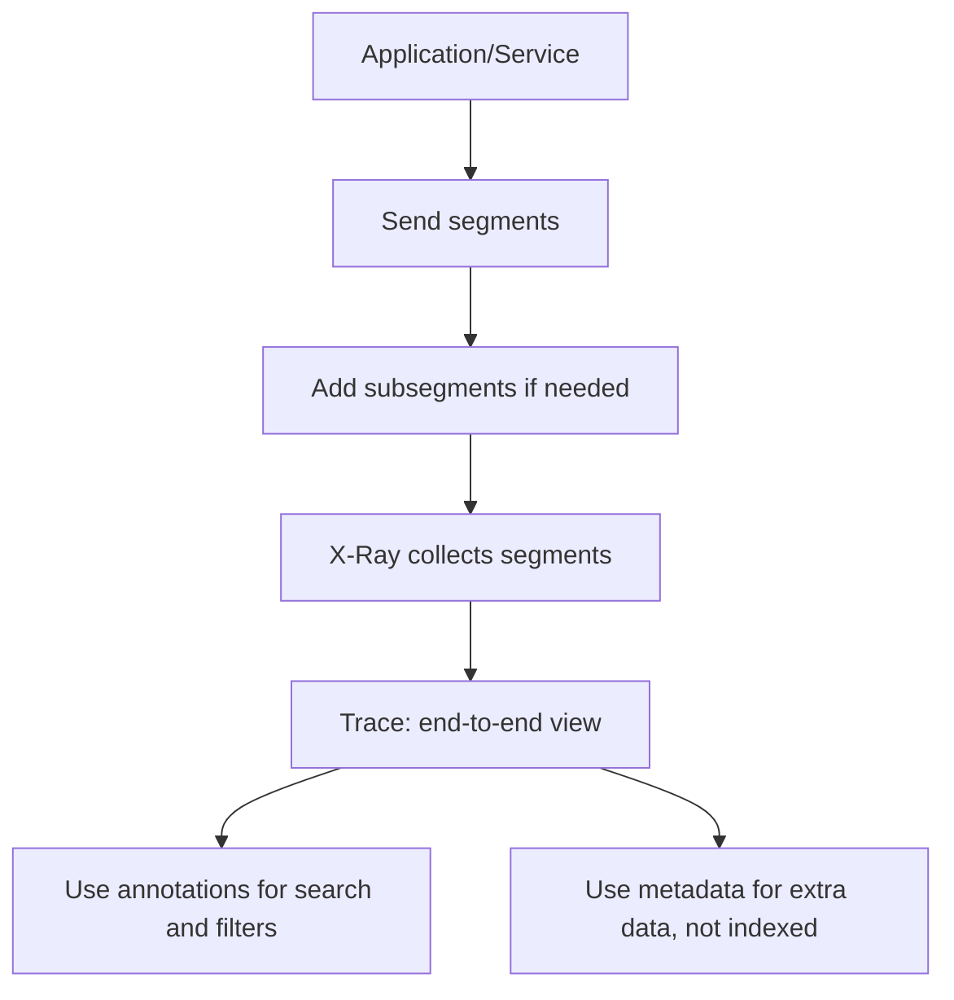

# 251. X-Ray: Instrumentation and Concepts

## 🎯 Giới thiệu
AWS X-Ray dùng để **instrumentation** ứng dụng, tức là:
- đo performance của hệ thống
- diagnose errors
- ghi lại trace information

Muốn dùng X-Ray hiệu quả, bạn cần hiểu cách **thêm X-Ray SDK vào code**, cách X-Ray tổ chức dữ liệu trace, và cách **sampling** kiểm soát lượng request gửi lên X-Ray service.

## 1. Instrumentation với X-Ray SDK
- Để instrument application, cần **thay đổi code** và dùng **X-Ray SDK**.
- Ví dụ với `node.js` và `express app`, chỉ cần thêm SDK và cấu hình phù hợp là code sẽ được instrumented.
- Sau đó, application sẽ gửi **trace information** vào X-Ray service.
- Mức độ thay đổi thường khá nhỏ:
  - đôi khi chỉ cần **configuration changes**
  - đôi khi cần chỉnh application code
- Có thể custom cách X-Ray hoạt động trong code bằng:
  - `interceptors`
  - `filters`
  - `handlers`
  - `middleware`

## 2. Các khái niệm cốt lõi: segment, subsegment, trace, annotations, metadata
- **segment**: phần dữ liệu cơ bản mà application/service gửi lên X-Ray.
- **subsegment**: dùng khi cần chi tiết hơn, granular hơn trong một segment.
- **trace**: tập hợp tất cả segments lại để tạo **end-to-end view** của API call hoặc request.
- **annotations**:
  - là key-value pair data
  - được **index**
  - dùng để **search traces** và filter
- **metadata**:
  - cũng là key-value pair
  - nhưng **không được index**
  - không dùng để search

### Mermaid: Trace flow

## 3. Sampling, custom rules, và cross-account tracing
- **sampling** dùng để giảm lượng data gửi tới X-Ray, từ đó giảm chi phí.
- Sampling rules có thể thay đổi **mà không cần sửa code**.
- Default sampling rule:
  - ghi nhận **every first request each second**
  - sau đó lấy **5%** các request bổ sung
- Phần “first request each second” được gọi là **reservoir**.
  - mục tiêu: đảm bảo ít nhất **1 trace mỗi second** nếu service vẫn đang nhận request
- Phần **5%** là rate cho các request vượt quá reservoir.

### Custom sampling rules
- Có thể tự định nghĩa:
  - `reservoir`
  - `rate`
- Ví dụ trong transcript:
  - đặt reservoir = 10, rate = 10% để gửi nhiều request hơn vào X-Ray
  - đặt reservoir = 1, rate = 1 để gửi **tất cả requests** vào X-Ray, phục vụ debugging
- Trong production, việc gửi quá nhiều data sẽ rất tốn kém.
- Điểm quan trọng:
  - đổi sampling rules trong **X-Ray console** thì **không cần restart application**
  - X-Ray daemon sẽ tự lấy rule mới và gửi đúng lượng data

### Cross-account traces
- **X-Ray daemon agent** có config để gửi traces **across accounts**.
- Cần đảm bảo **IAM permissions** đúng.
- Agent sẽ tự assume correct role để hỗ trợ **central account** cho logging và application tracing.

## 📊 Bảng tóm tắt
| Tiêu chí | Mô tả |
|----------|------|
| Instrumentation | Thêm X-Ray SDK vào code để gửi trace information |
| segment | Dữ liệu cơ bản từ application/service gửi lên X-Ray |
| subsegment | Chi tiết hơn trong segment |
| trace | Tập hợp segments thành end-to-end view |
| annotations | Key-value pair, được index, dùng search/filter |
| metadata | Key-value pair, không index, không dùng search |
| sampling | Giảm lượng data gửi lên X-Ray để giảm cost |
| default rule | 1 request đầu mỗi second + 5% request bổ sung |
| reservoir | Phần đảm bảo ít nhất 1 trace mỗi second |
| custom sampling | Tự chỉnh reservoir/rate, không cần restart app |
| cross-account tracing | Có thể gửi traces giữa accounts nếu IAM permissions đúng |

## 💡 Mẹo ghi nhớ cho kỳ thi AWS
- `segment` là đơn vị cơ bản, `subsegment` là chi tiết hơn.
- `trace` là bức tranh end-to-end, ghép từ nhiều segments.
- `annotations` thì **search được** vì có index, `metadata` thì **không**.
- Sampling giúp giảm cost, và rule có thể chỉnh từ console **không cần restart**.
- Default sampling rule = **1 trace mỗi second** + **5% phần còn lại**.
- Muốn debugging sâu thì tăng sampling, nhưng trong production phải cân nhắc chi phí.

## ✅ Kết luận
AWS X-Ray giúp bạn instrument application để thu thập trace, phân tích lỗi và quan sát luồng request end-to-end. Điểm cần nhớ nhất là cách dùng X-Ray SDK, sự khác nhau giữa `segment/subsegment/trace`, và vai trò của `annotations`, `metadata`, cùng cơ chế `sampling` để kiểm soát chi phí và lượng dữ liệu gửi lên X-Ray.
