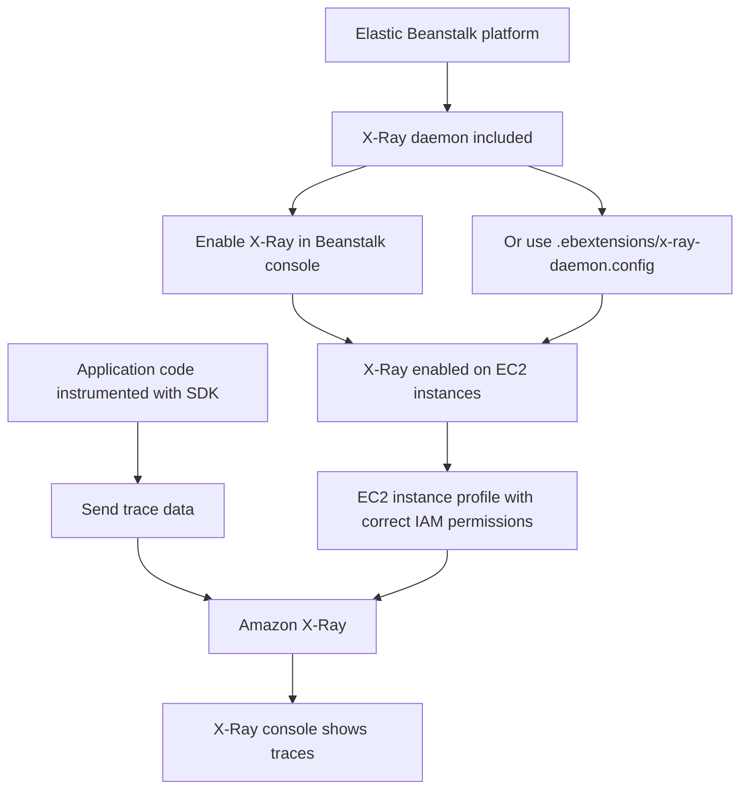

# 254. X-Ray with Beanstalk

## 🎯 Giới thiệu
- Mục tiêu của bài này là tích hợp **X-Ray** với **Elastic Beanstalk**.
- Điểm chính:
  - **Beanstalk platform** đã bao gồm sẵn **X-Ray daemon** nên không cần cài thêm.
  - Có thể bật daemon bằng:
    - một tùy chọn trong **Beanstalk console**, hoặc
    - file extension cấu hình `x-ray-daemon.config` trong thư mục `.ebextensions`.
- Khi dùng X-Ray với Beanstalk, cần:
  - **EC2 instance profile** có **IAM permissions** phù hợp để daemon ghi dữ liệu lên X-Ray.
  - Ứng dụng được **instrumented** bằng SDK để gửi trace.
- Nếu chạy **multi Docker container**, việc quản lý X-Ray sẽ do bạn tự làm.

## 1. Cách bật X-Ray trong Beanstalk ⚙️
- Beanstalk hỗ trợ bật **X-Ray daemon** trực tiếp trên platform.
- Cách cấu hình:
  - Bật trong **Beanstalk console**
  - Hoặc tạo file `x-ray-daemon.config`
- File này nằm trong `.ebextensions` và chỉ cần một dòng để enable daemon.
- Kết quả:
  - **X-Ray** sẽ được kích hoạt trên **Beanstalk EC2 instances**.

## 2. Yêu cầu về IAM và ứng dụng 🔐
- EC2 instance phải có **instance profile** với quyền IAM đúng.
- Trong môi trường mặc định của Beanstalk:
  - **AWS Elastic Beanstalk EC2 role**
  - Có sẵn policy như **Elastic Beanstalk Web Tier Policy**
  - Policy này đã bao gồm quyền cần thiết cho X-Ray
- Nếu bạn dùng **custom role**:
  - Phải tự đảm bảo role đó có đủ permission để daemon:
    - gửi dữ liệu tới **Amazon X-Ray**
    - và lấy dữ liệu cần thiết

## 3. Quy trình triển khai và quan sát trace 📈
- Khi tạo application trên Beanstalk:
  - Chọn **web server environment**
  - Chọn platform như **node.js**
  - Giữ các thiết lập mặc định
  - Ở phần monitoring, bật **Amazon X-Ray**
- Sau khi submit:
  - Beanstalk sẽ launch environment
  - X-Ray được activate trên EC2 instances
- Nếu ứng dụng không chỉ là trang chào mừng mà đã được tích hợp X-Ray:
  - trace sẽ xuất hiện trong **X-Ray console**

## 📊 Bảng tóm tắt
| Tiêu chí | Mô tả |
|----------|------|
| Thành phần chính | **Elastic Beanstalk**, **X-Ray daemon**, **EC2 instance profile**, **IAM permissions**, SDK instrumentation |
| Cách bật X-Ray | Bật trong **Beanstalk console** hoặc dùng `x-ray-daemon.config` trong `.ebextensions` |
| Điều kiện bắt buộc | EC2 instance phải có role phù hợp để daemon ghi dữ liệu lên **X-Ray** |
| Môi trường mặc định | **AWS Elastic Beanstalk EC2 role** đã có **Elastic Beanstalk Web Tier Policy** với quyền X-Ray |
| Kết quả | Trace của ứng dụng sẽ hiển thị trong **X-Ray console** nếu ứng dụng đã được tích hợp đúng |

## 💡 Mẹo ghi nhớ cho kỳ thi AWS
- **Beanstalk đã có sẵn X-Ray daemon**: không cần tự cài thêm.
- Nhớ 3 điều kiện khi dùng X-Ray với Beanstalk:
  - bật daemon,
  - có **IAM permission** đúng trên EC2 role,
  - app phải được **instrumented**.
- Nếu dùng **custom role**, hãy nghĩ ngay đến việc kiểm tra permission cho X-Ray.
- Với **multi Docker container**, transcript nhấn mạnh rằng bạn sẽ phải tự quản lý X-Ray.

## ✅ Kết luận
- **Elastic Beanstalk** hỗ trợ tích hợp **X-Ray** khá đơn giản vì platform đã bao gồm daemon.
- Chỉ cần bật X-Ray, đảm bảo **IAM role** phù hợp, và instrument ứng dụng bằng SDK.
- Sau đó trace sẽ có thể được xem trong **X-Ray console**.
- Đừng quên **terminate environment** sau khi thực hành.
