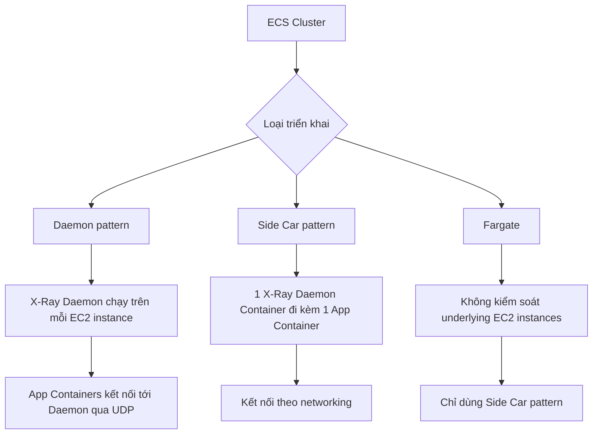
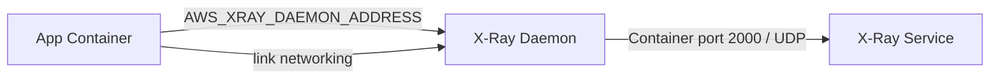

# 255. X-Ray & ECS

## 🎯 Giới thiệu
Bài này nói về cách tích hợp **ECS** với **X-Ray** và có **3 cách triển khai** chính. Trọng tâm là hiểu vị trí của **X-Ray Daemon**, cách nó kết nối với **App Container**, và điểm khác nhau giữa **EC2 launch type** và **Fargate**.

## 1. Daemon pattern
- Dùng khi ECS Cluster chạy trên **EC2 instances** mà bạn quản lý.
- **X-Ray Daemon Container** sẽ chạy như một **Daemon task** trên **mỗi EC2 instance**.
- Nếu cluster có 10 EC2 instances thì sẽ có **10 X-Ray Daemon Containers**.
- App Container sẽ gửi dữ liệu tới X-Ray Daemon thông qua **UDP port**.

### Ý chính
- 1 instance EC2 = 1 X-Ray Daemon Container.
- Các ứng dụng chạy trên cùng instance sẽ dùng daemon đó để gửi trace.

## 2. Side Car pattern
- Mỗi **App Container** sẽ có một **X-Ray Daemon Container** đi kèm.
- Hai container kết nối với nhau về mặt networking.
- Vì daemon chạy “bên cạnh” ứng dụng nên gọi là **Side Car**.
- Nếu có 20 App Containers trên 1 EC2 instance thì sẽ có **20 X-Ray Side Car Containers**.

### Ý chính
- 1 App Container = 1 X-Ray Side Car.
- Không phụ thuộc vào việc daemon chạy theo từng EC2 instance nữa.

## 3. Fargate với X-Ray
- Với **Fargate**, không có quyền kiểm soát các **EC2 instances underlying**.
- Vì vậy:
  - **Không dùng được Daemon Container theo EC2 instance**
  - **Phải dùng Side Car pattern**
- Khi chạy Fargate task, sẽ có:
  - **App Container**
  - **X-Ray Side Car**

### Ý chính
- Fargate chỉ phù hợp với mô hình **Side Car** trong bài này.

## 4. Task Definition mẫu
Trong ví dụ task definition từ tài liệu:
- **X-Ray Daemon** được khai báo trước.
- **Container port 2000** được map với **protocol UDP**.
- App container ví dụ là **Scorekeep Api**.
- Cần đặt environment variable:
  - `AWS_XRAY_DAEMON_ADDRESS`
- Giá trị sẽ trỏ tới **X-Ray Daemon :2000**.
- Cần **link** hai container để App Container resolve được hostname của X-Ray Daemon.

### Mermaid flow

## 📊 Bảng tóm tắt
| Tiêu chí | Mô tả |
|----------|------|
| Daemon pattern | X-Ray Daemon chạy trên **mỗi EC2 instance** |
| Side Car pattern | 1 X-Ray Daemon Container đi kèm **mỗi App Container** |
| Fargate | Chỉ dùng **Side Car pattern** |
| Port quan trọng | **2000/UDP** cho X-Ray Daemon |
| Env var quan trọng | `AWS_XRAY_DAEMON_ADDRESS` |
| Networking | Cần **link** container để App Container tìm được X-Ray Daemon |

## 💡 Mẹo ghi nhớ cho kỳ thi AWS
- **EC2 + ECS**: nhớ cả **Daemon pattern** và **Side Car pattern**.
- **Fargate**: chỉ nhớ **Side Car**.
- Câu hỏi hay gặp:
  - X-Ray Daemon dùng **port nào**? → **2000 UDP**
  - App container tìm daemon bằng gì? → `AWS_XRAY_DAEMON_ADDRESS`
  - Cần cấu hình gì để hai container nói chuyện được? → **link/networking**
- Khi thấy đề hỏi “X-Ray chạy ở đâu trong ECS?”, hãy xác định ngay:
  - **theo instance** hay **theo container**

## ✅ Kết luận
Bài học chính là:
- ECS với X-Ray có **3 cách**: **Daemon pattern**, **Side Car pattern**, và **Fargate chỉ dùng Side Car**.
- Trong task definition, điểm cần nhớ nhất là:
  - **port 2000/UDP**
  - **`AWS_XRAY_DAEMON_ADDRESS`**
  - **linking/networking giữa App Container và X-Ray Daemon**
