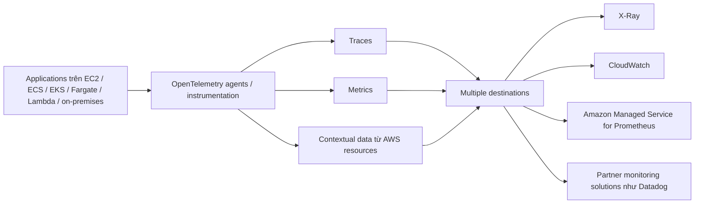

# 256. AWS Distro for OpenTelemetry

## 🎯 Giới thiệu
- **OpenTelemetry** là một project dùng để thu thập:
  - **distributed traces**
  - **metrics**
  - metadata từ **AWS resources and services**
- AWS tạo ra một bản phân phối riêng gọi là **AWS Distro for OpenTelemetry**:
  - được **AWS supported**
  - mô tả là **Secure and Production Ready**
- Mục tiêu chính:
  - chuẩn hóa telemetry bằng **open-source APIs**
  - thu thập dữ liệu quan sát ở quy mô lớn trong application và account

## 1. OpenTelemetry là gì? 🔍
- Cung cấp một bộ thống nhất gồm:
  - **APIs**
  - **libraries**
  - **agents**
  - **collector services**
- Dùng để thu thập:
  - trace của application
  - metrics của application
  - contextual data từ tài nguyên AWS
- Hoạt động tương tự **X-Ray**, nhưng là **open-source**
- Có thể **auto-instrumented** để thu thập traces mà không cần sửa code

## 2. Dữ liệu được thu thập và gửi đi 📤
- Ứng dụng có thể chạy trên:
  - **EC2**
  - **ECS**
  - **EKS**
  - **Fargate**
  - **Lambda**
  - hoặc **on-premises**
- Sau khi instrument application:
  - traces và metrics được gửi theo chuẩn **OpenTelemetry**
  - có thể đẩy tới nhiều đích cùng lúc
- Các đích được nhắc đến trong transcript:
  - **X-Ray** cho traces
  - **CloudWatch** cho metrics
  - **Prometheus** / **Amazon Managed Service for Prometheus**
  - các **partner solutions** như **Datadog**

## 3. Quan hệ với X-Ray và lý do dùng 🧭
- **OpenTelemetry** giống **X-Ray** ở chỗ đều hỗ trợ thu thập traces
- Khác biệt chính:
  - OpenTelemetry là **open-source**
  - hỗ trợ gửi dữ liệu tới **multiple destinations simultaneously**
- Có thể dùng AWS Distro for OpenTelemetry khi:
  - muốn **migrate từ X-Ray**
  - muốn chuẩn hóa theo **telemetry open source**
  - muốn gửi trace/metric tới nhiều nơi cùng lúc

## 📊 Bảng tóm tắt
| Tiêu chí | Mô tả |
|----------|------|
| Bản chất | Project open-source để thu thập telemetry |
| AWS Distro | Bản phân phối do AWS hỗ trợ, “Secure and Production Ready” |
| Dữ liệu thu thập | Traces, metrics, metadata/context từ AWS resources |
| Cách hoạt động | Có thể auto-instrumentation, không cần đổi code nhiều |
| Môi trường áp dụng | EC2, ECS, EKS, Fargate, Lambda, on-premises |
| Đích gửi dữ liệu | X-Ray, CloudWatch, Prometheus, partner solutions |
| Điểm khác X-Ray | OpenTelemetry là open-source và có thể gửi đến nhiều đích cùng lúc |

## 💡 Mẹo ghi nhớ cho kỳ thi AWS
- **OpenTelemetry = thu thập traces + metrics + metadata**
- **AWS Distro for OpenTelemetry = AWS-supported distribution**
- Nhớ 3 ý quan trọng:
  - **open-source**
  - **auto-instrumentation**
  - **multiple destinations**
- Nếu đề bài nhắc đến **migrate từ X-Ray** hoặc **gửi telemetry tới nhiều nơi**, nghĩ ngay đến **AWS Distro for OpenTelemetry**
- Trên exam, câu hỏi thường chỉ ở mức **high level**

## ✅ Kết luận
- **AWS Distro for OpenTelemetry** là cách AWS cung cấp một bản phân phối OpenTelemetry được hỗ trợ chính thức để thu thập **traces**, **metrics**, và **contextual data**.
- Điểm nổi bật là khả năng **auto-instrumentation**, chạy trên nhiều môi trường, và gửi telemetry đến nhiều hệ thống như **X-Ray**, **CloudWatch**, **Prometheus**, hoặc các giải pháp đối tác.
