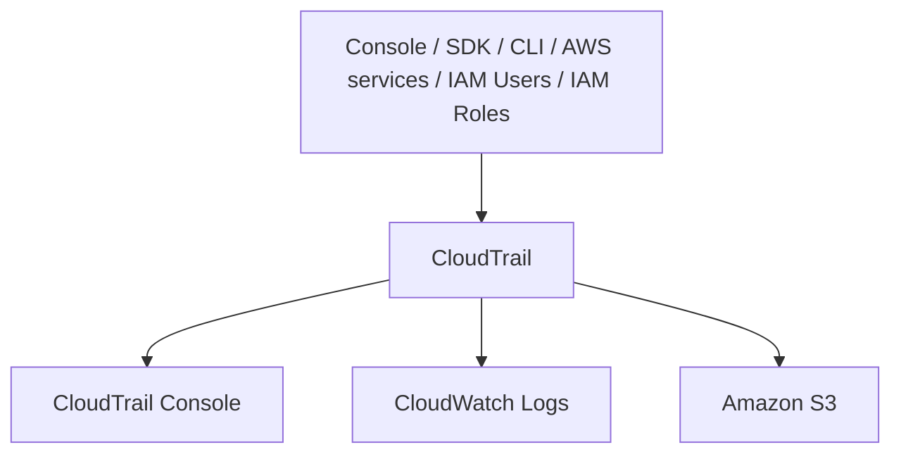
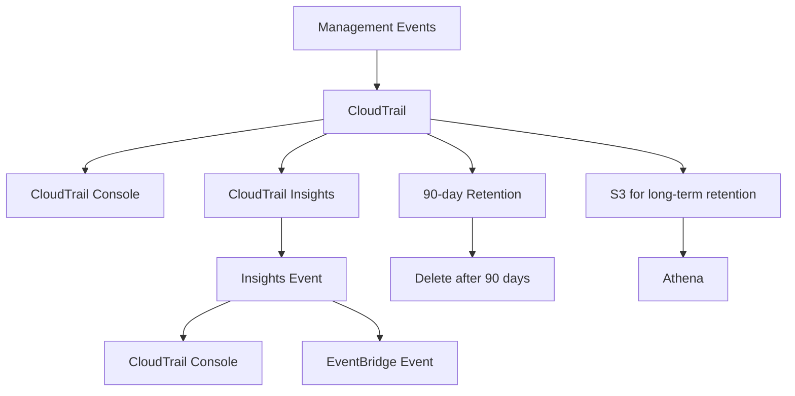

# 257. CloudTrail

## 🎯 Giới thiệu
- **CloudTrail** là dịch vụ dùng để **governance, compliance và audit** cho AWS Accounts.
- CloudTrail **được bật mặc định**.
- Dịch vụ này ghi lại **history of all events và API Calls** được thực hiện trong AWS Accounts, từ:
  - **Console**
  - **SDK**
  - **CLI**
  - **Other AWS services**
  - **IAM Users** và **IAM Roles**
- Log từ CloudTrail có thể được đưa vào:
  - **CloudWatch Logs**
  - **Amazon S3**
- Có thể tạo **trail** cho:
  - **All regions**
  - **Single region**

## 1. CloudTrail dùng để làm gì? 🔍
- Dùng để **inspect** và **audit** hành động đã xảy ra trong AWS.
- Rất hữu ích khi cần biết:
  - **Who did what**
  - **When**
- Ví dụ:
  - Nếu một **EC2 instance** bị **terminated**, có thể xem CloudTrail để biết ai đã thực hiện API Call đó.

## 2. Các loại Events trong CloudTrail 📦
### Management Events
- Là các operations được thực hiện trên resources trong AWS Accounts.
- **Mặc định trails sẽ log Management Events**.
- Bao gồm các hành động như:
  - `IAM AttachRolePolicy`
  - Create subnet
  - Set up logging
- Chia thành 2 nhóm:
  - **Read Events**: không làm thay đổi resource
    - Ví dụ: list users trong **IAM**, list EC2 instances
  - **Write Events**: có thể thay đổi resource
    - Ví dụ: delete DynamoDB table

### Data Events
- **Không được log mặc định** vì là high volume operations.
- Bao gồm:
  - **Amazon S3 object-level activity**
    - `GetObject`
    - `PutObject`
    - `DeleteObject`
  - **AWS Lambda function execution activities**
    - `Invoke API`
- Cũng có thể chia thành:
  - **Read Event**: `GetObject`
  - **Write Event**: `PutObject`, `DeleteObject`

### CloudTrail Insights Events
- Là loại event dùng để phát hiện **unusual activity** trong account.
- Phải **enable** và **pay for it**.
- CloudTrail sẽ tạo baseline từ hoạt động bình thường, sau đó phân tích liên tục để phát hiện bất thường như:
  - Inaccurate resource provisioning
  - Hitting service limits
  - Burst of AWS IAM actions
  - Gaps in periodic maintenance activity

## 3. CloudTrail Insights và Retention ⏳
- **CloudTrail Insights** phân tích **Management Events** để phát hiện pattern bất thường.
- Khi phát hiện anomaly, **Insights Event** sẽ xuất hiện trong **CloudTrail console**.
- Có thể được gửi thành **EventBridge Event** để automation, ví dụ gửi email.

### Event Retention
- Mặc định, events được lưu trong CloudTrail **90 days** rồi bị xóa.
- Nếu muốn giữ lâu hơn:
  - Log events vào **S3**
  - Dùng **Athena** để query và phân tích
- Áp dụng cho:
  - **Management Events**
  - **Data Events**
  - **Insights Events**

## 📊 Bảng tóm tắt
| Tiêu chí | Mô tả |
|----------|------|
| Mục đích | Governance, compliance, audit cho AWS Accounts |
| Trạng thái mặc định | Enabled by default |
| Nguồn sự kiện | Console, SDK, CLI, AWS services, IAM Users, IAM Roles |
| Nơi lưu log | CloudWatch Logs hoặc Amazon S3 |
| Trail scope | All regions hoặc single region |
| Management Events | Ghi mặc định, gồm Read Events và Write Events |
| Data Events | Không log mặc định, high volume, gồm S3 object-level và Lambda Invoke |
| Insights Events | Phát hiện unusual activity, phải enable và trả phí |
| Retention mặc định | 90 days |
| Lưu dài hạn | Đẩy sang S3 và phân tích bằng Athena |

## 💡 Mẹo ghi nhớ cho kỳ thi AWS
- **CloudTrail = audit log**: dùng để biết **ai làm gì, lúc nào**.
- Nhớ rằng **CloudTrail is enabled by default**.
- **Management Events** là loại được log mặc định.
- **Data Events** có volume cao nên **không bật mặc định**.
- **CloudTrail Insights** = phát hiện **unusual activity**.
- Muốn lưu quá **90 days** thì phải đưa log sang **S3**.
- Muốn query log lâu dài trong S3 thì dùng **Athena**.

## ✅ Kết luận
- **CloudTrail** là dịch vụ trọng tâm cho **audit và compliance** trong AWS.
- Nó ghi lại **API Calls và events** từ nhiều nguồn, hỗ trợ điều tra sự cố và theo dõi thay đổi.
- Điểm thi cần nhớ nhất: **default enabled**, **90-day retention**, **Management Events mặc định**, **Data Events không mặc định**, và **Insights Events** để phát hiện bất thường.
