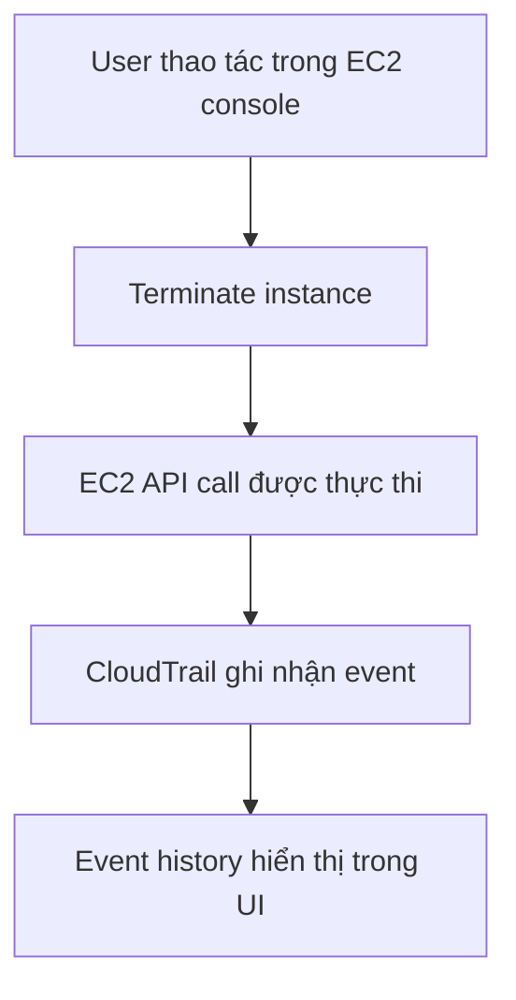

# 258. CloudTrail Hands On

## 🎯 Giới thiệu
- `CloudTrail` là dịch vụ dùng để theo dõi và ghi lại mọi `API calls` hoặc `user activity` trong AWS account.
- Trong `Event history`, bạn có thể xem lịch sử các `management events` trong **90 ngày gần nhất**.
- Bài lab minh họa cách kiểm tra một hành động thực tế trong `EC2` và đối chiếu nó với log trong `CloudTrail`.

## 1. CloudTrail ghi nhận những gì?
- Theo dõi các `API calls` được thực hiện trong account.
- Hiển thị toàn bộ sự kiện trong giao diện `CloudTrail`.
- Có thể xem:
  - `event source`
  - `access key` được dùng
  - `region`
  - và các chi tiết khác của event

## 2. Hands On: kiểm tra sự kiện terminate EC2
- Tạo một `demo instance` trong `EC2`.
- Thực hiện `Terminate` bằng cách:
  - right click
  - chọn `terminate`
- Sau đó chờ khoảng vài phút để event xuất hiện trong `CloudTrail`.
- Khi refresh lại trang, có thể thấy:
  - `terminate instances` API call
  - `event source` là `EC2`
  - `access key` được dùng
  - `region` đã thực thi

## 3. Ý nghĩa đối với kỳ thi AWS
- `CloudTrail` giúp bạn nhìn thấy các event thực sự xảy ra trong account.
- Đây là kiến thức mức thực hành nhưng đủ để trả lời câu hỏi trong exam.
- Điểm cần nhớ:
  - `CloudTrail` = theo dõi `API calls` / `user activity`
  - `Event history` = 90 ngày gần nhất của `management events`
  - Có thể truy vết chi tiết từng hành động trong UI

## 📊 Bảng tóm tắt
| Tiêu chí | Mô tả |
|----------|------|
| Dịch vụ | `CloudTrail` |
| Mục đích | Ghi nhận `API calls` và `user activity` trong account |
| Giao diện xem log | `Event history` |
| Phạm vi mặc định trong bài | `management events` của 90 ngày gần nhất |
| Ví dụ thực hành | `Terminate` một `EC2 instance` rồi kiểm tra event |
| Thông tin xem được | `event source`, `access key`, `region`, chi tiết event |

## 💡 Mẹo ghi nhớ cho kỳ thi AWS
- `CloudTrail` = “ai đã gọi API nào, khi nào, ở đâu”.
- `Event history` là nơi kiểm tra nhanh các `management events` gần đây.
- Nếu thấy hành động trong console mà muốn xác minh, nghĩ ngay đến `CloudTrail`.
- Với `EC2 terminate`, hãy nhớ rằng event đó có thể xuất hiện lại trong `CloudTrail` sau vài phút.

## ✅ Kết luận
- `CloudTrail` là công cụ quan trọng để theo dõi `API calls` và `user activity` trong AWS.
- Hands on cho thấy một hành động `Terminate instance` trong `EC2` sẽ được ghi lại và xem được trong `Event history`.
- Đây là nền tảng rất hữu ích cho cả thực hành và ôn thi AWS.
