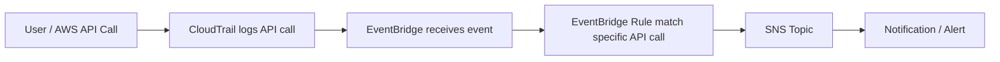

# 259. CloudTrail - EventBridge Integration

## 🎯 Giới thiệu
- Một tích hợp rất quan trọng giữa **CloudTrail** và **Amazon EventBridge** là khả năng **intercept API calls**.
- Ý chính:  
  - **CloudTrail** sẽ ghi lại mọi **API call** trong AWS.
  - Các API call này cũng trở thành **events** trong **EventBridge**.
  - Từ đó, có thể tạo **rule** để bắt đúng một sự kiện cụ thể và gửi sang đích như **SNS** để tạo alert.

## 1. Cơ chế hoạt động
- Khi một **API call** xảy ra trong AWS:
  - Nó được ghi vào **CloudTrail**.
  - Đồng thời, nó xuất hiện như một **event** trong **Amazon EventBridge**.
- Ta có thể tìm theo **specific API call** để tạo **EventBridge rule**.
- Rule này trỏ đến một **destination**, ví dụ **Amazon SNS**.

## 2. Các ví dụ trong transcript
- **DeleteTable** trong **DynamoDB**
  - Muốn nhận thông báo khi user xóa table bằng **DeleteTable API Call**.
  - CloudTrail log API call này.
  - EventBridge bắt event này.
  - Gửi notification đến **SNS**.

- **AssumeRole** trong **IAM**
  - **AssumeRole** là một **API** của **IAM service**.
  - API này được log bởi **CloudTrail**.
  - Có thể dùng **EventBridge integration** để trigger message vào **SNS topic**.

- **AuthorizeSecurityGroupIngress** trong **EC2**
  - Đây là API để thay đổi **Security Group inbound rules**.
  - CloudTrail ghi lại.
  - EventBridge nhận event.
  - Có thể trigger notification trong **SNS**.

## 3. Ý nghĩa khi ôn thi AWS
- Hiểu rằng:
  - **CloudTrail** = ghi nhận **API calls**
  - **EventBridge** = nhận **events** từ các API calls đó
  - **SNS** = nơi nhận notification/alert
- Tích hợp này giúp tạo cảnh báo theo hành động cụ thể như:
  - xóa **DynamoDB table**
  - **AssumeRole**
  - thay đổi **Security Group inbound rules**

## 📊 Bảng tóm tắt
| Tiêu chí | Mô tả |
|----------|------|
| Dịch vụ chính | **CloudTrail**, **EventBridge**, **SNS** |
| Dữ liệu đầu vào | **API calls** trong AWS |
| Vai trò của CloudTrail | Ghi log mọi **API call** |
| Vai trò của EventBridge | Nhận API call dưới dạng **event** và match theo rule |
| Hành động tiếp theo | Gửi sang **SNS** để tạo notification |
| Ví dụ API | **DeleteTable**, **AssumeRole**, **AuthorizeSecurityGroupIngress** |

## 💡 Mẹo ghi nhớ cho kỳ thi AWS
- Nhớ chuỗi này: **API call -> CloudTrail -> EventBridge -> SNS**
- Khi đề bài nói về **alert khi có một API action cụ thể**, hãy nghĩ đến:
  - **CloudTrail** để ghi log
  - **EventBridge rule** để bắt sự kiện
  - **SNS** để gửi thông báo
- Các từ khóa hay gặp:
  - **DeleteTable** = DynamoDB
  - **AssumeRole** = IAM
  - **AuthorizeSecurityGroupIngress** = EC2 Security Group inbound rule

## ✅ Kết luận
- Tích hợp **CloudTrail - EventBridge** cho phép bắt các **API calls** quan trọng và chuyển thành **events** để kích hoạt **SNS notification**.
- Đây là mẫu kiến trúc rất hữu ích khi cần theo dõi và cảnh báo các hành động cụ thể trong AWS.
