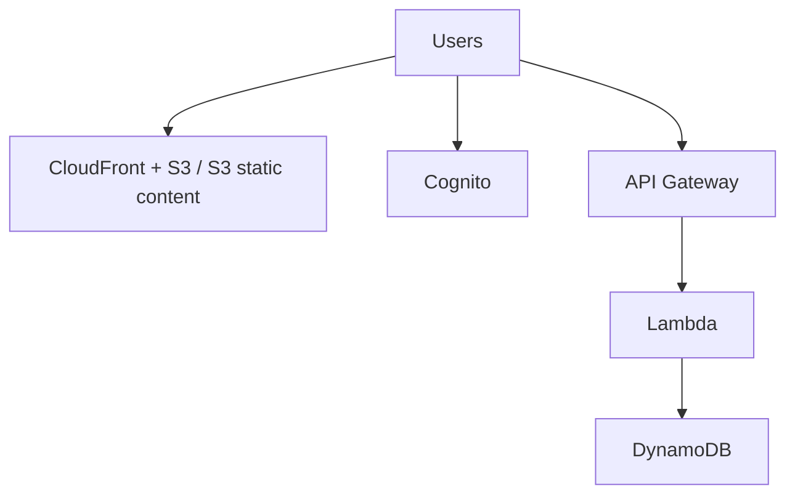

# 263. Serverless Introduction

## 🎯 Giới thiệu
- **Serverless** nghĩa là developer **không phải quản lý servers** nữa.
- Không phải là “không có server”, mà là:
  - bạn **không nhìn thấy**
  - và **không provision** servers
- Ban đầu, serverless chủ yếu là **Function as a Service (FaaS)**.
- AWS Lambda là dịch vụ tiên phong trong mô hình này, và hiện serverless đã mở rộng sang nhiều dịch vụ được quản lý khác.

## 1. Serverless là gì
- Bạn chỉ cần **deploy code**, ban đầu là deploy **functions**.
- Tư duy cốt lõi:
  - **không quản trị hạ tầng server**
  - **trả tiền theo mức sử dụng**
  - dịch vụ có thể **scale** theo nhu cầu

## 2. Ví dụ kiến trúc serverless trên AWS
- Người dùng có thể:
  - nhận **static content** từ **S3**
  - hoặc từ **CloudFront + S3**
- Xác thực người dùng qua **Cognito**
- Người dùng gọi **REST API** qua **API Gateway**
- **API Gateway** gọi **Lambda**
- **Lambda** lưu và truy xuất dữ liệu từ **DynamoDB**

## 3. Các dịch vụ được xem là serverless trong bài
- **Lambda**
- **DynamoDB**
- **Cognito**
- **API Gateway**
- **Amazon S3**
- **SNS**
- **SQS**
- **Kinesis Data Firehose**
- **Aurora Serverless**
- **Step Functions**
- **Fargate**

## 📊 Bảng tóm tắt
| Tiêu chí | Mô tả |
|----------|------|
| Định nghĩa | Không phải quản lý servers |
| Bản chất | Servers vẫn có, nhưng developer không provision hay vận hành trực tiếp |
| Khởi nguồn | Ban đầu là **FaaS** |
| Trọng tâm AWS | **Lambda**, **DynamoDB**, **API Gateway**, **Cognito**, **S3** |
| Tính chất | Scale theo nhu cầu, pay for what you use |
| Ví dụ mở rộng | **SNS**, **SQS**, **Kinesis Data Firehose**, **Aurora Serverless**, **Step Functions**, **Fargate** |

## 💡 Mẹo ghi nhớ cho kỳ thi AWS
- **Serverless = không quản lý servers, không phải không có servers**.
- Nhớ cụm trọng tâm: **API Gateway -> Lambda -> DynamoDB**.
- **S3 + CloudFront** thường dùng cho **static content**.
- **Cognito** gắn với **identity/authentication** trong kiến trúc serverless của bài.
- Các dịch vụ được nhắc trong transcript đều là ví dụ serverless vì **không phải provision servers** và **scale tự động**.
- Nếu gặp câu hỏi thi, hãy nhớ serverless không chỉ là Lambda, mà còn bao gồm nhiều dịch vụ managed khác.

## ✅ Kết luận
- Serverless là mô hình giúp developer tập trung vào **code** thay vì **quản lý hạ tầng**.
- Trong AWS, kiến trúc serverless thường xoay quanh **S3/CloudFront, Cognito, API Gateway, Lambda, DynamoDB**.
- Đây là chủ đề quan trọng vì transcript nhấn mạnh rằng kỳ thi AWS sẽ kiểm tra khá nhiều về **serverless knowledge**.
