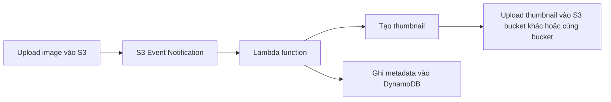
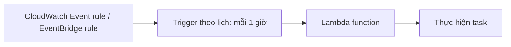

# 264. AWS Lambda Overview

## 🎯 Giới thiệu
AWS Lambda là dịch vụ chạy **visual functions** mà bạn **không cần quản lý server**. So với **Amazon EC2**, Lambda thay đổi cách vận hành theo hướng:

- **EC2**: phải provision virtual servers, bị giới hạn bởi memory/CPU đã cấp, và server thường chạy liên tục.
- **Lambda**: chỉ cần provision code/function, chạy **on demand**, và **chỉ bị tính phí khi function đang chạy**.

Lambda đặc biệt phù hợp khi bạn muốn:
- giảm việc quản lý hạ tầng
- tự động scale
- xử lý tác vụ ngắn
- tích hợp nhanh với nhiều dịch vụ AWS

## 1. Lambda là gì và khác gì EC2? 🖥️⚡
- Lambda là **serverless compute**.
- Không có server để quản lý.
- Function chạy khi được invoke, không chạy liên tục nếu không có request.
- Thời gian thực thi tối đa là **15 minutes**.
- Auto scaling là **tự động**:
  - nếu cần nhiều concurrency hơn
  - AWS sẽ tự provision thêm Lambda function occurrences

### So sánh nhanh
| Tiêu chí | EC2 | Lambda |
|----------|-----|--------|
| Mô hình | Virtual server | Function serverless |
| Quản lý server | Có | Không |
| Chạy liên tục | Có | Không, chỉ khi được invoke |
| Scale | Cần Auto Scaling group | Tự động |
| Thời gian chạy | Không nhấn mạnh giới hạn như Lambda | Tối đa 15 phút |

## 2. Tính năng chính, pricing và runtime 💰
### Lợi ích nổi bật
- **Pricing đơn giản**
  - tính theo **number of requests / invocations**
  - tính theo **compute time**
- Có **free tier** rất rộng:
  - **1 million Lambda requests**
  - **400,000 gigabyte seconds** of compute time
- Tích hợp mạnh với nhiều AWS services
- Có monitoring tích hợp dễ dàng qua **CloudWatch**
- Có thể provision đến **10 GB RAM per function**
- Khi tăng RAM cho function:
  - **CPU** và **network performance** cũng được cải thiện

### Ngôn ngữ hỗ trợ
- `node.js` / JavaScript
- `Python`
- `Java`
- `C#` (`.NET Core` hoặc `PowerShell`)
- `Ruby`
- Các ngôn ngữ khác qua **custom runtime API**
  - ví dụ: `Rust`, `Golang`

### Container images
- Lambda có thể chạy **container image**
- Nhưng để chạy Docker images từ góc nhìn thi AWS, transcript nhấn mạnh:
  - thường **ưu tiên ECS hoặc Fargate**
  - hơn là Lambda, dù Lambda có hỗ trợ mức nào đó cho custom Docker images

## 3. Integrations và use cases phổ biến 🔗
Lambda được tích hợp với nhiều dịch vụ AWS. Các ví dụ trong transcript:

- **API Gateway**: tạo REST API và invoke Lambda
- **Kinesis**: xử lý / transform data on the fly
- **DynamoDB**: tạo triggers khi có thay đổi trong database
- **S3**: trigger Lambda khi file được tạo
- **CloudFront**: dùng **Lambda@Edge**
- **CloudWatch Events / EventBridge**: phản ứng với sự kiện trong AWS infrastructure
- **CloudWatch Logs**: stream logs
- **SNS**: react to notifications
- **SQS**: process messages from queues
- **Cognito**: react khi user login

### Flow: serverless thumbnail creation

- Một image mới được upload lên **S3**
- **S3 event notification** trigger **Lambda**
- Lambda tạo thumbnail
- Thumbnail được upload lại vào **S3**
- Lambda có thể ghi metadata vào **DynamoDB**
  - như image name, size, creation date, ...

### Flow: serverless CRON job

- CRON truyền thống thường chạy trên **EC2**
- Với Lambda:
  - dùng **CloudWatch Event rule** hoặc **EventBridge rule**
  - trigger theo lịch
- Đây là cách tạo **serverless CRON**
- Trong ví dụ này:
  - **CloudWatch Events** là serverless
  - **Lambda** cũng là serverless

## 📊 Bảng tóm tắt
| Tiêu chí | Mô tả |
|----------|------|
| Bản chất | Serverless function, không quản lý server |
| Cách chạy | On demand, chỉ chạy khi được invoke |
| Giới hạn thời gian | Tối đa 15 minutes |
| Scale | Tự động scale theo concurrency |
| Pricing | Theo requests + compute time |
| Free tier | 1 million requests + 400,000 gigabyte seconds |
| RAM tối đa | 10 GB per function |
| Ảnh hưởng khi tăng RAM | CPU và network performance cũng tốt hơn |
| Ngôn ngữ | node.js, Python, Java, C#, Ruby, custom runtime API |
| Tích hợp nổi bật | API Gateway, Kinesis, DynamoDB, S3, CloudFront, EventBridge, CloudWatch Logs, SNS, SQS, Cognito |
| Use case tiêu biểu | Thumbnail processing, serverless CRON |

## 💡 Mẹo ghi nhớ cho kỳ thi AWS
- **Lambda = code chạy khi cần, không cần server**
- Nhớ sự khác biệt cốt lõi với **EC2**:
  - EC2 = provision server
  - Lambda = provision function
- Câu hỏi thi thường xoay quanh:
  - **on demand**
  - **auto scaling**
  - **15 minutes max**
  - **billed per request và compute time**
- Với **container images**, transcript nhấn mạnh:
  - **ECS/Fargate** thường là lựa chọn ưu tiên hơn Lambda
- Khi thấy bài toán:
  - upload file lên **S3** rồi xử lý tiếp
  - chạy job theo lịch
  - trigger theo event
  - thì hãy nghĩ đến **Lambda**

## ✅ Kết luận
AWS Lambda là lựa chọn serverless giúp chạy code **không cần quản lý server**, **scale tự động**, và **tính phí theo mức sử dụng**. Transcript nhấn mạnh các điểm quan trọng cho kỳ thi: **15 phút max**, **free tier lớn**, **RAM tối đa 10 GB**, và khả năng tích hợp mạnh với các dịch vụ như **S3, API Gateway, DynamoDB, EventBridge, SNS, SQS, CloudWatch**.
