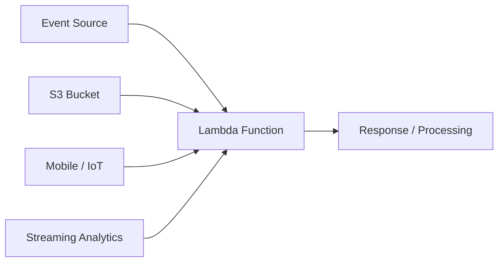

# 265. AWS Lambda - First Hands On

## 🎯 Giới thiệu
- Bài thực hành này giới thiệu cách dùng **AWS Lambda** qua console.
- Mục tiêu chính:
  - Tạo và chạy Lambda function đầu tiên
  - Xem cách Lambda phản ứng với **event triggers**
  - Kiểm tra **test event**, **CloudWatch Logs**, và **configuration**
- Lambda có thể viết bằng nhiều ngôn ngữ như: **.NET, Java, Node.js, Python, Ruby** hoặc **custom runtime**.

## 1. Lambda hoạt động như thế nào
- Trong giao diện demo, Lambda có thể được chạy trực tiếp để trả về thông điệp như **"Hello from Lambda"**.
- Lambda có thể nhận event từ nhiều nguồn:
  - **Streaming analytics**
  - **Mobile / IoT backend**
  - Ảnh được đẩy vào **S3 bucket**
- Khi số lượng event tăng, Lambda sẽ **scale up tự động**.
- Điểm nổi bật:
  - **Không cần quản lý server**
  - **Scalability** diễn ra liền mạch
  - Phù hợp cho xử lý event theo thời gian thực

## 2. Tạo và test Lambda function
- Khi tạo function mới:
  - Chọn **blueprint**: `hello-world`
  - Chọn runtime: **Python**
  - Đặt tên function: **HelloWorld**
- Lambda function có **execution role**, tương tự như role gắn trên **EC2 instance**, nhưng áp dụng cho Lambda.
- Tạo role mới với **basic Lambda permissions**.
- Sau khi tạo xong:
  - Có sẵn **code**
  - Có **handler** là phần được gọi khi event đi vào
- Có thể bấm **Test** để chạy thử function với input JSON mẫu.
- Nếu thiếu key trong input JSON, function có thể **fail** vì code không xử lý được exception.
- Có thể lưu **test event** để dùng lại nhiều lần.

## 3. Monitor, logs và configuration
- Lambda có thể được theo dõi qua **CloudWatch**.
- Ở phần monitoring:
  - Xem **invocations**
  - Mở **CloudWatch Logs** để debug
- Trong logs có thể thấy:
  - Dữ liệu input đã được truyền vào
  - Lỗi phát sinh khi test thất bại
- Phần **general configuration** cho phép chỉnh:
  - **Memory**
  - **Ephemeral storage**
  - **Timeout**
  - **Execution role**
- Execution role hiện tại cho phép Lambda ghi log vào **CloudWatch Logs**.
- Có thể mở rộng role để Lambda truy cập thêm tài nguyên khác như **Amazon S3**.
- Phần **Triggers** cho phép xem và thêm các nguồn event có thể kích hoạt Lambda.
- **Amazon S3** là một use case quan trọng, với bucket và event type được chọn làm trigger.

## 📊 Bảng tóm tắt
| Tiêu chí | Mô tả |
|----------|------|
| Mục tiêu bài học | Thực hành Lambda từ tạo function đến test và monitoring |
| Ngôn ngữ hỗ trợ | .NET, Java, Node.js, Python, Ruby, custom runtime |
| Cách hoạt động | Lambda nhận event từ nhiều nguồn và scale tự động |
| Execution role | IAM role cho Lambda, tương tự role của EC2 nhưng dùng cho function |
| Test & debug | Dùng test event và xem **CloudWatch Logs** để kiểm tra lỗi |
| Cấu hình chính | Memory, ephemeral storage, timeout, execution role |
| Trigger phổ biến | **S3**, streaming analytics, mobile, IoT và các nguồn event khác |

## 💡 Mẹo ghi nhớ cho kỳ thi AWS
- **Lambda = event-driven + auto scaling + không quản lý server**.
- Nhớ rằng Lambda có **execution role** để truy cập tài nguyên AWS và ghi log.
- **CloudWatch Logs** là nơi quan trọng để debug Lambda.
- Khi số lượng event tăng, **chi phí invocations** cũng tăng theo.
- **S3** là một trong các trigger phổ biến nhất của Lambda.
- Biết rằng **handler** là phần được Lambda gọi khi có event.

## ✅ Kết luận
- Lambda trong bài này được giới thiệu từ góc nhìn thực hành: tạo function, test input, xem log, và cấu hình quyền truy cập.
- Trọng tâm cần nhớ là **event trigger**, **auto scaling**, **execution role**, và **CloudWatch Logs**.
