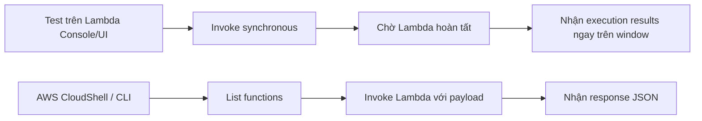

# 267. Lambda Synchronous Invocations Hands On

## 🎯 Giới thiệu
Bài học này nói về **Lambda Synchronous Invocations**. Điểm chính là khi invoke theo kiểu synchronous, bạn sẽ **chờ kết quả trả về ngay lập tức** từ Lambda, thay vì gửi yêu cầu rồi nhận kết quả sau.

## 1. Synchronous Invocation qua UI
- Khi bấm **Test** trong Lambda console, đó là một **synchronous invocation**.
- Bạn **đợi Lambda chạy xong** rồi mới thấy kết quả trong cửa sổ kết quả.
- Nếu function mất 2 phút để chạy, bạn cũng sẽ phải **chờ 2 phút** để nhận execution results.

## 2. Synchronous Invocation qua CLI
- Có thể test synchronous invocation bằng **CLI** hoặc **AWS CloudShell**.
- Trong CloudShell, có sẵn **CLI v2.1** trong ví dụ này.
- Trước tiên dùng:
  - `lambda list-functions`
- Lệnh này sẽ liệt kê các function trong đúng **region**.
- Nếu dùng terminal riêng, cần chú ý thêm **region flag**.
- Trong ví dụ, function được invoke bằng payload từ file/script `synchronous.sh`.
- Khi chạy lệnh invoke:
  - nếu nhập sai tên function như `hello world`, sẽ báo không tìm thấy function
  - đổi sang đúng tên `demo lambda` thì invocation thành công
- Kết quả trả về:
  - status **200**
  - response JSON có giá trị **1**

## 3. Kết quả và điểm cần nhớ
- **Synchronous invocation** nghĩa là:
  - gửi request
  - chờ Lambda xử lý xong
  - nhận response ngay
- Cách này áp dụng được cả trên **UI** và **CLI**
- Ví dụ trong bài:
  - function name đúng là `demo lambda`
  - response được ghi ra file JSON

## 📊 Bảng tóm tắt
| Tiêu chí | Mô tả |
|----------|------|
| Kiểu invoke | **Synchronous invocation** |
| Cách test trên UI | Dùng nút **Test** trong Lambda console |
| Cách test trên CLI | Dùng **AWS CloudShell** hoặc terminal |
| Lệnh liên quan | `lambda list-functions` và lệnh invoke từ `synchronous.sh` |
| Điều cần chú ý | Phải dùng đúng **function name** và đúng **region** |
| Kết quả | Nhận **response JSON** ngay sau khi Lambda hoàn tất |

## 💡 Mẹo ghi nhớ cho kỳ thi AWS
- **Synchronous = chờ kết quả ngay**
- Nếu đề bài nói về việc client **đợi response trực tiếp**, đó là **sync invocation**
- Nhớ phân biệt:
  - **UI Test** trong Lambda console
  - **CLI invoke** qua CloudShell/terminal
- Sai **function name** hoặc sai **region** thì invocation sẽ không chạy

## ✅ Kết luận
Lambda **Synchronous Invocations** là kiểu invoke mà bạn **phải chờ Lambda xử lý xong** rồi mới nhận kết quả. Trong bài này, cách test được thực hiện qua **Lambda console** và qua **CLI/CloudShell**, với kết quả trả về là **JSON response** ngay sau khi function chạy thành công.
