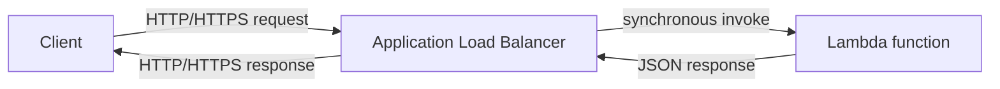

# 268. Lambda & Application Load Balancer

## 🎯 Giới thiệu
- Bài này nói về cách **Lambda** tích hợp với **Application Load Balancer (ALB)** để nhận request qua **HTTP/HTTPS**.
- Lambda có thể được invoke bằng **CLI** hoặc **SDK**, nhưng nếu muốn expose ra internet thì có thể dùng **ALB** hoặc **API Gateway**.
- Trọng tâm của lecture này là **ALB** và việc đăng ký **Lambda function** vào **target group**.

## 1. Luồng request từ Client đến Lambda
- Client gửi request **HTTP/HTTPS** đến **ALB**.
- **ALB** sẽ invoke **Lambda function** trong **target group** theo kiểu **synchronous**.
- Synchronous nghĩa là ALB chờ Lambda xử lý xong rồi mới trả response lại cho client.

## 2. Cách ALB chuyển đổi request/response
- Khi đi từ **ALB** sang **Lambda**, request **HTTP** được chuyển thành một **JSON document**.
- JSON request payload sẽ chứa:
  - Thông tin về **ELB** đã invoke request
  - **target group**
  - **HTTP method** và **path**
  - **query string parameters** dưới dạng **key/value pairs**
  - **headers** dưới dạng **key/value pairs**
  - **body** cho các method như **post**, **put**
  - Cờ **isBase64Encoded** để biết có cần decode hay không
- Khi Lambda trả về, nó cũng trả một **JSON document**.
- **ALB** sẽ chuyển JSON response đó ngược lại thành **HTTP response**.
- Response từ Lambda cần có:
  - **status code**
  - **description**
  - **response headers** dạng **key/value pairs**
  - **body**
  - cờ **isBase64Encoded**

## 3. Multi-value headers
- **ALB multi-value header** là một setting có thể bật trực tiếp trên **Application Load Balancer**.
- Khi client gửi:
  - nhiều **headers** với cùng một key
  - hoặc nhiều **query string parameters** với cùng một key
- Thay vì chỉ giữ một giá trị, ALB sẽ giữ **tất cả** các giá trị.
- Ví dụ: `name=foo&name=bar`
  - thay vì chỉ lấy một giá trị `name`
  - ALB sẽ truyền cả `foo` và `bar` vào **Lambda** dưới dạng **array**
- Tính năng này áp dụng cho cả **HTTP headers** và **query string parameters**.

## 📊 Bảng tóm tắt
| Tiêu chí | Mô tả |
|----------|------|
| Mục tiêu | Expose Lambda ra ngoài qua **HTTP/HTTPS** bằng **ALB** |
| Kết nối chính | Client -> **ALB** -> **Lambda function** |
| Kiểu invoke | **Synchronous** |
| Định dạng request | **HTTP** được chuyển thành **JSON document** |
| Định dạng response | **JSON** từ Lambda được chuyển lại thành **HTTP** |
| Dữ liệu quan trọng | **headers**, **query string parameters**, **body**, **isBase64Encoded** |
| Tính năng đặc biệt | **ALB multi-value header** giữ nhiều giá trị cho cùng một key |

## 💡 Mẹo ghi nhớ cho kỳ thi AWS
- Nhớ rằng **ALB** không gọi Lambda trực tiếp như HTTP endpoint thông thường, mà **chuyển HTTP request thành JSON** rồi invoke **Lambda**.
- Cần nhớ cặp chuyển đổi:
  - **HTTP -> JSON** khi vào Lambda
  - **JSON -> HTTP** khi trả về client
- **query string parameters** và **headers** đều là **key/value pairs** trong payload.
- Nếu gặp câu hỏi về nhiều giá trị cho cùng một key, hãy nghĩ đến **ALB multi-value header**.
- Nếu đề bài nói expose Lambda qua internet bằng **HTTP/HTTPS**, nhớ có hai hướng được nhắc đến là **ALB** và **API Gateway**.

## ✅ Kết luận
- **ALB** có thể dùng để đưa **Lambda function** ra phía sau một endpoint **HTTP/HTTPS**.
- Request từ client được ALB chuyển thành **JSON**, Lambda xử lý rồi trả lại **JSON**, sau đó ALB chuyển ngược về **HTTP response**.
- **multi-value headers** giúp giữ nhiều giá trị cho cùng một **header** hoặc **query string parameter** thay vì chỉ lấy một giá trị duy nhất.
