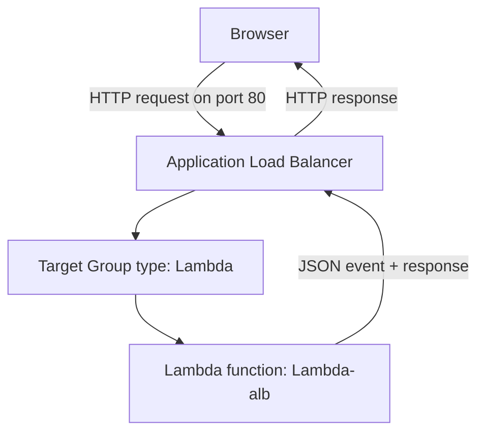

# 269. Lambda & Application Load Balancer Hands On

## 🎯 Giới thiệu
Bài này minh họa cách tích hợp `Lambda` với `Application Load Balancer (ALB)` để ALB gọi Lambda và trả kết quả trực tiếp trên trình duyệt.

## 1. Tạo Lambda và ALB
- Tạo Lambda function tên `Lambda-alb`
- Chọn runtime `Python 3`
- Tạo `Application Load Balancer` tên `demo-Lambda-alb`
- ALB là:
  - `internet-facing`
  - `IPv4`
  - triển khai ở `3 Availability Zones`
- Tạo security group mới cho ALB:
  - tên `DemoLambdaALBSG`
  - inbound rule cho phép `HTTP` từ `0.0.0.0/0`
- ALB lắng nghe trên `port 80`

## 2. Tạo target group cho Lambda
- Default action của ALB là forward đến `target group`
- Tạo target group:
  - loại target: `Lambda function`
  - tên: `demo-tg-lambda`
  - chỉ dùng được cho `Application Load Balancer`
- Chọn Lambda function `Lambda-alb` làm target
- Sau khi tạo xong, gán target group này vào ALB

## 3. Cách request và response hoạt động
- Ban đầu Lambda chỉ trả:
  - status code `200`
  - body: `hello from Lambda`
- Khi test trực tiếp Lambda:
  - có thể thấy output `Hello from Lambda`
  - có thể thêm `print(event)` để xem event được truyền vào
- Khi truy cập DNS của ALB:
  - ALB nhận request và gọi Lambda
  - nếu response chưa đúng format mong muốn, trình duyệt có thể tải nội dung như file text
- Cần trả về response theo document phù hợp để ALB hiểu đúng và hiển thị trên browser
- Khi sửa response:
  - `content-type` được đặt là `text/html`
  - browser hiển thị nội dung trực tiếp
- Trong log stream của Lambda:
  - thấy `JSON document` do ALB truyền vào
  - chứa `path`, `HTTP method`, `query string parameters`, `headers`
- Có thể cấu hình `multi-value header` trong target group attributes:
  - cho phép nhiều giá trị cho cùng một header như `accept`, `host`, `user agent`
  - nếu bật tính năng này, Lambda code cũng phải chỉnh theo
  - đây là một `target group` option

## 4. Quyền và kiểm tra
- Trong `Configuration` của Lambda:
  - trigger là `Application Load Balancer`
- Trong `Permissions` của Lambda:
  - có `resource-based policy statement`
  - policy này cho phép ALB `invoke` Lambda function
- Có thể xem policy đầy đủ bằng `view policy`
- Cách dọn dẹp cuối cùng:
  - xóa `load balancer`

## 📊 Bảng tóm tắt
| Tiêu chí | Mô tả |
|----------|------|
| Thành phần chính | `Lambda` + `Application Load Balancer` |
| Target group | Loại `Lambda function`, chỉ dùng cho `ALB` |
| Listener | `HTTP` trên `port 80` |
| Luồng request | Browser -> ALB -> Lambda -> ALB -> Browser |
| Dữ liệu Lambda nhận | `JSON event` gồm `path`, `HTTP method`, `query string`, `headers` |
| Response hiển thị trên browser | Cần format đúng, có thể đặt `content-type: text/html` |
| Header đặc biệt | Có thể bật `multi-value header` trong target group attributes |
| Quyền gọi Lambda | `resource-based policy` cho phép ALB invoke Lambda |
| Dọn dẹp | Xóa `load balancer` |

## 💡 Mẹo ghi nhớ cho kỳ thi AWS
- `ALB` có thể target trực tiếp vào `Lambda function`, không chỉ `EC2` hay `IP`.
- `Target group` cho Lambda là kiểu riêng, và chỉ dùng với `Application Load Balancer`.
- Muốn browser hiển thị đẹp, response phải đúng format và thường cần `content-type: text/html`.
- Khi debug, xem log stream của Lambda để hiểu `event` mà ALB truyền vào.
- Nếu thấy câu hỏi về quyền ALB gọi Lambda, nhớ đến `resource-based policy` trên Lambda.

## ✅ Kết luận
- Tích hợp `Lambda` với `ALB` cho phép ALB nhận request HTTP và chuyển vào Lambda.
- Lambda nhận một `JSON event` từ ALB và trả response về để browser hiển thị.
- Điểm cần nhớ nhất là: `target group type Lambda`, `resource-based policy`, và format response phù hợp với ALB.
