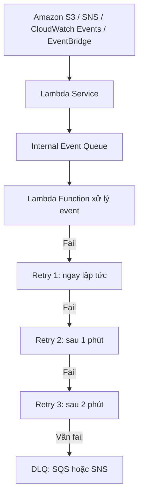

# 270. Lambda Asynchronous Invocations & DLQ

## 🎯 Giới thiệu
- **Asynchronous invocation** là kiểu gọi Lambda khi service khác kích hoạt ở phía sau, ví dụ: **Amazon S3**, **SNS**, **CloudWatch Events/EventBridge**.
- Điểm chính cần nhớ cho AWS exam:
  - Lambda không trả kết quả ngay cho caller như synchronous.
  - Event sẽ được đưa vào **internal Event Queue**.
  - Lambda đọc queue để xử lý sau.

## 1. Cơ chế Asynchronous Invocation
- Khi một service như **S3** phát sinh event, event được gửi vào **Lambda Service**.
- Vì là async, event không được xử lý trực tiếp ngay lập tức mà đi vào **internal Event Queue**.
- Lambda sẽ đọc event từ queue và thực thi function.

## 2. Retry, Idempotent và CloudWatch Logs
- Nếu xử lý thất bại, Lambda sẽ **tự động retry 3 lần**:
  - Lần 1: ngay lập tức
  - Lần 2: sau 1 phút
  - Lần 3: sau 2 phút kể từ lần retry thứ hai
- Do retry, cùng một event có thể được xử lý nhiều lần.
- Vì vậy, Lambda function nên **idempotent**:
  - Kết quả vẫn như cũ dù có retry.
- Khi retry xảy ra, có thể thấy **duplicate log entries** trong **CloudWatch Logs**.

## 3. DLQ và các Service thường dùng Async
- Nếu sau các lần retry vẫn thất bại, Lambda có thể gửi event sang **DLQ (dead-letter queue)**.
- DLQ có thể là:
  - **SQS**
  - **SNS**
- Mục đích: lưu lại event để xử lý sau.

### Khi nào dùng async?
- Khi **service bắt buộc** dùng async.
- Khi muốn **tăng tốc xử lý** và **không cần chờ kết quả ngay**.
- Ví dụ: xử lý nhiều file song song thay vì chờ từng file xong mới làm tiếp.

### Các service được nhắc trong transcript
- **Amazon S3** với **S3 Event Notifications**
- **SNS**
- **CloudWatch Events / EventBridge**
- Ngoài ra còn có:
  - **CodeCommit**
  - **CodePipeline**
  - **CloudWatch Logs**
  - **SES**
  - **CloudFormation**
  - **Config**
  - **IoT**
  - **IoT Events**

## 📊 Bảng tóm tắt
| Tiêu chí | Mô tả |
|----------|------|
| Kiểu invoke | Event được xử lý theo dạng **asynchronous** |
| Cơ chế trung gian | Event đi vào **internal Event Queue** |
| Retry | **3 lần**: ngay lập tức, sau 1 phút, sau 2 phút |
| Rủi ro | Có thể xử lý cùng event nhiều lần |
| Yêu cầu quan trọng | Lambda function nên **idempotent** |
| Dấu hiệu retry | Có thể thấy **duplicate log entries** trong **CloudWatch Logs** |
| Sau khi retry thất bại | Gửi sang **DLQ** |
| DLQ đích | **SQS** hoặc **SNS** |
| Service cần nhớ cho exam | **S3**, **SNS**, **CloudWatch Events/EventBridge** |

## 💡 Mẹo ghi nhớ cho kỳ thi AWS
- Nhớ công thức: **Async = Queue + Retry + Idempotent + DLQ**.
- **3 retries**: ngay lập tức, **1 phút**, **2 phút**.
- Nếu thấy câu hỏi về event từ **S3/SNS/EventBridge** và không cần phản hồi ngay, nghĩ đến **asynchronous invocation**.
- Nếu đề bài nhấn mạnh event thất bại sau retry, chọn **DLQ**.
- Nếu nhắc đến xử lý lặp lại an toàn, chọn **idempotent**.

## ✅ Kết luận
- **Lambda asynchronous invocation** dùng **internal Event Queue** để xử lý event sau khi service khác kích hoạt.
- Lambda sẽ **retry 3 lần** nếu thất bại, nên function cần **idempotent**.
- Nếu vẫn không xử lý được, event có thể được đẩy vào **DLQ** như **SQS** hoặc **SNS**.
- Với AWS exam, trọng tâm là cách Lambda hoạt động với **S3**, **SNS**, và **CloudWatch Events/EventBridge**.
