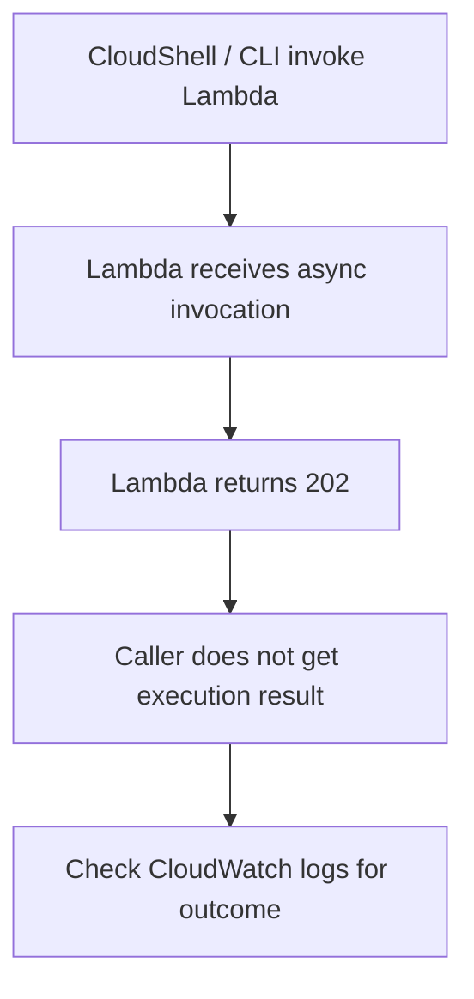

# 271. Lambda Asynchronous Invocations Hands On

## 🎯 Giới thiệu
Bài thực hành này minh họa cách **Lambda asynchronous invocation** hoạt động khi:
- Gọi Lambda từ **CLI / CloudShell** thay vì từ console.
- Lambda trả về **status code 202** nhưng không trả kết quả ngay.
- Khi function **thành công hoặc thất bại**, phía caller vẫn chỉ thấy 202 vì đây là luồng bất đồng bộ.
- Nếu function lỗi, có thể dùng **Dead Letter Queue (DLQ)** với **SQS** để nhận các event không xử lý được.

## 1. Gọi Lambda bất đồng bộ
- Function `demo-lambda` được invoke bằng **CloudShell**.
- Kết quả trả về là **202**.
- Ý nghĩa của 202:
  - Lambda đã được **invoke thành công**.
  - Không biết ngay function chạy **success hay fail**.
- Muốn kiểm tra kết quả thì xem:
  - **CloudWatch logs**
  - **log stream** của lần invoke gần nhất

## 2. Kiểm tra khi function thành công hoặc thất bại
- Khi function chạy bình thường:
  - CloudWatch logs cho thấy request đã được thực thi thành công.
  - Tuy nhiên, phía invoke vẫn chỉ nhận **202**.
- Khi sửa code để làm function **fail**:
  - Comment `return`
  - Uncomment `raise exception`
  - `Deploy` để lưu thay đổi
- Khi invoke lại:
  - Vẫn nhận **202**
  - Nhưng trong **CloudWatch log stream** sẽ thấy lỗi
- Kết luận:
  - Với **asynchronous invocation**, status code **202** không phản ánh success/failure của function.

## 3. Dead Letter Queue với SQS
- Để xử lý event thất bại, cấu hình **Dead Letter Queue** cho Lambda.
- Trong tab **Configurations** > **Asynchronous invocations**:
  - Có thể đặt số lần retry cho event bất đồng bộ.
  - Trong bài này giữ **2 retry attempts**.
- Cấu hình DLQ:
  - Chọn **SQS**
  - Tạo một **standard queue** tên `lambda-DLQ`
- Ban đầu không lưu được vì Lambda chưa có quyền gửi message vào SQS.
- Cách sửa:
  - Vào **execution role** của Lambda
  - Attach policy phù hợp
  - Dùng `AmazonSQSFullAccess` để đơn giản hóa
- Sau đó save lại cấu hình DLQ thành công.

## 4. Luồng retry và chuyển message sang DLQ
- Khi invoke function đã được cố tình làm fail:
  - Lambda sẽ thử lại theo số lần retry đã cấu hình
  - Trong bài này là **2 retry attempts**
- Quan sát trong **CloudWatch logs**:
  - Cùng một **request ID** xuất hiện nhiều lần
  - Lần nào cũng fail
  - Điều này chứng minh các lần retry đã diễn ra
- Sau khi hết retry:
  - Event được gửi vào **SQS DLQ**
- Trong **SQS**:
  - Có thể pull message để xem dữ liệu thất bại
  - Message attributes có:
    - **error cause**
    - **request ID**
  - Request ID trong SQS khớp với request ID của Lambda invocation

## 📊 Bảng tóm tắt
| Tiêu chí | Mô tả |
|----------|------|
| Cách invoke | Dùng **CloudShell / CLI**, không dùng console |
| Kết quả trả về | Luôn là **202** cho asynchronous invocation |
| Ý nghĩa 202 | Lambda đã nhận request, nhưng caller không nhận kết quả thực thi |
| Cách kiểm tra kết quả | Xem **CloudWatch logs** |
| Xử lý failure | Dùng **Dead Letter Queue (DLQ)** |
| Queue dùng trong bài | **SQS standard queue** tên `lambda-DLQ` |
| Retry behavior | Cấu hình **2 retry attempts** trước khi đẩy sang DLQ |
| Vấn đề quyền | Lambda cần quyền gửi message vào SQS thông qua **execution role / IAM role** |
| Policy dùng trong demo | `AmazonSQSFullAccess` |
| Dấu hiệu thành công của DLQ | Message thất bại xuất hiện trong SQS với **request ID** và thông tin lỗi |

## 💡 Mẹo ghi nhớ cho kỳ thi AWS
- **Async invocation = 202**
  - Đừng nhầm 202 với success của business logic.
- **CloudWatch logs** là nơi kiểm tra function thực sự chạy thành công hay thất bại.
- **DLQ** dùng để giữ lại các event không xử lý được sau retry.
- **SQS** có thể làm DLQ cho Lambda asynchronous invocations.
- Lambda phải có đúng **IAM permissions** trong **execution role** để gửi message vào SQS.
- Khi thấy cùng một **request ID** lặp lại nhiều lần trong logs, đó là dấu hiệu của **retry**.

## ✅ Kết luận
- **Lambda asynchronous invocation** trả về **202** và không trả kết quả ngay cho caller.
- Trạng thái thực thi thật sự phải xem trong **CloudWatch logs**.
- Nếu function fail, Lambda có thể retry theo số lần cấu hình.
- Sau khi hết retry, event có thể được đẩy vào **SQS DLQ**.
- Bài thực hành chứng minh đầy đủ flow: **invoke async -> retry -> fail -> message vào DLQ**.
