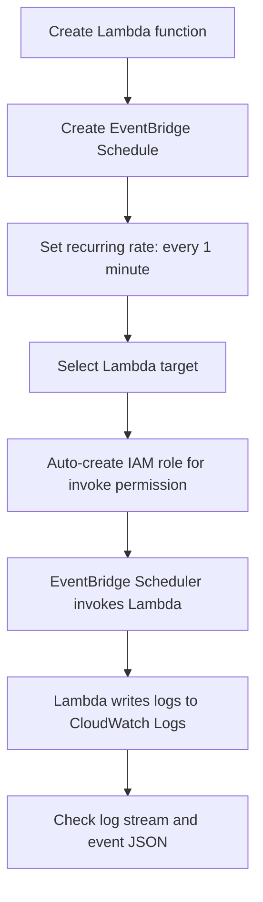

# 273. Lambda & CloudWatch Events / EventBridge Hands On

## 🎯 Giới thiệu
Bài thực hành này minh họa cách dùng **AWS Lambda** kết hợp với **EventBridge Scheduler** để tự động kích hoạt hàm Lambda theo chu kỳ, cụ thể là **mỗi 1 phút**.  
Điểm chính cần nhớ khi ôn thi AWS:
- **EventBridge** có thể tạo **schedule** để gọi Lambda theo `rate` hoặc `cron`.
- **IAM role** được tạo để cho phép EventBridge **invoke** Lambda.
- Lambda có thể ghi log vào **Amazon CloudWatch Logs** để kiểm tra kết quả chạy.

## 1. Tạo Lambda function
- Tạo function tên **`lambda-demo-eventbridge`**.
- Chọn runtime là **Python**.
- Sau khi tạo xong, Lambda sẽ sẵn sàng để nhận invoke từ EventBridge.
- Trong code, có thể thêm `print(event)` để xem payload event được gửi vào.

## 2. Tạo EventBridge Schedule để gọi Lambda mỗi phút
- Vào **Amazon EventBridge** và chọn tạo **Schedule**.
- Đặt tên schedule là **`InvokeLambdaEveryMinute`**.
- Chọn kiểu **recurring schedule**.
- Dùng **rate-based schedule** với chu kỳ **1 minute**.
- Có thể dùng **cron expression** nếu muốn, nhưng trong bài này dùng `rate`.
- Ở phần target:
  - Chọn **Lambda invoke**.
  - Chọn Lambda function đã tạo trước đó.
- Không cần thêm payload tùy chỉnh trong ví dụ này.
- Bật schedule để nó chạy tự động.
- EventBridge sẽ được cấp một **role** để có quyền gọi Lambda.

## 3. Kiểm tra CloudWatch Logs và IAM permissions
- Vào Lambda và kiểm tra phần **Configuration**:
  - Function có quyền ghi vào **Amazon CloudWatch logs**.
- Vào **Monitor** và mở **CloudWatch logs**:
  - Thấy **log stream** đã được tạo.
  - Mỗi lần schedule chạy, Lambda sẽ được invoke và sinh log mới.
- Trong log có JSON event được gửi từ **EventBridge Scheduler**:
  - `detail-type` là **scheduled event**
  - `source` là **aws.scheduler**
  - Có `account`, `time`, `region`, và `resource`
- IAM role được tạo tự động có **Allow statement** cho phép thực hiện **`Lambda InvokeFunction`** lên function `lambda-demo-eventbridge`.

## 📊 Bảng tóm tắt
| Tiêu chí | Mô tả |
|----------|------|
| Mục tiêu | Dùng **EventBridge Scheduler** để invoke Lambda tự động mỗi phút |
| Lambda | Function `lambda-demo-eventbridge`, runtime **Python** |
| EventBridge Schedule | Tên `InvokeLambdaEveryMinute`, kiểu **recurring**, dùng `rate` 1 minute |
| Target | **Lambda invoke** tới function đã tạo |
| IAM Role | Auto-created role cho phép EventBridge gọi **Lambda InvokeFunction** |
| Monitoring | Kiểm tra invoke qua **Amazon CloudWatch Logs** |
| Event payload | JSON scheduled event từ **aws.scheduler** |

## 💡 Mẹo ghi nhớ cho kỳ thi AWS
- **EventBridge Scheduler** dùng để chạy tác vụ theo lịch, không chỉ theo event pattern.
- Khi EventBridge gọi Lambda, cần có **IAM role** phù hợp để cấp quyền invoke.
- Nếu muốn kiểm tra Lambda có chạy hay không, xem **CloudWatch Logs**.
- Nếu cần debug event đầu vào, thêm `print(event)` trong code Lambda.
- Sau khi test xong, nhớ **disable scheduler** để tránh Lambda chạy mỗi phút không cần thiết.

## ✅ Kết luận
- Bài này cho thấy luồng cơ bản: **EventBridge Schedule → IAM role → Lambda → CloudWatch Logs**.
- Đây là mẫu rất quan trọng khi ôn thi vì nó kết hợp **schedule**, **permissions**, và **monitoring** trong một workflow thực tế.
- Điểm cần nhớ nhất: **EventBridge Scheduler có thể tự động invoke Lambda theo `rate` hoặc `cron`, và cần role để có quyền thực thi**.
