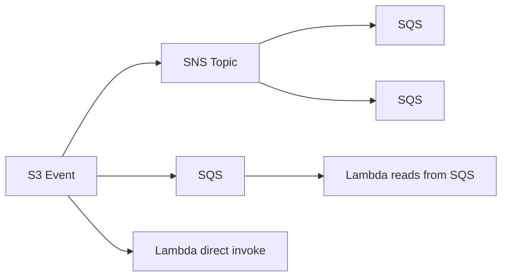
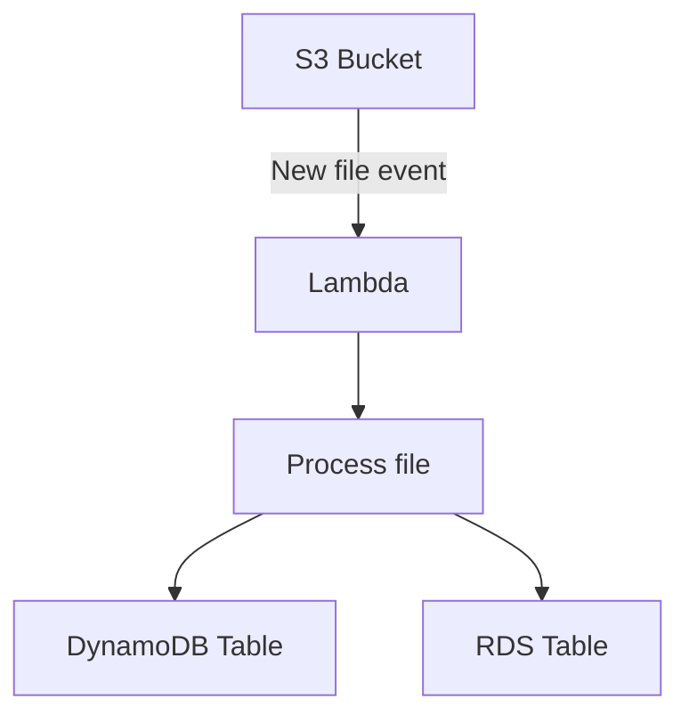

# 274. Lambda & S3 Event Notifications

## 🎯 Giới thiệu
- **S3 Event Notifications** là cơ chế để nhận thông báo khi có thay đổi trong S3, như:
  - object được **created**
  - object bị **removed**
  - object được **restored**
  - có **replication**
- Mục tiêu thường gặp trong bài thi: **S3 phát event để trigger Lambda** xử lý tự động, ví dụ tạo **thumbnail** cho ảnh upload lên S3.

## 1. S3 Event Notifications hoạt động thế nào
- S3 có thể gửi event tới 3 hướng chính:
  - **SNS**
  - **SQS**
  - **Lambda**
- Có thể lọc event theo:
  - **prefix**
  - **suffix**
- Đây là điểm quan trọng để giới hạn những file nào sẽ kích hoạt xử lý.

## 2. Các pattern tích hợp với Lambda
- Có 3 pattern chính được nhắc đến:
  - **S3 -> SNS -> nhiều SQS** theo kiểu **fan-out**
  - **S3 -> SQS -> Lambda** để Lambda đọc từ SQS
  - **S3 -> Lambda** trực tiếp
- Khi **S3 invoke Lambda trực tiếp**:
  - đây là **asynchronous invocation**
  - Lambda nhận event và xử lý theo logic của mình
- Nếu có lỗi, có thể cấu hình **dead-letter queue**, ví dụ **SQS**.

## 3. Điểm cần nhớ cho kỳ thi
- S3 event notifications thường được delivery trong **vài giây**, nhưng đôi khi có thể mất **1 phút hoặc lâu hơn**.
- Để tránh mất notification, cần **enable versioning** trên bucket.
- Nếu có **2 writes** vào cùng một object tại cùng thời điểm, có thể chỉ nhận **1 notification** thay vì 2.
- Đây là chi tiết nhỏ nhưng dễ xuất hiện trong đề thi.

## 📊 Bảng tóm tắt
| Tiêu chí | Mô tả |
|----------|------|
| Mục đích | Nhận thông báo khi S3 object thay đổi |
| Loại event | created, removed, restored, replication |
| Lọc event | Theo **prefix** và **suffix** |
| Hướng gửi | **SNS**, **SQS**, hoặc **Lambda** |
| Lambda invocation | Khi S3 gọi Lambda trực tiếp thì là **asynchronous** |
| Xử lý lỗi | Có thể dùng **dead-letter queue** như **SQS** |
| Độ trễ | Thường vài giây, đôi khi lâu hơn |
| Lưu ý quan trọng | Nên bật **versioning** để tránh mất notification |

## 💡 Mẹo ghi nhớ cho kỳ thi AWS
- Nhớ chuỗi: **S3 Event -> SNS/SQS/Lambda**.
- Gặp câu hỏi về **fan-out**, nghĩ ngay đến **SNS** rồi mới phân phối tiếp sang nhiều **SQS**.
- Gặp bài toán xử lý file upload trên S3, nghĩ đến:
  - **S3 notification**
  - **Lambda**
  - sau đó ghi dữ liệu vào **DynamoDB** hoặc **RDS**
- Nếu đề nhắc **không muốn mất event**, ưu tiên nhớ: **enable versioning**.
- Nếu Lambda cần xử lý bất đồng bộ và có lỗi, nhớ đến **dead-letter queue**.

## ✅ Kết luận
- **S3 Event Notifications** là cách S3 báo cho hệ thống khi object thay đổi.
- Có thể kết hợp với **Lambda** để xử lý tự động, hoặc đi qua **SNS/SQS** tùy kiến trúc.
- Với AWS exam, hai ý cần nhớ nhất là:
  - **S3 -> Lambda** có thể là **asynchronous invocation**
  - nên **bật versioning** để giảm rủi ro mất notification
