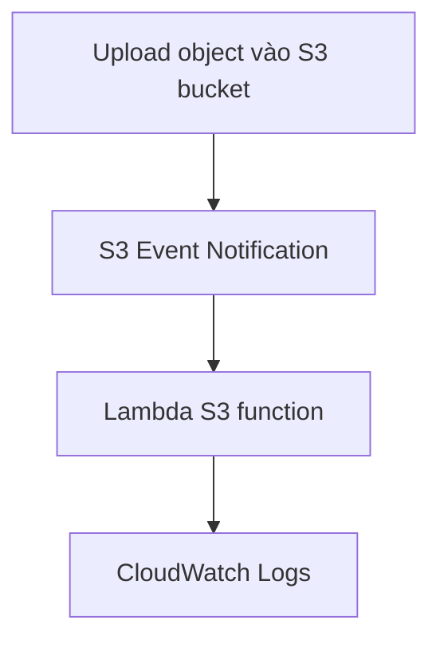

# 275. Lambda & S3 Event Notifications - Hands On

## 🎯 Giới thiệu
- Bài học này demo cách cấu hình **S3 Event Notification** để kích hoạt **Lambda** khi một object được upload vào S3 bucket.
- Mục tiêu chính:
  - Tạo Lambda function tên `Lambda S3`
  - Tạo S3 bucket và bật event notification
  - Gửi event từ S3 sang Lambda
  - Kiểm tra kết quả qua **CloudWatch Logs**
- Lambda và S3 bucket phải ở **cùng region** để tích hợp hoạt động đúng.

## 1. Tạo Lambda và S3 Bucket
- Tạo Lambda function mới với runtime **Python 3.8**
- Đặt tên function là **Lambda S3**
- Tạo một S3 bucket để trigger Lambda
- Bucket được tạo trong **Ireland region**, cùng region với Lambda

## 2. Cấu hình S3 Event Notification
- Vào **S3 bucket > Properties > Event notifications**
- Tạo event notification với tên **invoke Lambda**
- Cấu hình:
  - **Prefix**: all
  - **Suffix**: all
  - **Event types**: **All object create events**
- Destination:
  - Chọn **Lambda**
  - Chọn Lambda function **Lambda S3**
- Sau khi lưu, event notification sẽ được bật để gửi data vào Lambda function

## 3. Kiểm tra luồng hoạt động và Resource-Based Policy
- Sau khi cấu hình xong, refresh trang Lambda để thấy **S3 đang invoke Lambda**
- Sửa Lambda function để chỉ **print event** nhận được, rồi deploy
- Trong phần **Configuration > Permissions**, xem **resource-based policy**
- Policy statement cho phép **Lambda S3** được invoke function
- Có thể mở **view policy document** để xem JSON policy đầy đủ

## 4. Test bằng cách upload file
- Upload file **coffee.jpeg** vào bucket S3
- Việc upload sẽ tạo event và kích hoạt Lambda
- Vào:
  - **Monitor > View logs in CloudWatch**
- Trong log stream, có thể thấy:
  - **event source** là **AWS S3**
  - thông tin **region**
  - **bucket name** là `demo S3 events Stephane`
  - **object key** là `coffee.jpeg`
  - **size**
  - **ETag**
- Dữ liệu event này đủ để Lambda dùng **S3 get object API** và xử lý object được upload

## 📊 Bảng tóm tắt
| Tiêu chí | Mô tả |
|----------|------|
| Mục đích | Dùng **S3 Event Notification** để invoke **Lambda** |
| Runtime Lambda | **Python 3.8** |
| Điều kiện quan trọng | S3 bucket và Lambda phải ở **cùng region** |
| Event type | **All object create events** |
| Destination | **Lambda** |
| Kiểm tra kết quả | Xem **CloudWatch Logs** |
| Thông tin trong event | Bucket name, object key, size, ETag, event source |

## 💡 Mẹo ghi nhớ cho kỳ thi AWS
- **S3 upload object** có thể kích hoạt **Lambda** thông qua **Event Notification**
- Muốn S3 invoke Lambda thì cần có **resource-based policy**
- Khi debug, hãy xem:
  - **Lambda Configuration > Permissions**
  - **CloudWatch Logs**
- Nếu transcript nói đến event từ S3, hãy nhớ đây là một dạng **asynchronous invocation**
- Dữ liệu event từ S3 chứa đủ metadata để Lambda tiếp tục xử lý object

## ✅ Kết luận
- Bài hands-on này cho thấy cách nối **S3 → Lambda** bằng **Event Notification**
- Sau khi upload file vào bucket, Lambda được invoke tự động và log xuất hiện trong **CloudWatch**
- Đây là ví dụ rõ ràng về **asynchronous notification** và cách **resource policy** cho phép S3 gọi Lambda
