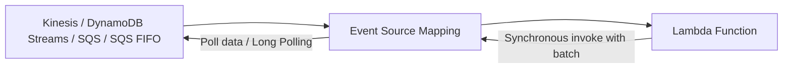

# 276. Lambda Event Source Mapping

## 🎯 Giới thiệu
Lambda Event Source Mapping là cách thứ ba để Lambda xử lý event trong AWS, bên cạnh **asynchronous processing** và **synchronous processing**.  
Cơ chế này áp dụng cho các nguồn mà Lambda phải **poll** dữ liệu từ service rồi mới xử lý, gồm:

- **Kinesis Data Streams**
- **DynamoDB Streams**
- **SQS**
- **SQS FIFO queue**

Điểm cốt lõi: **Lambda sẽ được invoke synchronously** với một **event batch** sau khi Event Source Mapping lấy dữ liệu về.

## 1. Cách Event Source Mapping hoạt động
- Khi cấu hình Lambda đọc từ source như Kinesis, AWS sẽ tạo **Event Source Mapping** nội bộ.
- Thành phần này chịu trách nhiệm:
  - **poll dữ liệu** từ source
  - nhận **batch** từ source
  - invoke Lambda **synchronously** với batch đó
- Với model này, Lambda không tự nhận event trực tiếp từ source, mà đi qua lớp mapping trung gian.

## 2. Nhóm **Streams**: Kinesis Data Streams và DynamoDB Streams
### 🧩 Cách xử lý
- Với streams, Event Source Mapping tạo **iterator cho từng shard**.
- Dữ liệu được xử lý **theo thứ tự ở cấp shard**.
- Có thể chọn điểm bắt đầu đọc:
  - chỉ đọc **new items**
  - đọc từ **beginning of shard**
  - đọc từ **specific timestamp**
- Item đã xử lý **không bị remove** khỏi stream.
  - Nghĩa là các consumer khác vẫn có thể đọc lại dữ liệu.

### ⚙️ Tối ưu hiệu năng
- Với stream traffic thấp:
  - dùng **batch window** để gom record trước khi xử lý
- Với stream throughput cao:
  - có thể xử lý nhiều batch song song ở cấp shard
- AWS cho phép tối đa **10 batch processors per shard**
- Trong mỗi batch:
  - xử lý **in-order** ở cấp **partition key**
  - cùng một shard nhưng các key khác nhau có thể được song song hóa

### ❌ Xử lý lỗi
- Mặc định, nếu function trả về error:
  - **entire batch** sẽ bị reprocess
  - lặp lại cho đến khi function thành công hoặc item hết hạn
- Lỗi trong batch có thể **block processing** của shard đó
- Để xử lý:
  - **discard old events**
  - **restrict retries**
  - **split the batch on errors**
- Nếu Lambda timeout giữa chừng:
  - có thể chia batch nhỏ hơn để tiếp tục xử lý phần còn lại

## 3. Nhóm **Queues**: SQS và SQS FIFO
### 📩 Cách xử lý
- Event Source Mapping sẽ **poll SQS bằng Long Polling**
- Khi có batch trả về:
  - Lambda được invoke **synchronously** với event batch đó
- Có thể cấu hình:
  - **batch size** từ **1 đến 10 messages**

### ⏱️ Khuyến nghị cấu hình
- AWS khuyến nghị đặt **visibility timeout** của queue bằng **6 lần Lambda timeout**
- Nếu muốn dùng **DLQ**:
  - cấu hình **trên SQS queue**
  - **không cấu hình trên Lambda**
- Lý do:
  - **Lambda DLQ chỉ dùng cho asynchronous invocations**
  - còn case này là **synchronous invocations**

### 🔁 FIFO vs Standard
- **SQS FIFO**
  - giữ **in-order processing**
  - số Lambda scale lên bằng số **active message groups**
  - group được xác định bởi **group ID**
- **SQS Standard**
  - **không đảm bảo thứ tự**
  - Lambda scale nhanh để đọc hết message
  - Lambda tăng thêm **16 instances per minute**
  - tối đa **1000 batches per second** được xử lý đồng thời

### ⚠️ Lưu ý quan trọng
- Nếu có lỗi trong queue:
  - batch có thể được trả lại queue như **individual items**
  - thứ tự nhóm xử lý có thể khác batch ban đầu
- Event Source Mapping đôi khi có thể nhận **cùng một item hai lần**
  - dù không có function error
- Vì vậy, Lambda cần **idempotent processing**
- Khi xử lý xong:
  - Lambda sẽ **delete items from the queue**
- Queue cũng có thể gửi message lỗi sang **dead-letter queue**

## 📊 Bảng tóm tắt
| Tiêu chí | Mô tả |
|----------|------|
| Loại nguồn | **Kinesis Data Streams, DynamoDB Streams, SQS, SQS FIFO** |
| Cơ chế chính | Lambda **poll** source qua **Event Source Mapping** |
| Kiểu invoke | **Synchronous** với **event batch** |
| Streams ordering | Theo **shard**, và theo **partition key** trong batch |
| Streams parallelism | Tối đa **10 batch processors per shard** |
| Streams error handling | Reprocess cả batch, có thể **discard old events / restrict retries / split batch on errors** |
| SQS polling | Dùng **Long Polling** |
| SQS batch size | **1 đến 10 messages** |
| SQS timeout recommendation | **Visibility timeout = 6 x Lambda timeout** |
| DLQ | Cấu hình trên **SQS queue**, không phải Lambda |
| FIFO behavior | Giữ thứ tự theo **group ID** |
| Standard queue behavior | Không đảm bảo thứ tự, scale rất nhanh |
| Scale detail | Standard queue tăng **16 instances/minute**, tối đa **1000 batches/sec** |
| Reliability note | Có thể nhận trùng item, cần **idempotent processing** |

## 💡 Mẹo ghi nhớ cho kỳ thi AWS
- Nhớ câu: **Event Source Mapping = poll source + invoke Lambda synchronously**
- **Streams**:
  - đọc theo **shard**
  - giữ thứ tự trong shard
  - lỗi có thể làm **pause shard processing**
- **Queues**:
  - **SQS Standard**: không ordered
  - **SQS FIFO**: ordered theo **group ID**
- **DLQ của Lambda không dùng cho synchronous invocation**
  - với SQS, đặt DLQ ở **queue**
- Khi thấy câu hỏi về **duplicate message / duplicate processing**:
  - nghĩ ngay đến yêu cầu **idempotent**

## ✅ Kết luận
Lambda Event Source Mapping là cơ chế trung gian để Lambda đọc dữ liệu từ **streams** và **queues** bằng cách **poll** source rồi invoke function **synchronously** theo batch.  
Điểm thi hay hỏi nằm ở:
- **ordering**
- **batching**
- **scaling**
- **error handling**
- **DLQ**
- và sự khác nhau giữa **Kinesis/DynamoDB Streams** với **SQS/SQS FIFO**.
