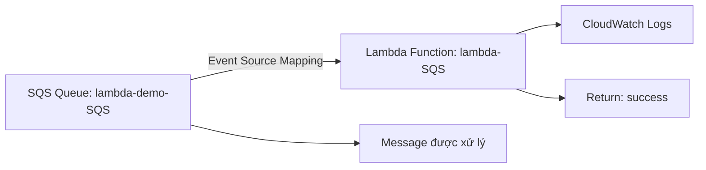

# 277. Lambda Event Source Mapping Hands On (SQS)

## 🎯 Giới thiệu
Bài học này thực hành **Lambda Event Source Mapping** với **SQS** và sau đó xem nhanh các tùy chọn khi gắn **Kinesis** làm event source.

- Tạo mới một **Lambda function** từ đầu: `lambda-SQS` với `python 3.8`
- Tạo một **SQS queue**: `lambda-demo-SQS`
- Gắn **trigger** từ SQS vào Lambda để Lambda tự đọc message từ queue
- Kiểm tra quyền **IAM role** để Lambda có thể gọi `ReceiveMessage` trên SQS
- Test bằng cách gửi message vào SQS và xem log trong **CloudWatch**

## 1. Thiết lập Lambda + SQS
- Tạo Lambda function mới:
  - Tên: `lambda-SQS`
  - Runtime: `python 3.8`
- Tạo SQS queue:
  - Tên: `lambda-demo-SQS`
  - Loại: **standard queue**
- Trong Lambda, chọn **Add trigger**
- Chọn **SQS** và chọn queue `lambda-demo-SQS`

### Các tùy chọn chính khi gắn SQS
- **Batch size**: số message xử lý trong một batch
- **Batch window**: thời gian gom record trước khi invoke function
- **Enable trigger**: phải bật thì trigger mới hoạt động

## 2. Xử lý lỗi quyền truy cập IAM
Khi thêm trigger lần đầu, hệ thống báo lỗi vì **execution role** của Lambda chưa có quyền gọi `ReceiveMessage` trên SQS.

- Vào **Configuration** → **Permissions**
- Mở **role name** của Lambda trong **IAM console**
- Gắn policy phù hợp, trong transcript dùng:
  - **AWS Lambda SQS queue execution role**
- Sau khi attach policy, thêm lại trigger thì thành công

### Ý chính cần nhớ
- Lambda đọc SQS thông qua **IAM role attached to Lambda**
- Nếu thiếu quyền, trigger sẽ không hoạt động

## 3. Test và quan sát kết quả
- Sửa code Lambda để:
  - In ra `events`
  - Trả về `success`
- **Deploy** thay đổi
- Gửi message vào SQS:
  - Message body: `hello world`
  - Message attribute: `foo = bar`
- Vì Lambda đang pull từ SQS, message sẽ được xử lý tự động
- Kiểm tra **CloudWatch Logs**:
  - Thấy nội dung message body là `hello world`
  - Thấy message attributes có `foo bar`
  - Thấy thông tin event source là **SQS**
- Quay lại SQS, số message available là **0** vì message đã được xử lý

### Lưu ý vận hành
- Sau khi test xong, cần **disable event mapper**
- Nếu không tắt, Lambda sẽ liên tục pull từ SQS
- Điều này có thể gây **chi phí** hoặc bị tính vào số lần poll của SQS

## 4. Nhìn nhanh sang Kinesis
Bài giảng cũng mở phần **Kinesis trigger** để cho thấy đây cũng là một **event source mapping**.

Các tùy chọn được nhắc tới:
- Chọn **Kinesis stream**
- **Consumer** / **enhanced fan-out consumer**
- **Batch size**
- **Batch window**
- **Starting position**:
  - latest
  - earliest
  - timestamp cụ thể
- Các thiết lập thêm:
  - **on-failure destination**
  - **retries**
  - **maximum age of record**
  - **split batch on error**
  - **concurrent batches per shard**
  - **tumbling window duration**
  - **report batch item failures**

## 📊 Bảng tóm tắt
| Tiêu chí | Mô tả |
|----------|------|
| Mục tiêu | Thực hành **Lambda Event Source Mapping** với **SQS** |
| Thành phần chính | `Lambda function`, `SQS queue`, `IAM role`, `CloudWatch Logs` |
| Cấu hình quan trọng | `Batch size`, `Batch window`, `Enable trigger` |
| Vấn đề thường gặp | Thiếu quyền `ReceiveMessage` trên SQS |
| Cách khắc phục | Gắn policy/role phù hợp cho **Lambda execution role** |
| Cách kiểm tra | Gửi message vào SQS và xem log trong **CloudWatch** |
| Kết quả mong đợi | Message được xử lý, queue trống |
| Lưu ý | Tắt event mapper sau khi test để tránh Lambda poll liên tục |

## 💡 Mẹo ghi nhớ cho kỳ thi AWS
- **Lambda + SQS** thường cần **event source mapping** để Lambda tự pull message
- Nếu trigger không hoạt động, hãy nghĩ ngay đến **IAM permissions**
- **Batch size** và **batch window** là hai tham số cần nhớ khi xử lý theo lô
- Sau khi test xong, nên **disable trigger** để tránh Lambda poll liên tục
- **Kinesis** cũng là một event source mapping, và có nhiều tùy chọn hơn SQS

## ✅ Kết luận
Bài học cho thấy cách:
- Tạo Lambda và SQS từ đầu
- Gắn **SQS trigger** vào Lambda
- Sửa lỗi quyền bằng **IAM role**
- Kiểm tra kết quả qua **CloudWatch Logs**
- Hiểu thêm rằng **Kinesis** cũng là một **event source mapping** với nhiều thiết lập bổ sung
