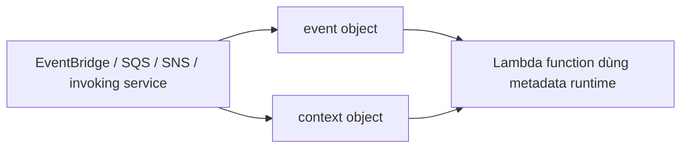

# 278. Lambda Event & Context Objects

## 🎯 Giới thiệu
Trong Lambda function, có 2 đối tượng rất quan trọng khi hàm được invoke:
- `event` object: chứa dữ liệu mà Lambda sẽ xử lý
- `context` object: chứa metadata về lần invoke và runtime của Lambda

Ví dụ trong transcript: `EventBridge` tạo event rồi truyền vào Lambda. Lambda nhận dữ liệu này dưới dạng `event` object.

## 1. `event` object 📩
- Là JSON-formatted document được truyền vào Lambda
- Chứa dữ liệu cần được function xử lý
- Có thể bao gồm:
  - source của event
  - region của event
  - thông tin từ invoking service
- Trong Python, `event` thường được chuyển thành `dictionary`
- Dùng cho input/arguments từ service gọi Lambda như:
  - `EventBridge`
  - `SQS`
  - `SNS`

## 2. `context` object 🧩
- Cung cấp metadata về invocation và runtime environment
- Được truyền vào Lambda khi runtime chạy
- Chứa các thông tin như:
  - AWS request ID
  - function name
  - function ARN
  - memory limit in megabytes
  - CloudWatch Logs stream name
  - CloudWatch Logs group name
- Dùng để lấy thông tin liên quan đến lần gọi hàm và môi trường thực thi

## 3. Phân biệt nhanh giữa `event` và `context` ⚖️
- `event`
  - chứa dữ liệu đầu vào để Lambda xử lý
  - đến từ service invoke
- `context`
  - chứa metadata của invocation
  - liên quan đến function và runtime environment

### Ví dụ trong code
- Handler trong Python thường có dạng:
  - `event`
  - `context`
- `event` dùng để đọc dữ liệu sự kiện
- `context` dùng để lấy request ID, function name, memory limit, Log info

## 📊 Bảng tóm tắt
| Tiêu chí | Mô tả |
|----------|------|
| `event` object | JSON/formatted input data mà Lambda xử lý |
| `context` object | Metadata của invocation và runtime |
| Nguồn tạo event | `EventBridge`, `SQS`, `SNS`, hoặc service invoke khác |
| Thông tin trong `event` | source, region, dữ liệu sự kiện |
| Thông tin trong `context` | request ID, function name, function ARN, memory limit, CloudWatch Logs info |
| Mục đích ôn thi | Nhận biết đúng object để lấy đúng thông tin được hỏi |

## 💡 Mẹo ghi nhớ cho kỳ thi AWS
- `event` = dữ liệu cần xử lý
- `context` = thông tin về lần invoke và môi trường chạy
- Khi đề hỏi “dữ liệu sự kiện đến từ service nào, payload là gì” -> nghĩ ngay đến `event`
- Khi đề hỏi “request ID, function name, memory, log group/stream” -> nghĩ ngay đến `context`

## ✅ Kết luận
`event` và `context` là 2 phần bổ trợ nhau trong Lambda:
- `event` mang dữ liệu đầu vào
- `context` mang metadata của function và runtime

Nắm rõ sự khác nhau này giúp chọn đúng đối tượng khi làm bài thi AWS.
