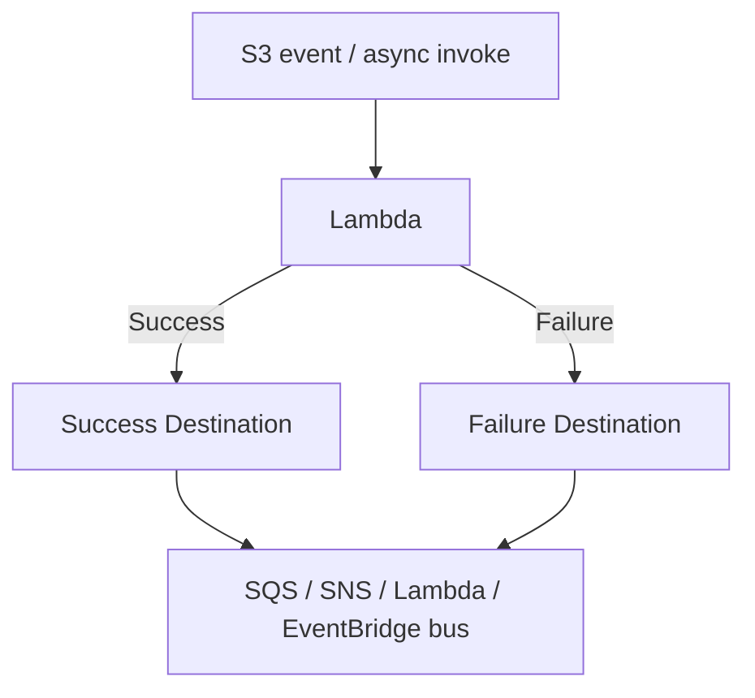
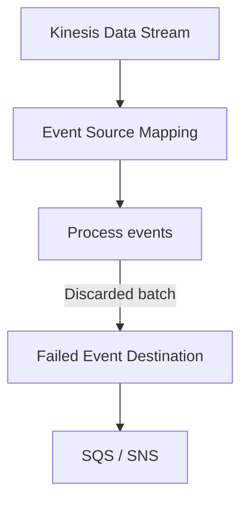

# 279. Lambda Destinations

## 🎯 Giới thiệu
- **Lambda Destinations** là một tính năng mới được giới thiệu từ **November 2019**.
- Mục tiêu chính: giải quyết vấn đề khó theo dõi khi **asynchronous invocation** hoặc **event mapping**:
  - xử lý **thành công** hay **thất bại**
  - lấy lại dữ liệu của event đã xử lý
- Ý tưởng: gửi **kết quả** của invocation bất đồng bộ hoặc **failure** của event mapper tới một đích (destination) cụ thể.

## 1. Lambda Destinations cho Asynchronous Invocation
- Với **asynchronous invocation**, có thể định nghĩa destination cho cả:
  - **successful events**
  - **failed events**
- Các destination được hỗ trợ:
  - **SQS**
  - **SNS**
  - **Lambda**
  - **Amazon EventBridge bus**  
- Ví dụ flow:
  - Lambda được invoke bất đồng bộ, chẳng hạn từ **S3 event**
  - Nếu xử lý **thành công** thì gửi sang **success destination**
  - Nếu xử lý **thất bại** thì gửi sang **failure destination**

## 2. Lambda Destinations và DLQ
- Lambda Destinations nhìn giống cấu hình **DLQ** cho asynchronous invocations.
- Tuy nhiên, khuyến nghị hiện tại là:
  - **dùng Destinations thay cho DLQ**
- Vẫn có thể dùng cả hai cùng lúc.
- Lý do:
  - **Destinations mới hơn**
  - hỗ trợ **nhiều target hơn**
- So sánh theo transcript:
  - **DLQ**: chỉ gửi **failures** vào **SQS** và **SNS**
  - **Destinations**: gửi cả **successes** và **failures** vào **SQS**, **SNS**, **Lambda**, và **EventBridge**

## 3. Lambda Destinations cho Event Source Mapping
- Với **Event Source mapping**, Destinations chỉ dùng khi:
  - có **event batch** bị **discarded** vì không xử lý được
- Trong trường hợp đó, event batch có thể được gửi tới:
  - **Amazon SQS**
  - **Amazon SNS**
- Ví dụ flow:
  - đọc dữ liệu từ **Kinesis**
  - **Event Source mapping** cố gắng xử lý dữ liệu
  - nếu không thành công, thay vì làm block toàn bộ luồng xử lý của **Kinesis Data Stream**
  - batch bị loại sẽ được gửi đến **failed event destination**

- Lưu ý:
  - Nếu Event Source mapping đọc từ **SQS**, bạn có thể:
    - set **failed destination**
    - hoặc set **DLQ** trực tiếp trên **SQS Queue**
  - Cách dùng là tùy bạn lựa chọn

## 📊 Bảng tóm tắt
| Tiêu chí | Mô tả |
|----------|------|
| Mục đích | Theo dõi kết quả xử lý của **asynchronous invocation** và **event mapping** |
| Asynchronous invocation | Có **success destination** và **failure destination** |
| Target hỗ trợ | **SQS**, **SNS**, **Lambda**, **EventBridge bus** |
| So với DLQ | **Destinations** mới hơn và hỗ trợ nhiều target hơn; **DLQ** chỉ cho failures vào **SQS/SNS** |
| Event Source mapping | Chỉ áp dụng khi **event batch** bị discard do không xử lý được |
| Với SQS source mapping | Có thể dùng **failed destination** hoặc **DLQ** trực tiếp trên **SQS Queue** |

## 💡 Mẹo ghi nhớ cho kỳ thi AWS
- **Destinations = Success + Failure**
- **DLQ = Failure only**
- **Destinations** hỗ trợ nhiều target hơn: **SQS, SNS, Lambda, EventBridge**
- Với **Event Source mapping**, nhớ rằng destination dùng cho **discarded batch**, không phải cho mọi trường hợp
- Nếu thấy câu hỏi về việc theo dõi kết quả của async invocation, ưu tiên nghĩ tới **Lambda Destinations**

## ✅ Kết luận
- **Lambda Destinations** giúp gửi kết quả **success** hoặc **failure** của **asynchronous invocation** đến đích phù hợp.
- Đây là lựa chọn được khuyến nghị hơn **DLQ** vì linh hoạt hơn và hỗ trợ nhiều target hơn.
- Với **Event Source mapping**, Destinations dùng để xử lý các **event batch bị discard** mà không làm gián đoạn toàn bộ luồng xử lý.
