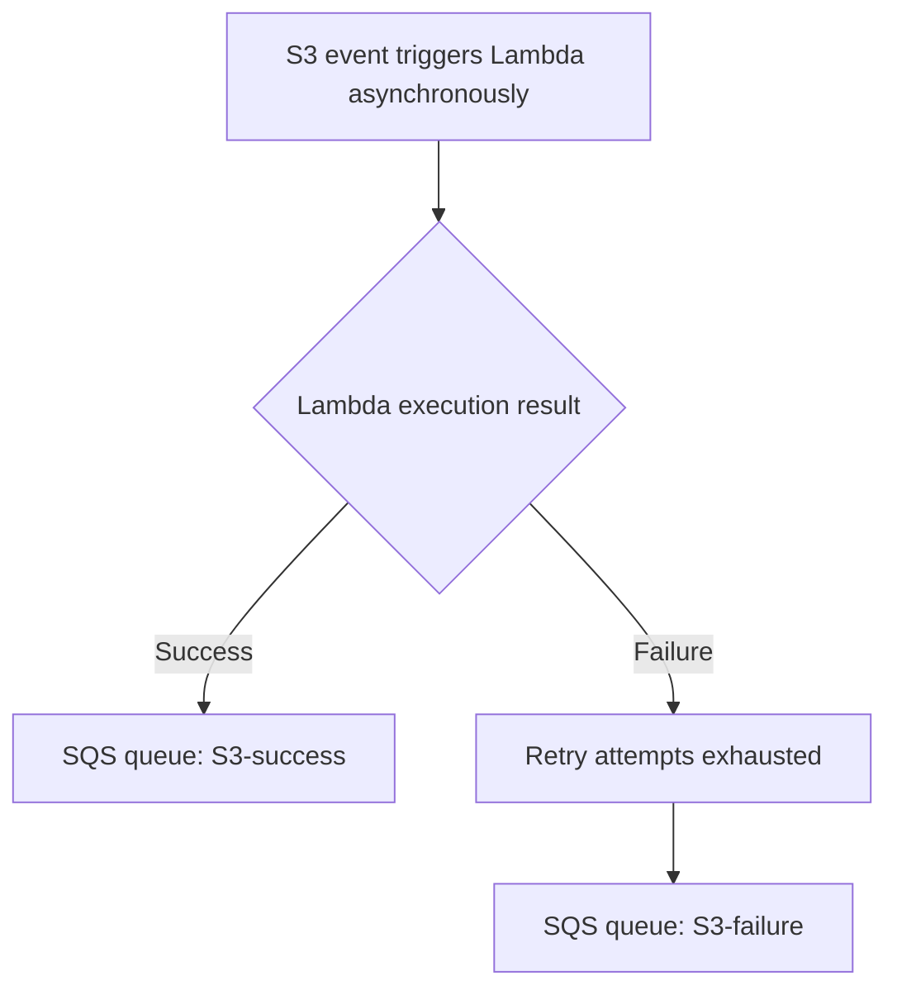

# 280. Lambda Destinations Hands On

## 🎯 Giới thiệu
Bài thực hành này minh họa cách cấu hình **Lambda Destinations** cho một **Lambda S3 function** để tách riêng kết quả xử lý theo 2 nhánh:

- **Success destination**: nhận kết quả khi invocation thành công
- **Failure destination**: nhận kết quả khi invocation thất bại

Trong bài, destination được gắn trực tiếp vào Lambda function và dùng **SQS queue** làm đích nhận.

## 1. Cấu hình Lambda Destinations
- Tạo 2 **SQS queues**:
  - `S3-success` cho kết quả thành công
  - `S3-failure` cho kết quả thất bại
- Vào phần **Configuration** của Lambda function và thêm destination:
  - **Source type**: `Asynchronous invocation`
  - **Condition**: `On failure`
  - **Destination type**: `SQS queue`
  - **Destination**: `S3-failure`
- Khi lưu cấu hình, **Lambda console** tự động bổ sung quyền cần thiết vào **IAM role** của function.
- Kiểm tra trong **IAM role** sẽ thấy quyền kiểu:
  - `Amazon Lambda SQS queue destination execution role`
  - cho phép ghi vào queue tương ứng
- Thêm tiếp một destination khác:
  - **Condition**: `On success`
  - **Destination**: `S3-success`

### Mermaid: Luồng destination

## 2. Luồng xử lý khi thành công
- Upload một file mới vào S3, ví dụ `beach.JPEG`
- S3 kích hoạt Lambda theo kiểu **asynchronous invocation**
- Lambda xử lý thành công
- Kết quả:
  - log nằm trong **CloudWatch Logs**
  - message được gửi vào queue `S3-success`
- Khi vào **SQS** và poll message, body của message chứa:
  - **request context**
  - thông tin về event source
  - **response payload**
- Message không chỉ chứa trạng thái thành công, mà còn có nhiều metadata hữu ích để theo dõi và debug

## 3. Luồng xử lý khi thất bại
- Sửa code Lambda để thay vì `return` thì **raise exception**
- Deploy lại function
- Upload một file khác vào S3, ví dụ `index.HTML`
- Vì đây là **asynchronous invocation**, Lambda sẽ:
  - retry theo cấu hình
  - chỉ sau khi retry bị exhausted mới đẩy sang destination failure
- Ban đầu queue `S3-failure` chưa có message ngay
- Sau khi retry xong, message xuất hiện trong `S3-failure`
- Khi xem message body, có thể thấy:
  - lý do là **retries have been exhausted**
  - `approximate invoke count` là `3`
  - thông tin về record gây lỗi
  - **response payload** gồm:
    - error message: `"boom!"`
    - type: `exception`
    - stack trace
- Điều này giúp debug nguyên nhân lỗi và xử lý error case tốt hơn

## 📊 Bảng tóm tắt
| Tiêu chí | Mô tả |
|----------|------|
| Mục tiêu | Thực hành **Lambda Destinations** với success và failure |
| Source type | `Asynchronous invocation` |
| Destination success | `SQS queue` `S3-success` |
| Destination failure | `SQS queue` `S3-failure` |
| Quyền IAM | Console tự thêm permission để Lambda ghi vào SQS |
| Success flow | Upload S3 -> Lambda thành công -> message vào `S3-success` |
| Failure flow | Lambda raise exception -> retry -> hết retry -> message vào `S3-failure` |
| Dữ liệu trong message | Request context, event source, response payload, error info |
| Giá trị thực tế | Hỗ trợ theo dõi kết quả và debug lỗi dễ hơn |

## 💡 Mẹo ghi nhớ cho kỳ thi AWS
- **Async invocation** mới là luồng gắn với **Lambda Destinations** trong bài này.
- Nhớ cặp khái niệm:
  - **Success -> S3-success**
  - **Failure -> S3-failure**
- Khi Lambda thất bại, **không đẩy ngay** sang failure destination nếu còn retry.
- Message trong destination có thể chứa:
  - event source
  - response/error details
  - stack trace
- Nếu thấy nhắc đến **destination permissions**, nghĩ ngay đến việc Lambda cần quyền ghi vào đích như **SQS**.

## ✅ Kết luận
Lambda Destinations cho phép tách riêng xử lý **success** và **failure** trong **asynchronous invocation**. Trong bài thực hành này, kết quả thành công được gửi vào `S3-success`, còn lỗi sau khi hết retry được gửi vào `S3-failure`. Cách này giúp quan sát luồng xử lý rõ ràng hơn và hỗ trợ debug hiệu quả hơn.
