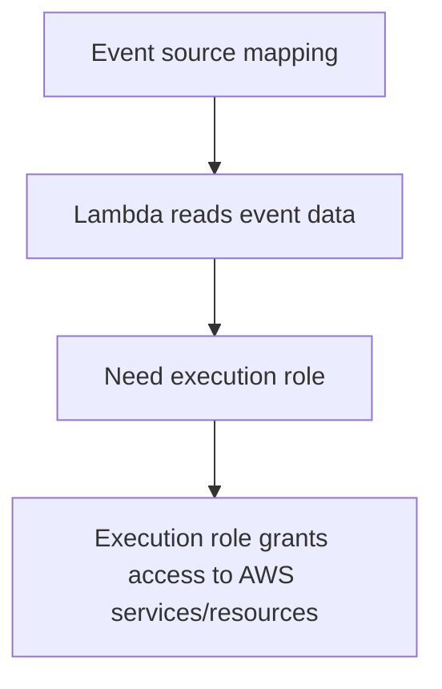

# 281. Lambda Permissions - IAM Roles & Resource Policies

## 🎯 Giới thiệu
- Bài này nói về **Lambda execution roles** và cách cấp quyền cho **AWS Lambda**.
- Có 2 cách chính để Lambda được phép truy cập hoặc được gọi:
  - **IAM Role / IAM policy** gắn vào principal hoặc Lambda
  - **Resource-based policy** gắn trên Lambda resource
- Ý chính để ôn thi: phân biệt rõ **khi nào dùng execution role** và **khi nào dùng resource-based policy**.

## 1. Lambda execution role
- **IAM Role** phải được attach vào **Lambda function**.
- Role này cấp quyền để Lambda truy cập **AWS services and resources**.
- Một số **managed policies** dùng lại cho Lambda:
  - **BasicExecutionRole**: cho phép upload logs lên **CloudWatch**
  - **KinesisExecutionRole**: đọc từ **Kinesis**
  - **DynamoDBExecutionRole**: đọc từ **DynamoDB streams**
  - **SQSQueueExecutionRole**: đọc từ **SQS**
  - **LambdaVPCAccessExecutionRole**: cho phép deploy Lambda trong **VPC**
  - **XrayDaemonWriteAccess**: upload trace data lên **X-Ray**
- Có thể tự tạo policy riêng cho Lambda nếu cần.
- Best practice: **one Lambda execution role per function**.

## 2. Event source mapping và quyền truy cập
- Khi dùng **event source mapping** để invoke function:
  - **Lambda** là bên đọc event data
  - Vì vậy cần **execution role** để đọc dữ liệu event
- Trường hợp này khác với việc function được invoke bởi service khác.
- Nếu Lambda của bạn cần **invoke other services**, thì quyền đó cũng nằm trong phạm vi execution role.

## 3. Resource-based policy cho Lambda invocation
- Nếu **Lambda function được invoke bởi other services** thì dùng **resource-based policy**.
- Resource-based policy dùng để cấp quyền cho:
  - **other accounts**
  - **other AWS services**
- Mục đích: cho phép các bên đó **invoke Lambda function**.
- Cách này **rất giống S3 bucket policy** cho **Amazon S3 buckets**.
- Điều kiện để **IAM principal** truy cập Lambda function:
  - **IAM policy attached to the principal** cho phép truy cập
  - hoặc **resource-based policy** cho phép truy cập
- Resource-based policy hữu ích hơn trong trường hợp **service-to-service access**.
- Ví dụ được nhắc tới:
  - **Amazon S3** muốn invoke Lambda function thì resource-based policy phải cho phép.
- Console có thể tự xử lý phần này “behind the scenes”, nhưng nếu tự tích hợp thì phải cấu hình thủ công.

## 📊 Bảng tóm tắt
| Tiêu chí | Mô tả |
|----------|------|
| Lambda execution role | IAM Role attach vào Lambda function để Lambda truy cập AWS services/resources |
| Managed policies | BasicExecutionRole, KinesisExecutionRole, DynamoDBExecutionRole, SQSQueueExecutionRole, LambdaVPCAccessExecutionRole, XrayDaemonWriteAccess |
| Event source mapping | Lambda đọc event data nên cần execution role |
| Resource-based policy | Dùng để cho other accounts hoặc other AWS services invoke Lambda |
| Best practice | One Lambda execution role per function |
| So sánh với S3 | Resource-based policy cho Lambda tương tự **S3 bucket policy** |

## 💡 Mẹo ghi nhớ cho kỳ thi AWS
- **Lambda đọc dữ liệu event** từ event source mapping thì nghĩ ngay đến **execution role**.
- **Service khác invoke Lambda** thì nghĩ đến **resource-based policy**.
- Nhớ câu này:
  - **IAM policy trên principal** hoặc **resource-based policy trên Lambda** đều có thể cho phép truy cập.
- Nếu đề bài nói về **service-to-service access**, ưu tiên nghĩ đến **resource-based policy**.
- Nếu đề bài hỏi quyền để Lambda **log CloudWatch**, nhớ **BasicExecutionRole**.

## ✅ Kết luận
- **Execution role** là quyền Lambda dùng để làm việc với AWS services/resources.
- **Resource-based policy** là quyền cấp cho bên ngoài để invoke Lambda.
- Hai cơ chế này là trọng tâm để hiểu **Lambda Permissions** trong AWS.
