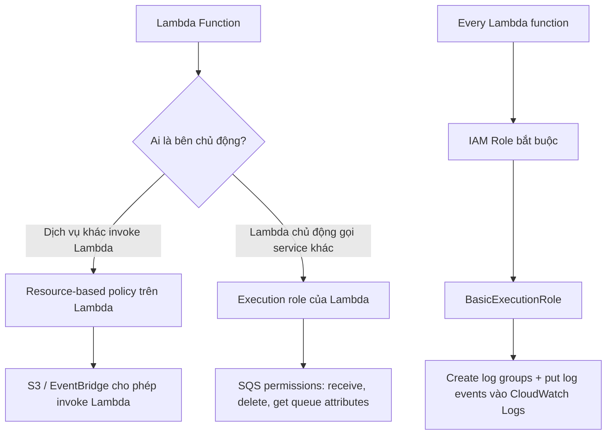

# 282. Lambda Permissions - IAM Roles & Resource Policies - Hands On

## 🎯 Giới thiệu
Bài này tập trung vào cách **Lambda permissions** hoạt động trong các tình huống khác nhau, đặc biệt là sự khác biệt giữa **IAM Role** và **resource-based policy**. Mục tiêu chính là hiểu khi nào **Lambda** cần được **invoke** bởi dịch vụ khác, và khi nào chính **Lambda** chủ động truy cập service khác.

## 1. IAM Role bắt buộc cho mọi Lambda
- Mỗi **Lambda function** đều phải có một **IAM role**.
- Khi tạo Lambda qua console, thường sẽ có **Lambda basic execution role** được gắn kèm.
- Role này chủ yếu dùng để:
  - tạo **log groups**
  - gửi **log events** vào **CloudWatch Logs**
- Vì vậy nó được gọi là **BasicExecutionRole**.

## 2. Resource-based policy khi service invoke Lambda
- Khi một service như **S3** hoặc **EventBridge** gọi Lambda, Lambda cần có **resource-based policy statement**.
- Ví dụ:
  - **Lambda S3** có policy cho phép **Amazon S3** invoke Lambda.
  - Policy này còn kiểm tra:
    - **source account**
    - **source ARN** của S3 bucket
- Với **EventBridge**, policy sẽ cho phép **events.amazonaws.com** invoke Lambda và ràng buộc theo **EventBridge rule ARN**.

## 3. Execution role khi Lambda truy cập SQS
- Với **Lambda SQS**, khác với S3/EventBridge:
  - **SQS không invoke Lambda**
  - mà **Lambda chủ động query SQS** để lấy data
- Vì vậy ở đây **không có resource-based policy statement** trên Lambda.
- Thay vào đó, Lambda dùng **execution role** để có quyền với SQS:
  - **receive messages**
  - **delete messages**
  - **get queue attributes**
- Đây là điểm cần nhớ: **SQS case = Lambda pulls data from SQS**, không phải SQS invoke Lambda.

## 📊 Bảng tóm tắt
| Tiêu chí | Mô tả |
|----------|------|
| IAM Role của Lambda | Bắt buộc cho mọi Lambda function |
| BasicExecutionRole | Cho phép tạo log groups và gửi log events vào CloudWatch Logs |
| Resource-based policy | Dùng khi service như S3 hoặc EventBridge invoke Lambda |
| S3 / EventBridge | Cần policy trên Lambda để cho phép invoke theo source account / source ARN |
| SQS | Không invoke Lambda, Lambda chủ động đọc dữ liệu từ SQS |
| Execution role với SQS | Cần quyền receive, delete, get queue attributes |

## 💡 Mẹo ghi nhớ cho kỳ thi AWS
- **Invoke Lambda từ service khác** như **S3** hay **EventBridge** thì nghĩ đến **resource-based policy**.
- **Lambda chủ động gọi service khác** như **SQS** thì nghĩ đến **execution role**.
- **BasicExecutionRole** gần như luôn có khi tạo Lambda qua console, và nhiệm vụ chính là **CloudWatch Logs**.
- Câu hỏi thi thường xoay quanh việc phân biệt:
  - ai là bên **invoke**
  - ai là bên **pull data**
  - quyền nằm ở **IAM Role** hay **resource policy**

## ✅ Kết luận
- **Lambda luôn cần IAM role**.
- Nếu **service khác invoke Lambda**, dùng **resource-based policy** trên Lambda.
- Nếu **Lambda truy cập service khác**, dùng **execution role**.
- Điểm mấu chốt của bài này là phân biệt rõ **invoke flow** và **execution flow** để chọn đúng cơ chế permission.
