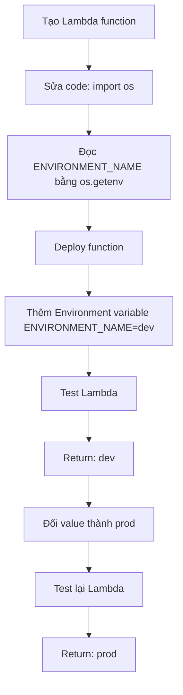

# 284. Lambda Environment Variables - Hands On

## 🎯 Giới thiệu
Bài thực hành này minh họa cách dùng **environment variables** trong **AWS Lambda** để thay đổi hành vi của function mà không cần sửa code.

- Tạo một Lambda function mới từ đầu: `lambda-config-demo`
- Dùng **Python 3.8**
- Mục tiêu: truyền `ENVIRONMENT_NAME` vào Lambda và cho function trả về giá trị đó
- Giá trị environment variable được thêm ở dạng **unencrypted** trong bài này
- Phần **encryption** sẽ được học ở section security sau

## 1. Chuẩn bị Lambda function
- Tạo function mới tên `lambda-config-demo`
- Chọn runtime: **Python 3.8**
- Sửa code để đọc environment variable:
  - `import os`
  - dùng `os.getenv("ENVIRONMENT_NAME")`
- Sau khi chỉnh code, **deploy** để lưu thay đổi

## 2. Cấu hình environment variable
- Vào **Configuration** của Lambda
- Chọn mục **Environment variables**
- Thêm key:
  - `ENVIRONMENT_NAME`
- Gán value:
  - `dev`
- Có thể thêm nhiều environment variables khác nếu muốn
- Trong bài này, cấu hình vẫn là **không mã hóa**

## 3. Kiểm tra hoạt động và thay đổi giá trị
- Tạo **sample event** và test function
- Kết quả trả về là `dev`, đúng với value của `ENVIRONMENT_NAME`
- Sau đó đổi value từ `dev` sang `prod`
- **Code không đổi**, nhưng khi test lại, kết quả trả về là `prod`
- Điều này cho thấy environment variables có thể làm thay đổi:
  - output của function
  - behavior của code
  - mà không cần sửa logic xử lý

## 📊 Bảng tóm tắt
| Tiêu chí | Mô tả |
|----------|------|
| Mục tiêu | Thực hành environment variables trong Lambda |
| Runtime | Python 3.8 |
| Code chính | `import os` và `os.getenv("ENVIRONMENT_NAME")` |
| Environment variable | `ENVIRONMENT_NAME` |
| Giá trị ban đầu | `dev` |
| Giá trị sau khi đổi | `prod` |
| Điểm quan trọng | Đổi environment variable có thể đổi hành vi function mà không cần sửa code |
| Bảo mật | Encryption có thể cấu hình, nhưng không xử lý trong bài này |

## 💡 Mẹo ghi nhớ cho kỳ thi AWS
- **Lambda + environment variables**: dùng để truyền cấu hình vào function
- Nhớ cú pháp đọc biến trong Python: `os.getenv("ENVIRONMENT_NAME")`
- Đổi **value** của environment variable có thể thay đổi kết quả trả về mà **không cần đổi code**
- Trong bài này, environment variable được thêm ở dạng **unencrypted**
- Key và value phải khớp đúng tên khi đọc trong code, ví dụ `ENVIRONMENT_NAME`

## ✅ Kết luận
Lambda environment variables cho phép tách **configuration** khỏi **code**. Trong ví dụ này, chỉ cần đổi `ENVIRONMENT_NAME` từ `dev` sang `prod` là output của function thay đổi ngay, dù code không đổi. Đây là cách rất hữu ích để quản lý hành vi Lambda theo từng môi trường.
