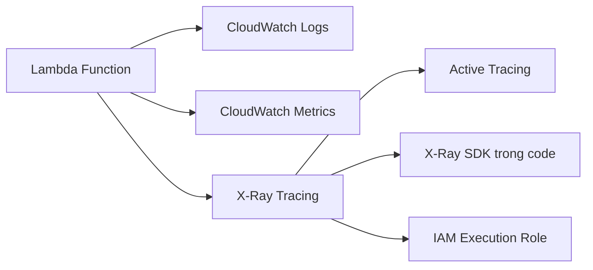

# 285. Lambda Monitoring & X-Ray Tracing

## 🎯 Giới thiệu
- Bài này nói về cách **Lambda** thực hiện **logging**, **monitoring** và **tracing**.
- Ba phần chính cần nhớ:
  - **CloudWatch Logs** cho log execution
  - **CloudWatch Metrics** cho chỉ số vận hành
  - **X-Ray** cho tracing

## 1. Logging với CloudWatch Logs 📝
- **Lambda execution logs** được tự động lưu vào **CloudWatch Logs**.
- Để Lambda ghi log, execution role phải có **IAM policy** phù hợp.
- Quyền này đã được bao gồm trong **Lambda basic execution role**.

## 2. Monitoring với CloudWatch Metrics 📊
- **CloudWatch metrics** có thể xem trong:
  - **CloudWatch Metrics UI**
  - **Lambda UI**
- Các metric quan trọng được nhắc tới:
  - **Invocations**
  - **Duration**
  - **Concurrent execution**
  - **Error counts**
  - **Success rate**
  - **Throttles**
  - **Async delivery failures**
  - **Iterator age** nếu đọc từ **Kinesis** hoặc **DynamoDB Streams**
- **Iterator age** cho biết mức độ trễ khi Lambda đang đọc stream.

## 3. Tracing với X-Ray 🔍
- Bật tracing bằng cách enable **Active tracing** trong cấu hình Lambda.
- Khi bật, Lambda sẽ tự chạy **X-Ray daemon**.
- Trong code, cần dùng **X-Ray SDK**.
- Lambda phải có **correct IAM execution role** để ghi dữ liệu vào X-Ray.
- Có một managed policy được nhắc tới là **AWS X-Ray daemon write access**.
- Có các **environment variables** để giao tiếp với X-Ray; trong đó quan trọng nhất là:
  - **AWS_XRAY_DAEMON_ADDRESS**
- Biến này cho biết **IP và port** nơi X-Ray daemon đang chạy liên quan tới Lambda function.

## 📊 Bảng tóm tắt
| Tiêu chí | Mô tả |
|----------|------|
| Logging | Lambda execution logs tự động lưu vào **CloudWatch Logs** |
| Quyền ghi log | Cần **IAM execution role** đúng; thường có trong **Lambda basic execution role** |
| Monitoring | Dùng **CloudWatch Metrics** hoặc **Lambda UI** |
| Metric quan trọng | Invocations, Duration, Concurrent execution, Error counts, Success rate, Throttles, Async delivery failures |
| Stream metric | **Iterator age** khi đọc từ **Kinesis** hoặc **DynamoDB Streams** |
| Tracing | Bật **Active tracing** trong Lambda config |
| X-Ray integration | Lambda tự chạy **X-Ray daemon**, code dùng **X-Ray SDK** |
| IAM cho X-Ray | Cần quyền ghi vào X-Ray, có managed policy **AWS X-Ray daemon write access** |
| Env var quan trọng | **AWS_XRAY_DAEMON_ADDRESS** |

## 💡 Mẹo ghi nhớ cho kỳ thi AWS
- **Logs -> CloudWatch Logs**
- **Metrics -> CloudWatch Metrics**
- **Tracing -> X-Ray**
- Nhớ rằng **Active tracing** là cách bật tracing cho Lambda.
- Nếu câu hỏi nhắc tới **Iterator age**, hãy liên hệ ngay với **Kinesis** hoặc **DynamoDB Streams**.
- Nếu hỏi về quyền ghi log của Lambda, nghĩ tới **Lambda basic execution role**.
- Nếu hỏi về X-Ray daemon address, nhớ keyword **AWS_XRAY_DAEMON_ADDRESS**.

## ✅ Kết luận
- Lambda có sẵn tích hợp với **CloudWatch Logs** để lưu log tự động.
- **CloudWatch Metrics** cung cấp các chỉ số quan trọng để theo dõi hiệu năng và lỗi.
- **X-Ray** dùng để tracing, cần bật **Active tracing**, dùng **X-Ray SDK**, và có **IAM permission** phù hợp.
