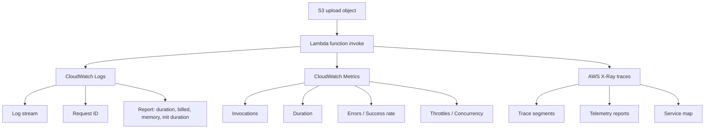

# 286. Lambda Monitoring & X-Ray Tracing - Hands On

## 🎯 Giới thiệu
Bài này tập trung vào cách **monitoring** và **tracing** cho **AWS Lambda** khi function được invoke từ **S3**. Nội dung chính xoay quanh 3 phần:
- **CloudWatch Metrics** để theo dõi hiệu năng và lỗi
- **CloudWatch Logs** để xem chi tiết từng lần invoke
- **AWS X-Ray** để quan sát trace và service map của Lambda

## 1. 📈 CloudWatch Metrics cho Lambda
Khi mở tab **Monitor** của Lambda, bạn có thể xem các metric quan trọng:
- **Invocations**: số lần Lambda được gọi
- **Duration**: thời gian thực thi của mỗi lần invoke
- **Errors**: số lượng lỗi
- **Success rate**: tỷ lệ thành công
- **Throttles**: số lần vượt quá giới hạn Lambda
- **Async delivery failures**: event không được xử lý kịp
- **Iterator age**: hữu ích khi đọc từ stream
- **Concurrent executions**: mức độ concurrency hiện tại

Lưu ý:
- Graph đổi từ **green** sang **red** cho thấy có giai đoạn success và sau đó bị error.
- Đây là dữ liệu rất quan trọng để theo dõi Lambda trong môi trường production.

## 2. 📝 CloudWatch Logs cho Lambda
Mỗi lần Lambda được invoke sẽ tạo ra một **log stream** trong **CloudWatch Logs**.

Trong log stream có thể thấy:
- **request ID**
- thông tin log được ghi ra trong function
- **end of request ID**
- phần **report** chứa:
  - thời gian chạy
  - chi phí bị tính
  - **memory size**
  - **max memory used**
  - **init duration** nếu có liên quan

Điểm chính:
- CloudWatch Logs giúp debug và kiểm tra từng lần invoke của Lambda.
- Đây là phần mà bài giảng nhấn mạnh là đã xem rất nhiều lần trước đó.

## 3. 🔎 AWS X-Ray Tracing cho Lambda
Trong **Configuration** > **Monitoring and operation tools**, có thể bật:
- **CloudWatch logs**: bật mặc định
- **X-Ray**: bật thêm để Lambda ghi **traces** vào AWS X-Ray

Khi bật X-Ray:
- Lambda sẽ ghi **trace segments** và **telemetry reports**
- Console có thể cố gắng tự sửa **permissions** bằng cách thêm vào **execution role**
- Sau khi save, Lambda sẽ bắt đầu gửi dữ liệu trace

Sau đó:
- Upload file vào **S3 bucket**
- Lambda xử lý file
- Sau một lúc, vào **X-Ray console** để xem **service map**
- Sẽ thấy client gọi Lambda, và Lambda xuất hiện trong map
- Có thể quan sát lúc success và lúc error trong trace

### Mermaid: luồng monitoring và tracing

## 📊 Bảng tóm tắt
| Tiêu chí | Mô tả |
|----------|------|
| CloudWatch Metrics | Theo dõi invocations, duration, errors, success rate, throttles, async delivery failures, iterator age, concurrency |
| CloudWatch Logs | Mỗi invoke tạo log stream, chứa request ID và report chi tiết |
| AWS X-Ray | Bật trong monitoring tools để ghi traces và xem service map |
| Permissions | Console có thể tự thêm quyền vào execution role để Lambda ghi vào X-Ray |
| Mục tiêu thực hành | Upload file vào S3 để kích hoạt Lambda rồi kiểm tra metrics, logs, và traces |

## 💡 Mẹo ghi nhớ cho kỳ thi AWS
- **Metrics = số liệu tổng quan**: xem hiệu năng, lỗi, throttle, concurrency
- **Logs = chi tiết từng request**: request ID, report, memory, duration
- **X-Ray = tracing end-to-end**: thấy đường đi của request và service map
- Nếu thấy **green/red** trên metrics thì đó là dấu hiệu có success và error xen kẽ
- Trong câu hỏi thi, khi cần **monitor Lambda**, thường phải nghĩ ngay đến **CloudWatch** và **X-Ray**

## ✅ Kết luận
Lambda trong bài này được theo dõi theo 3 lớp:
- **CloudWatch Metrics** để nhìn tổng quan
- **CloudWatch Logs** để debug chi tiết
- **AWS X-Ray** để trace và xem service map

Đây là workflow rất quan trọng khi làm việc với Lambda trong production và cũng là kiến thức hay xuất hiện trong đề thi AWS.
