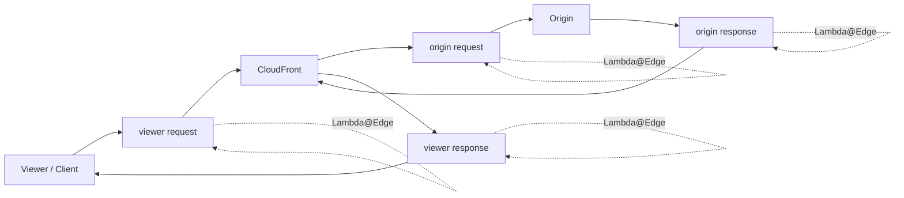

# 287. Lambda@Edge & CloudFront Functions

## 🎯 Giới thiệu
- **Customization At The Edge** là việc chạy logic ở **Edge locations** của **CloudFront** thay vì chỉ xử lý trong một region.
- Mục tiêu là thực thi code **gần user hơn** để giảm **latency** và tùy biến nội dung CDN trước khi đến application.
- CloudFront có 2 loại Edge Functions:
  - **CloudFront Functions**
  - **Lambda@Edge**
- Cả hai đều:
  - **serverless**
  - không cần quản lý server
  - được deploy **globally**
  - chỉ trả tiền theo mức sử dụng

## 1. Luồng request trong CloudFront ⚡

- Request đi theo luồng:
  - **viewer request**: client gửi vào CloudFront
  - **origin request**: CloudFront gọi origin server
  - **origin response**: origin trả về CloudFront
  - **viewer response**: CloudFront trả về client
- Điểm khác nhau quan trọng là nơi có thể chèn logic xử lý:
  - **CloudFront Functions**: chỉ ở **viewer request** và **viewer response**
  - **Lambda@Edge**: ở cả **viewer request**, **origin request**, **origin response**, **viewer response**

## 2. CloudFront Functions 🚀
- Là lightweight functions viết bằng **JavaScript**.
- Dùng cho **high-scale**, **latency-sensitive CDN customizations**.
- Đặc điểm chính:
  - **sub-millisecond startup times**
  - scale đến **millions of requests per second**
  - chỉ xử lý **viewer request** và **viewer response**
  - là **native feature of CloudFront**
  - code được quản lý trực tiếp trong **CloudFront**
- Use cases:
  - **cache key normalization**
  - **header manipulation**: insert, modify, delete HTTP headers
  - **URL rewrites or redirects**
  - **authorization**: create và validate **JWT tokens** để allow/deny request

## 3. Lambda@Edge 🧩
- Viết bằng **NodeJS** hoặc **Python**.
- Scale đến **1000s of requests per second**.
- Có thể xử lý cả 4 điểm:
  - **viewer request**
  - **origin request**
  - **origin response**
  - **viewer response**
- Function được author trong **us-east-1**, rồi CloudFront **replicate** đến tất cả locations.
- Đặc điểm:
  - execution time có thể lên tới **5 to 10 seconds**
  - có **adjustable CPU and memory**
  - có thể dùng **third party libraries** và **SDK**
  - có **network access** tới external services
  - có **file system access**
  - có thể truy cập **body** của HTTP request
- Use cases:
  - các logic phức tạp hơn, cần nhiều thời gian xử lý
  - tích hợp với service bên ngoài
  - xử lý dữ liệu với library bổ sung

## 📊 Bảng tóm tắt
| Tiêu chí | Mô tả |
|----------|------|
| Mục tiêu | Customization At The Edge, chạy logic gần user để giảm latency |
| CloudFront Functions | JavaScript, chỉ xử lý viewer request/response, cực nhanh, scale rất lớn |
| Lambda@Edge | NodeJS/Python, xử lý cả viewer và origin events, linh hoạt hơn |
| Runtime | CloudFront Functions: JavaScript בלבד; Lambda@Edge: NodeJS và Python |
| Scale | CloudFront Functions: millions requests/second; Lambda@Edge: thousands requests/second |
| Execution time | CloudFront Functions: < 1 ms; Lambda@Edge: 5-10 seconds |
| Trigger scope | CloudFront Functions: viewer only; Lambda@Edge: viewer + origin |
| Deployment | Cả hai đều serverless và deploy globally; Lambda@Edge author ở us-east-1 rồi replicate |
| Use cases | Cache key normalization, header manipulation, URL rewrite/redirect, JWT auth; Lambda@Edge dùng cho logic nặng hơn, có network/file system/body access |

## 💡 Mẹo ghi nhớ cho kỳ thi AWS
- **CloudFront Functions = nhanh nhất, đơn giản nhất, chỉ viewer**
- **Lambda@Edge = mạnh hơn, chậm hơn, có cả viewer và origin**
- Nhớ cụm:
  - **CloudFront Functions**: **JavaScript + sub-millisecond + millions RPS**
  - **Lambda@Edge**: **NodeJS/Python + 5-10 seconds + us-east-1**
- Nếu câu hỏi nhắc đến:
  - **cache key**, **header manipulation**, **URL rewrite/redirect**, **JWT auth** → nghĩ đến **CloudFront Functions**
  - **network access**, **third party libraries**, **file system access**, **body access** → nghĩ đến **Lambda@Edge**

## ✅ Kết luận
- **Edge Functions** dùng để chạy logic ngay tại **CloudFront edge locations** nhằm giảm latency và tùy biến nội dung.
- **CloudFront Functions** phù hợp cho các xử lý rất nhanh, rất nhẹ, chỉ ở **viewer request/response**.
- **Lambda@Edge** phù hợp khi cần logic phức tạp hơn, xử lý cả **viewer** và **origin**, và cần nhiều khả năng hơn về runtime, network, hoặc body access.
