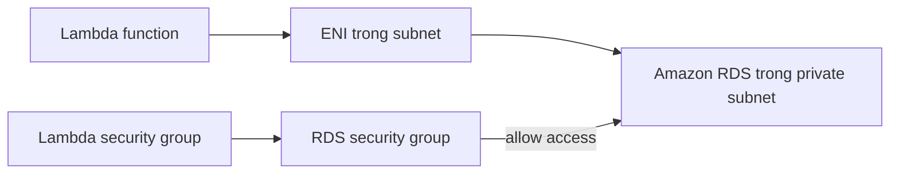
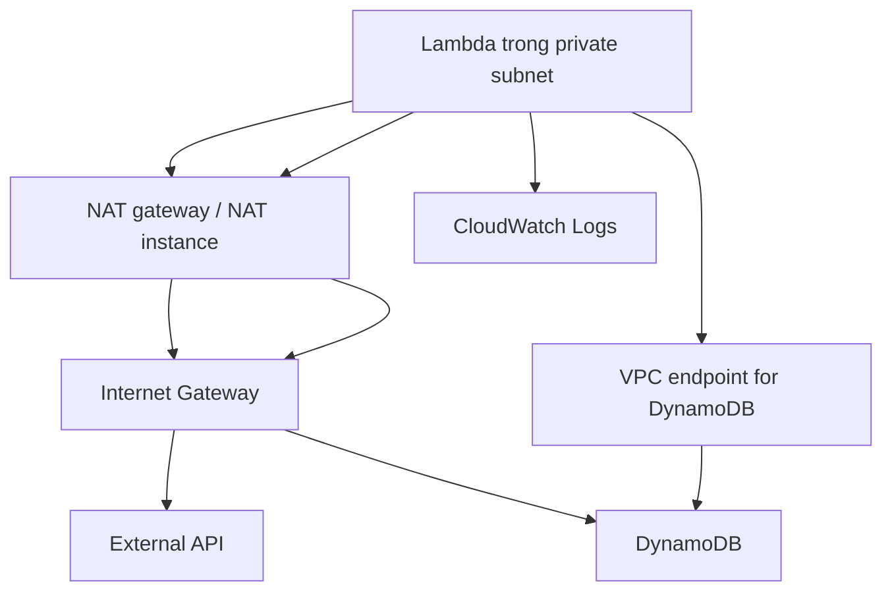

# 288. Lambda in VPC

## 🎯 Giới thiệu
- Mặc định, Lambda function được chạy **ngoài VPC của bạn** trong một VPC do AWS quản lý.
- Vì vậy, Lambda **không thể truy cập trực tiếp** các tài nguyên nằm trong VPC riêng của bạn như:
  - EC2 instances
  - RDS database
  - ElastiCache
  - internal Elastic Load Balancer
- Tuy nhiên, Lambda vẫn có thể truy cập:
  - các **public websites**
  - **external APIs**
  - một số dịch vụ AWS như **DynamoDB**
- Khi deploy Lambda vào VPC, bạn cần hiểu rõ đường đi mạng và các giới hạn về internet access.

## 1. Lambda mặc định và giới hạn truy cập
- Khi không cấu hình VPC, Lambda chạy trong môi trường tách biệt với VPC riêng của bạn.
- Do đó:
  - truy cập tài nguyên công khai vẫn hoạt động
  - truy cập tài nguyên private trong VPC thì không
- Đây là điểm quan trọng để ôn thi: Lambda **không tự động** nhìn thấy RDS trong private subnet.

## 2. Deploy Lambda trong VPC để truy cập tài nguyên private
- Bạn có thể deploy Lambda vào VPC bằng cách cấu hình:
  - `VPC ID`
  - `subnets`
  - `security group`
- Khi đó, Lambda sẽ tạo một **ENI (Elastic Network Interface)** trong subnet đã chọn.
- Để tạo ENI, Lambda cần **Lambda VPC Access Execution Role**.
- Luồng truy cập tới RDS:
  - Lambda -> ENI -> Amazon RDS database
- Về security:
  - **RDS security group** phải cho phép network access từ **Lambda security group**
- Đây là cách để Lambda truy cập tài nguyên private trong VPC.

## 3. Internet access, DynamoDB và CloudWatch Logs
- Nếu Lambda nằm trong VPC, mặc định nó **không có internet access**.
- Lưu ý quan trọng cho kỳ thi:
  - Deploy Lambda vào **public subnet** cũng **không** làm Lambda có internet access hoặc public IP.
  - Điều này khác với **EC2 instances**.
- Nếu Lambda cần truy cập internet hoặc external API:
  - đặt Lambda trong **private subnet**
  - dùng **NAT gateway** hoặc **NAT instance**
  - NAT sẽ đi qua **Internet Gateway** để ra internet
- Với **DynamoDB**, có 2 cách:
  - đi qua public route bằng **NAT**
  - truy cập riêng tư bằng **VPC endpoint**
- Nếu dùng **VPC endpoint** cho DynamoDB:
  - Lambda truy cập DynamoDB **private**
  - không cần NAT device hay Internet Gateway
- Một điểm cần nhớ:
  - **CloudWatch Logs vẫn hoạt động** dù Lambda ở private subnet và không có endpoint hay NAT gateway.

## 📊 Bảng tóm tắt
| Tiêu chí | Mô tả |
|----------|------|
| Mặc định của Lambda | Chạy ngoài VPC của bạn, trong VPC do AWS quản lý |
| Truy cập tài nguyên private | Không truy cập được RDS, EC2, ElastiCache, internal ELB nếu không cấu hình VPC |
| Deploy vào VPC | Cần `VPC ID`, `subnets`, `security group` |
| ENI | Lambda tạo **ENI** trong subnet đã chọn |
| Quyền cần có | Cần **Lambda VPC Access Execution Role** |
| Truy cập RDS | Lambda đi qua ENI, và RDS security group phải cho phép từ Lambda security group |
| Internet access | Lambda trong VPC mặc định **không có internet access** |
| Public subnet | Deploy Lambda vào public subnet vẫn **không** có public IP hay internet access |
| Cách ra internet | Dùng **NAT gateway** hoặc **NAT instance** |
| Truy cập DynamoDB | Qua NAT/Internet Gateway hoặc qua **VPC endpoint** |
| CloudWatch Logs | Vẫn hoạt động ngay cả khi không có NAT hay endpoints |

## 💡 Mẹo ghi nhớ cho kỳ thi AWS
- Nhớ câu: **Lambda trong VPC không mặc định có internet access**.
- `Public subnet` chỉ có ý nghĩa rõ ràng với **EC2**, không phải Lambda.
- Muốn Lambda vào private resource:
  - nhớ `subnet + security group + ENI + execution role`
- Muốn Lambda ra internet:
  - nhớ `private subnet + NAT gateway/NAT instance`
- Muốn truy cập **DynamoDB private**:
  - nhớ **VPC endpoint**
- **CloudWatch Logs** là ngoại lệ quan trọng: vẫn hoạt động dù không có NAT hay endpoint.

## ✅ Kết luận
- Lambda mặc định không nằm trong VPC riêng của bạn nên không truy cập được resource private.
- Khi deploy Lambda vào VPC, AWS sẽ tạo **ENI** và dùng **Lambda VPC Access Execution Role** để kết nối.
- Muốn đi ra internet phải dùng **NAT gateway** hoặc **NAT instance**.
- Muốn truy cập **DynamoDB** riêng tư thì dùng **VPC endpoint**.
- **CloudWatch Logs** vẫn hoạt động bình thường trong mọi trường hợp đã nêu.
